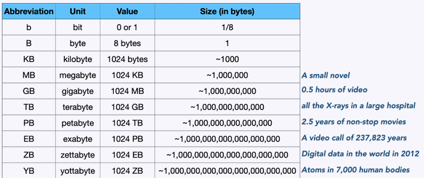
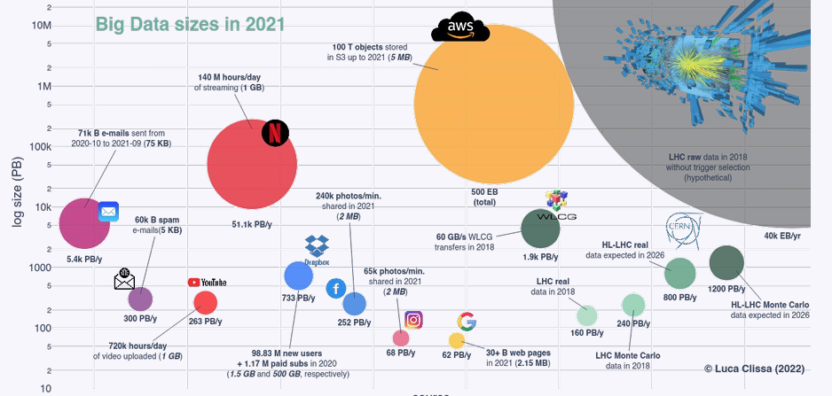
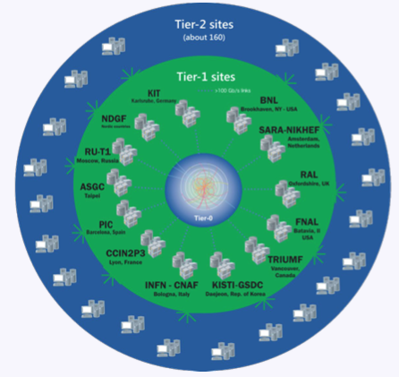

# Lecture 1

## AI making headlines
* OpenAI plan $100 billion data-center project
* Google building Seven Nuclear Reactors to power AI Systems
* Ever-growing amount of floating point operations

## Advancements in hardware
* Central Processing Units (CPU): jack-of-all-trades (general-purpose)
* Graphical Processing Units (GPU): specialized at the time; accelerate complex tasks in graphics, video rendering and simulations
* Tensor Processing Units (TPU): built for AI; specific purpose running matrix and vector mathematics

## Big data
### What are some challenges related to big data?
* Where do we store it?
* What are the storage/compute costs?
* What does it contain?
* How do we analyze it?
* How to represent it?
* Do we need it?
* Etc.

### 3 V's of big data
* Big data is **high-volume**, **high-velocity**, and/or **high-variety** information that demmand cost-effected forms of information processing to enable insight, decision making, and process automation.

### High Volume data

* Mapping the brain of a fly: 21 million images, more than 100TB of data

**How do we store such massive amounts of data?**

#### Other examples of high volume data?
* Scale of data
* Stock market
* Particle Collider
* Instragram comments are petabytes of data each year

### High Velocity Data

#### Particle Collider Example
- We only read kilobytes that hold in a buffer for a few nanoseconds, it goes through a check whether it should leave the machine or not. Even then its still 100GB/s, where it goes through a several check to filtrate more of.
- f99.72 of data is rejected, and further 99 procent is rejected again.
- We call this high-velocity data, much higher that you’d get in every day however.

#### LHC Computing Grid

* All data filtered is recorded on physical tape (long time archival stroage)
* It is then sent to Tier-1 centers (large computing centers) that has enough storage to hold this
* It is then sent again to Tier-2, which makes the data avaialbel for smaller universities, storage centers etc.

**Computing Grid**
* Can be seen as power grid; shared across institutions and can be accessed as if it was one storage system
* Heterogeneous system, which means it is different storage device and diggerent computers
* Goal: collaboration on complex (compute) projects across geographic and institutional boundary
  * Solve a common large-cale problem

#### Other examples of high velocity data?

...

### High variet data
* Different forms of data

#### Self driving cars
* Data centers on wheels
* 1 billion autonomous vehicles, each driving for one hour per day with a computer consuming 840 watts, would consume enough energy to **generate about the same amount of emissions as data centers currently do**

#### Other example of high variety data:
* Weather forecasting, different kind of sensor data/images/sattelite data

### More V's of Big Data
* **Volume**: Amount of data
* **Variety** Diversity of data
* **Velocity**: Speed of data generation
* **Veracity**: Accuracy of data
* **Value**: Worth of data/if it provides insight

#### Big Data requires data analytics/mining/science

The course objectives:
* Address the challenges that emerge during the collection, management, processing, and analytics of large-scale data
  * Big data management tools/platforms
  * Big data processing and analysis

---

### How do we process/manage big data?
**How do you store your data that does not fit in a single machine?**
* Distributed data
* Partitioning
* Replication
* Etc.

**How do you store datasets to speed up query answering?**
* Query and analyze a dataset of millions of reviews (Assignment 1)

### How do we implement ML models for big data in practice?
* Implement and deploy a ML pipeline (Assignment 2)

