# ML impact

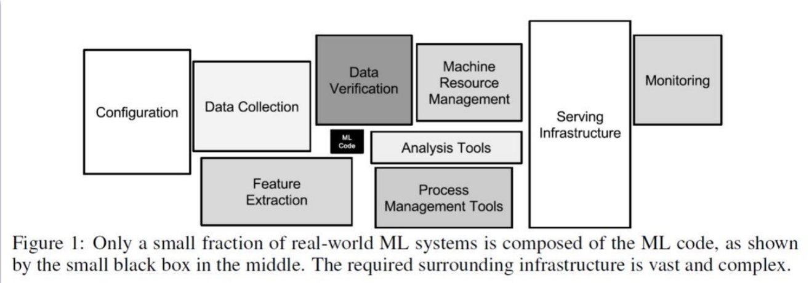

## Hardware for data processing and ML
* **CPU (Central Processing Unit)**: Designed with a few powerful cores and large caches. Optimized for *complex, sequential, and varied tasks*
  * Has its own L1 Cache for quick data access
  * Designed for fast sequential processing
  * Handless complex instructions
  * Layers of coordination between cores
* **GPU (Graphics Processing Unit)**: Designed with a massive number of simple cores. Optimized for parallel tasks like matrix multiplication, making them ideal for Deep Learning
  * Each core:
    * Individually less powerful than a typical CPU core
    * control units manage groups of cores
    * Designed for: doing the *same operation on manay data points simultaneouisly*
* Others: **Tensor Processing Units**, FPGAs, accelerators etc.

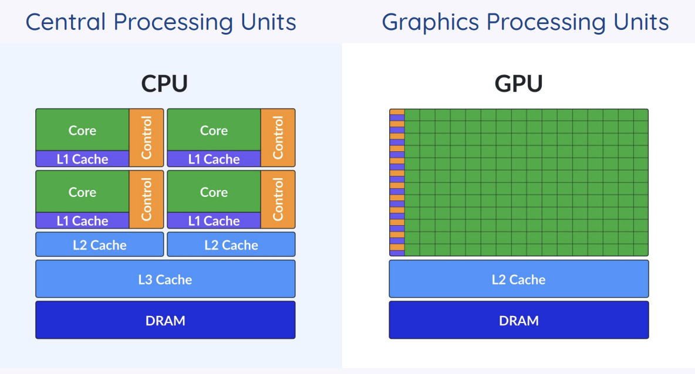
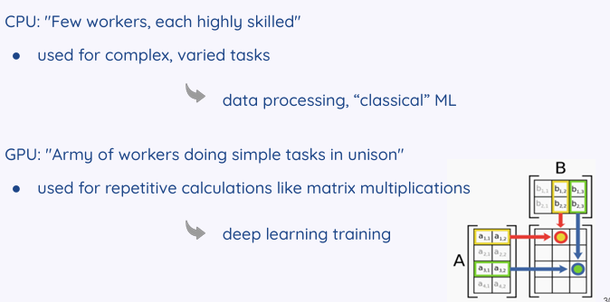

## Parallelism
**Embarrassingly Parallel**: Tasks with no dependencies between data points (e.g., doubling every number in a list), ideal for GPUs.

* No dependencies, cases like these are near optimal.

**Dependent Workloads**: Tasks where the next step depends on the previous one (e.g., cumulative sum), which are harder to parallelize.

* workload is completely dependent

### Performance vs. efficiency
Breakthroughs in hardware research have continuously improved performance in data-intensive applications for many decades.

**Performance (Speed):** Measures "how fast" a task is completed

**Efficiency (Resources):** Measures "how many resources" (energy) are required for a task.

### Thermal Design power

**Definition:** The maximum amount of heat a chip generates under a compute-intensive workload.

**Thermal design power (TDP)**:
What resources are needed for compute?
* Thermal design power = power needed under a compute intensive workload.
* Intel: The maximum power consumption under a sustained workload
* AMD: The maximum cooling capacity required to keep the chip operational.
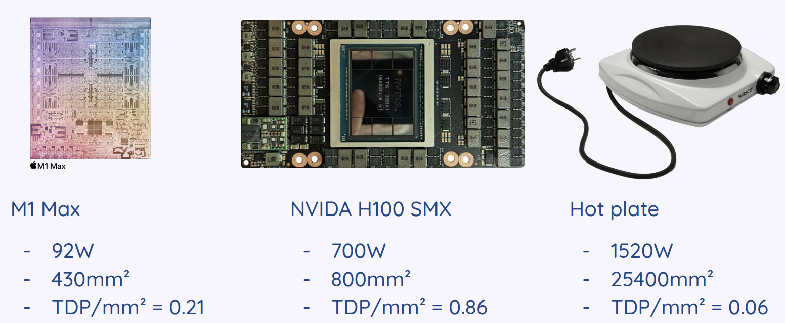

### Performance vs. Efficiency**
Performance is how fast a task is done; efficiency is the resources required. 

Hardware has improved performance (3x) more than energy efficiency (1.45x) in recent years

## Environmental Impact

### Carbon Emission

**How to estimate Carbon Emission**:
* The carbon intensity of the local energy grid
* The energy consumption of the system.

$$Emissions = Carbon\ Intensity \times Energy\ Consumption$$

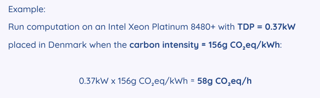

### Carbon Intensity

* Carbon intensity = a measure of the greenhouse gas emissions associated with producing electricity 
* Grams of CO2 equivalent released per kWh of electricity. This varies heavily by location and energy source (e.g., coal vs. wind)

### Emission Factors

* **Emission factors**: factors for the whole lifecycle of consumed fuels and used power plants (coal, gas, oil, etc.)

### Life cycle of a Cloud Server

**Carbon Footprint** (life cycle of a cloud server):
* Server footprint = embodied + operational
* **Operational**: The footprint from using the hardware. Calculated as $(Energy \times Carbon Intensity)$ i.e (CPU x utilization + DRAM + SSD) x Carbon Intensity
* **Embodied**: The footprint from manufacturing and transporting the hardware
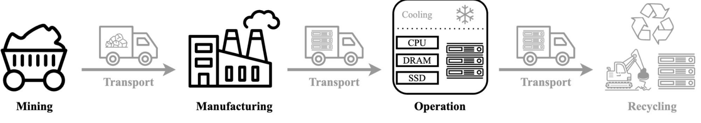

### Energy Reporting in ML

**PUE (Power Usage Effectiveness)**: A metric for data center efficiency, calculated as Total Facility Energy divided by IT Equipment Energy. A value closer to 1.0 is better

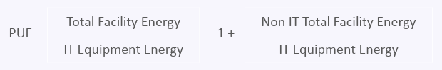

**Water Consumption**: Data centers consume massive amounts of water for cooling, often in water-scarce areas

### Data center trends
* Data centers are becoming more efficient in terms of cooling and operation
* Currently, all major cloud providers are missing carbon reduction targets and increase their footprints
* **Major factor**: new hardware deployment
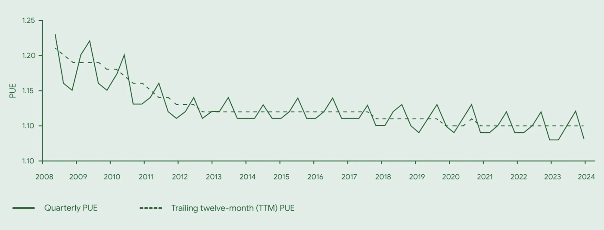

## System-Level Effects & Privacy

### Compute-related impacts for AI/ML

**Primary Emission Sources:**
* Energy consumed during active ML computations + 
  * Energy needed for ML computations + Carbon footprint associated with hardware manufacturing, transport, and disposal (embodied emission)

**ML compute**:
* Amount of computing power varies dramatically between both applications and users
* Lifecycle of an ML model:
  * inference
  * training
  * development and tuning
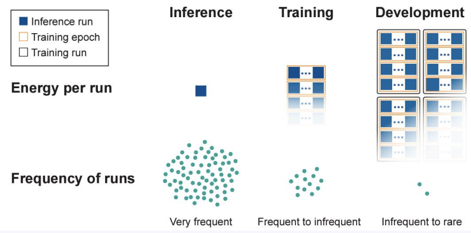

### Large Increase in Emissions
* "Generative AI is reportedly tripling carbon dioxide emissions from data centers"
* "Google says its emissions have grown nearly 50% due to AI data center boom"

# Water Cooling in Data Centers

Water is primarily used in data centres to cool hardware, using air mechanisms to dissipate heat, causing up to nine liters of water to evaporate per kWh of energy used.

## Assessing GHG Emissions impact of ML

A framework for **assessing greenhouse gas (GHG)** emissions impacts of Machine Learning
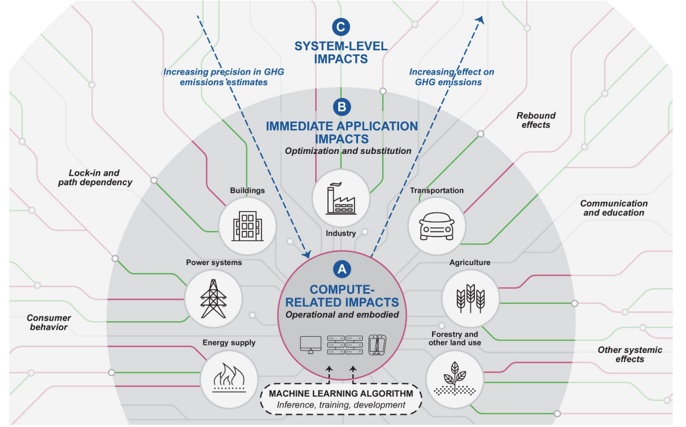

### Impact of AI/ML - negative effects
Effects associated with computation:
* **Energy** (both of running software and maintaining infrastructure)
* **indirect emissions** (producing hardware)

Facilitation of activities associated with high emissions:
* oil and gas exploration and extraction
* advertising industry - consumption

Wider societal impact:
* inequality, discrimination can be perpetuated and amplified through AI systems, privacy

#### Positive Effects 

**Immediate application**: Optimization and substitution (e.g., optimizing supply chains).

### Wider Impact - System level effects
Broader societal changes, such as **rebound effects** (e.g., autonomous cars making driving easier, leading to more trips and higher overall energy use)

* Structural **rebound effects**: increase individual efficiency => increase overall energy use

In the case of autonomous driving:
* longer and more frequent trips
* living further in the suburbs
* higher quality of assistance systems

### Privacy & Unicity:

**Loss of privacy**: We live in a surveillance economy; where personal data is
* being collected en masse
* sold to 3rd parties
* **anonymised, but how secure is it?**

**Concepts**:
* **Unicity**: The likelihood that an individual can be uniquely identified in a dataset.
  * Under the random attack scheme, the assumption is that an attacker has information about n apps selected at random from the pool of an individual’s mobile phone apps
  
* **Re-identification**: Metadata is highly identifying. Knowing just 4 spatiotemporal points is enough to identify 95% of mobility traces. Knowing 4 installed apps can re-identify >90% of individuals

**Estimating unicity**
1. randomly choose an individual
2. sample n apps (using any heuristic)
3. check if a person is the only one with those apps
4. count the number of “re-identifications”

Under the **popularity attack scheme**, an attacker would know the n least popular app used by a person.

Additional data - app popularity
* Can with under 3 random number of popular apps, you can identify 90% oof individuals.
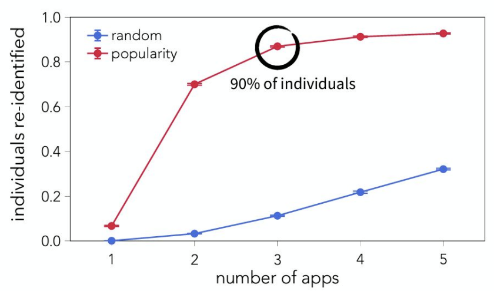

* This also works for mobility patterns
  * We have location data from 1.5 million people
* Knowing as few as four spatio-temporal points taken at random (Ip = 4) is enough to uniquely characterize 95% of the traces amongst 1.5 M users.
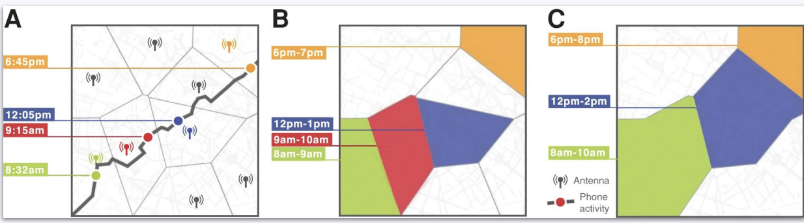

### Impact of AI/ML - positive effects
**Distilling raw data into actionable information**
* scaling up annotations that humans provide
* example: Analyze satellite imagery in order to pinpoint deforestation

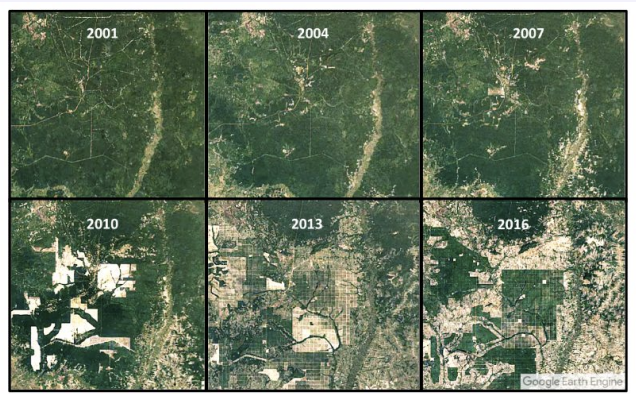

**Improving forecasting**
* provide forecasts of quantities such as wind power production, transportation demand, and extreme events by analyzing patterns in historical data
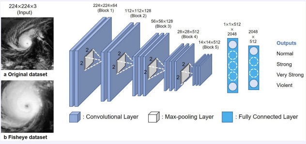

**Optimizing complex systems**
* optimizing for a specific objective given a complicated system with many variables
* example: optimize freight transportation schedules

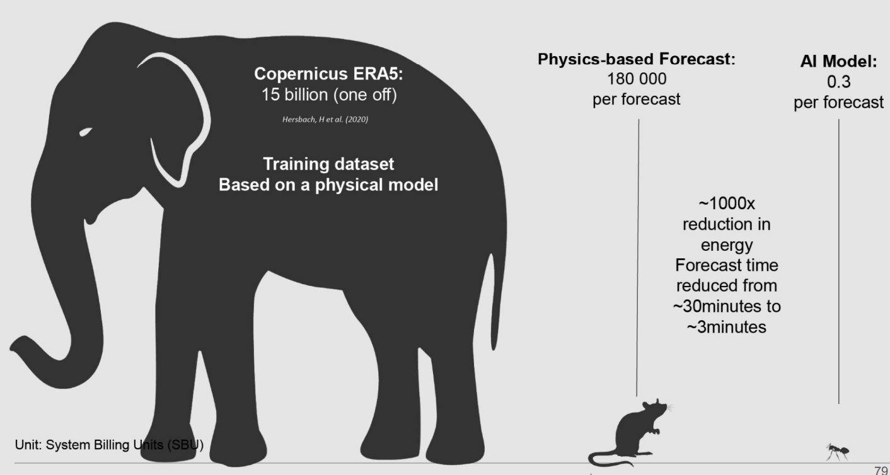
* AI uses 1000x reduction in energy and forecast time. 