# Lecture 11 (Learning at the edge)

## Training on multiple GPUs: Data Parallelism

Every GPU (worker) holds a complete replica of the model, including its parameters, gradients, and optimizer states.

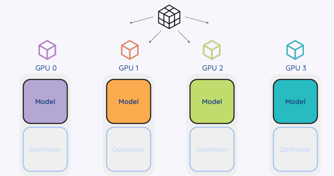

Each GPU:
* Run a forward pass on its data batch
* Computes the loss
* Backward pass to calculate gradients locally.

Data Batch Definition: A data batch is a subset of the total training dataset processed at one time

**Synchronization (Aggregation):** Gradients from all GPUs are aggregated (typically via an allreduce operation) so that every model replica receives the exact same gradient updates.

Running the optimizer step will update all replicas parameters to the same values

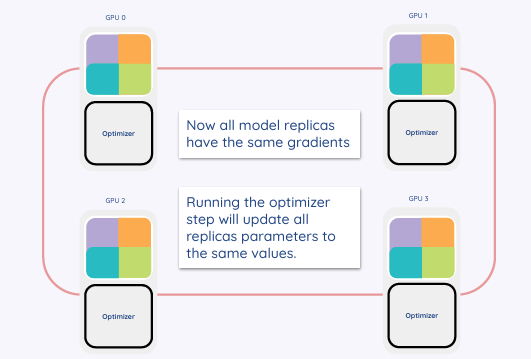

## Gardient Descent 

**Goal:** To minimize the cost function $J$, which typically consists of a loss term and a regularizer: $\min_w \sum_{i \in data} l_i(w) + R(w)$1.

**Update Rule: **Parameters are updated iteratively by moving in the opposite direction of the gradient:
$$w^{k+1} = w^k - \alpha_k \nabla J(w^k)$$

Key components:
* $w$: Parameters/weights; The goal is to find the values of $w$ that minimize the cost function
* $\alpha_k$: Learning rate (step size); This is the step size that determines how big of a step the algorithm takes in the direction of the gradient during each update (important for convergence)
* $\nabla J$: Gradient of the cost function: It indicates the direction of the steepest ascent, so the algorithm subtracts it (moves in the opposite direction) to minimize the loss.

**Types of Gradient Descent:**
* Batch: Uses the entire dataset ($\sum_{i=0}^{n}$).
* Stochastic: Uses a single random example ($i$)
* Mini-batch: Uses a subset of size $m$ (where $m \ll n$)

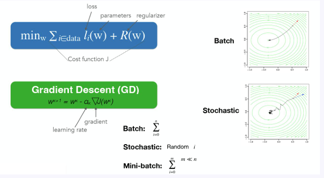

## Fully Sharded Data Parallelism

Data parallelism:
* each processor/worker had a replica of the model (model parameters, gradients, and optimizer states)

Fully sharded data parallelism: 
* Model parameters, optimizer states and gradients across are distributed across workers

**Leads to:**
* Smaller GPU memory footprint, posible to train very large models
* However has an increased communication cot

**How does it work?**
* Before the forward and backward passes, workers communicate to gather the necessary model parameters locally.
* After computing gradients, they are synchronized and sharded back across workers

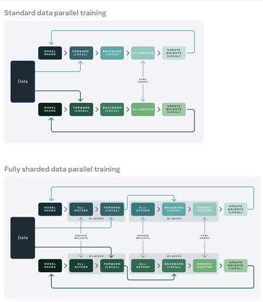

## Distributed Computing vs. Parallel Computing

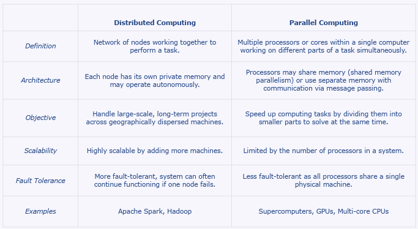

## Edge Computing 

Edge computing is a distributed computing paradigm that brings computation and data storage closer to the sources of data.

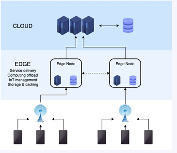

**Architecture**:
* Cloud: Centralized servers for heavy processing and long-term storage
* Edge Nodes: Intermediate nodes (e.g., servers, gateways) physically closer to users that handle caching, offloading, and IoT management.
* IoT Devices: The physical sensors and devices generating raw data.

## Internet of Things

Physical objects (or groups of such objects) with sensors, processing ability, software and other technologies that connect and exchange data with other devices and systems over the Internet or other communications networks

## Edge computing 

Raw data may not need to be sent through a network
* Models can work where Internet connections are unreliable = offline availability
* Network latency not a problem = improved response time
* Sensitive data stays on device = data security

**However**: Devices need to be powerful enough to handle the computation

## Federated Learning

**Definition:** A distributed approach where multiple parties collaboratively train a machine learning model without ever sharing their raw training data.

Instead of bringing the data to the model (centralized), you bring the model to the data (decentralized).

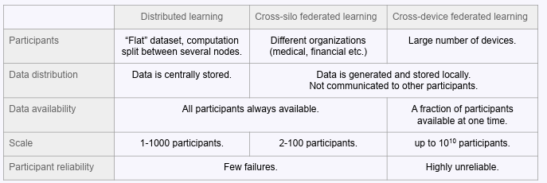

### Federated Lerning Settins

Cross-Silo: Involves fewer participants (2–100), typically organizations like hospitals or banks. The participants are reliable and have large datasets.

Cross-Device: Involves a massive number of participants (up to $10^{10}$), typically mobile devices or IoT sensors. These are often unreliable and have limited availability1.

### Challenges

**Non-IID Data (Non-Independent and Identically Distributed):**
* Observations are not independent of each other and/or the distribution of the observations can change
**Communication Constraints:**
* Devices often operate on higher-latency, lower-throughput connections
**Harder to Identify Bias:**
* It is difficult to identify unwanted biases in the model without access to the data.
**Vulnerable to model-poisoning attacks:**
* Malicious participants can send bad updates to corrupt the global model
**Difficult to prevent attacks by detecting anomalies**
* It is harder to detect attacks or bad data because the server cannot inspect the raw data directly.

Other ones:
* Devices may drop out, run out of battery, or turn off at any time, especially in cross-device settings.
* Devices have varying computing power and memory, limiting the size of models they can train

### Federated Learning Workflow
1. **Participant Selection**: The server selects a subset of available devices (participants) based on specific eligibility requirements
2. **Broadcast**: The current global model parameters are sent (broadcasted) to the selected participants.
3. **Local Computation**: Each participant computes a model update (like gradients) by training on their own local, private data.
4. **Aggregation**: The server collects the updates from all participants and combines them into a single aggregate update (often by averaging)
5. **Model Update**: The server uses this aggregated update to modify the global model, creating a new version for the next round.

### Federated Stochastic Gradient Descent

**Definition:** FedSGD is the translation of Stochastic Gradient Descent (SGD) into the federated learning setting.

**How it works**:
1. Select a fraction of participants to take a step of gradient descent.
2. Selected participants compute the gradients for the current global model using their local data.
3. The participants send their gradients to the server, which calculates a weighted average of these gradients.
4. The server uses this average to update the global model parameters

#### FedAvg

**Improves on FedSGD:**
* significantly reduces communication costs by performing multiple local training steps on the device before sending an update to the server.

**3 Key Parameters:**
* $C$: The fraction of total participants selected for a round.
* $E$: The number of training passes (epochs) a device runs on its local dataset.
* $B$: The size of the local data batch used for training.

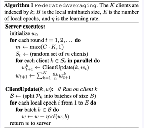

#### FEdAVg - Experimental Setup (Example)

**Image classification and language modeling tasks**:

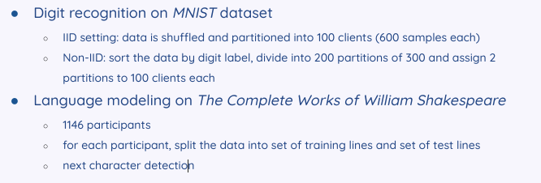

**Key findings**
* More Local Work = Fewer Rounds
  *  More local SGD updates per round can decrease communication cost
*  Shakespeare task
   * learning on the non-IID and unbalanced data is actually much easier; some roles have relatively large local datasets 

### Variations of the FL framework

**Fully Decentralized**:
* Eliminates the central server, which removes the single point of failure and bottleneck
* Peer-to-Peer: Communication happens directly between neighbors in a connected graph topology (often sparse).
* In one round, a participant performs a local update (e.g., gradient step) and averages their parameters with their specific neighbors. The goal is for all local models to eventually converge to the same global solution

**Data Partitioning by Features**:
* settings where participants hold different features for the same sample (e.g., one hospital has blood tests, another has X-rays for the same patient).

**Split Learning**:
* The model is split into parts; Model itself is executed on different devices, in a per-layer fashion
* A participant computes a pass through a network up to a specific layer
* The output (activations) of the local layers is sent to another participant or server to complete the rest of the computation.
* There is potential for data leakage through the communicated activation data

### Properties of data in the FL setting

**Non-identical participant distributions:** meaning the data looks very different from one participant to another
* Feature Distribution Skew (Covariate Shift): The local data has different statistical distributions across participants.
* Label Distribution Skew (Prior Probability Shift): The distribution of labels varies across participants
* Quantity Skew (Unbalancedness): Different participants hold vastly different amounts of data.
* Concept Drift: The same labels correspond to different features (e.g., "cool" might mean "cold" to one user and "fashionable" to another)
* Concept Shift: The same features correspond to different labels
**Violations of Independence:** Data often contains temporal or geographical patterns, introducing bias based on the source

**Dataset Shift:** The set of participants used for training might differ from the participants encountered during actual deployment.

### Global FL vs local models

**Small and IID Datasets:**
* Global Models are better
* When data is uniform across users (IID) and local datasets are small, a single global model performs better because it aggregates diverse data, preventing the overfitting that would occur if a user trained only on their tiny local dataset.

**Pathologically non-IID**
* Local Models are better
* When data distributions are extremely different between users a "one-size-fits-all" global model often fails to capture the nuances. A model trained locally on the specific user's data yields higher accuracy for that individual.

### IID vs Non-IID Data

**IID (Independent and Identically Distributed):**
* Data is shuffled randomly and partitioned, meaning every participant holds a statistically representative sample of the global dataset.

**Non-IID:**
* Observations are not independent, and the data distribution changes significantly from one participant to another.

### Privacy
FL provides a level of privacy

However, there is no formal guarantee that no information about raw data is leaked. 

**Datas Minimization**: FL improves privacy by keeping raw data on the device; only model updates (parameters/gradients) are shared.

**Leakage Risk**: However, sharing model updates can still leak information. For example, knowing a user's previous model state and their new update might allow an attacker to infer specific training examples.

**Privacy Preserving Technologies:** To address these risks, advanced techniques are often added:

**Secure multi-party computation**
* A cryptographic method where participants collaborate to compute an agreed-upon function (like the average of updates) without any single party seeing another's private input.
**Homomorphic encryption**
* Allows operations (like addition or multiplication) to be performed directly on encrypted data. The server can aggregate updates without ever decrypting them
**Differential Privacy**
* Quantifies how much can be learned about an individual based on the output of an algorithm

### Differential Privacy

**Mechanism**:
It introduces random noise (uncertainty) to the data or the model updates. This ensures that the output is roughly the same whether a specific individual's data is included or not.

**$\epsilon$ (Epsilon):** A value that measures the "privacy loss." A smaller $\epsilon$ means better privacy but often lower model accuracy

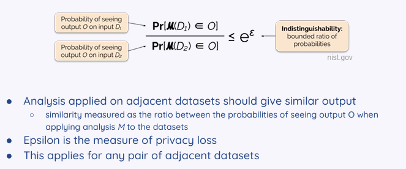

### Local Differential Privacy

* Participants add noise to their own data (perturbation) before it even leaves their device.

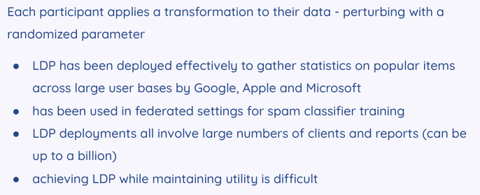

**model utility refers to the accuracy and predictive performance of the model.**

### Fairness and Privacy

**The Conflict:** Techniques used to protect privacy, such as Differential Privacy (which adds noise to data), often reduce the model's accuracy

**Disparate Impact**: Privacy mechanisms can disproportionately hurt sensitive or minority groups. Because these groups often have less data to begin with, the "noise" added for privacy can drown out their signal more than it does for the majority group.

**Potential Solution**:
By allowing the model to adapt locally to a specific user, it can overcome the biases or inaccuracies of the global model for that individual

