# Lecture 2 (Big Data Storage)

## Questions

* Why do we store data in mutliple machines and what happens in this case?
* What are the challenges we face and how we solve them?

### Why use multiple machines?
* **Scalability**: ability to cope with increased load
* **Fault-tolerance/high-availabiliy**: when a machine fails, we want the system to still be available
* **Latency**: Speed up performnace

### Quantifying Load
* Load parameters
  * Requests/sec to a web server
  * Ratio of read to writes in a database
  * Number of simultaneous users in a chatroom
* Different statistical values can be used
  * mean / median / max

#### Twitter Example
* Tweets are posted: (4.6k req/sec on average, over 12k req/sec at peak)
* Timeline traffic: (300k req/sec)

**Approach 1**:

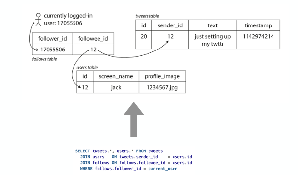
* Traditional relational database
* Difficult to keep up read load, as the joins are very costly and home timeline queries happen all the time

**Approach 2**:
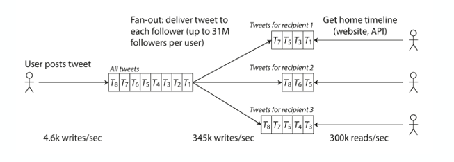
* Much faster for read requests
* The downside when someone writes, then the tweets need to be sent to all cast replicas
* When a user posts a tweet, the system immediately inserts a copy of that tweet into the timeline queue of every single follower.

---
These two approaches show the trade-off between read latency (Approach 1 struggles) and write latency (Approach 2 struggles with celebrities).

### Coping with Load
* **Vertical Scaling** (Scale up)
  * Moving to a more powerful machine 
  * Simplest solution
  * Cost grows faster than linearly
* **Horizontal** (Scale out)
  * Adding more (cheap) machines

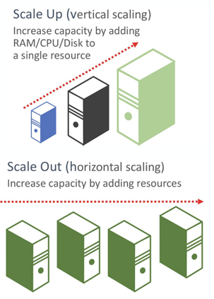

### Quantifying performance
* **Throughput**: how many units of information a system can process in a given amount of time
* **Response time**: time between user sending a request and receiving a response
* **Latency**: time to process a request

Based on these definitions: Response time includes Latency + Network travel time.

## Distributed Systems 
### Architecture
* **Shared-memory**:
  * Multiple CPUs share a single memory bus to access the same memory and disk (acts as a single machine)
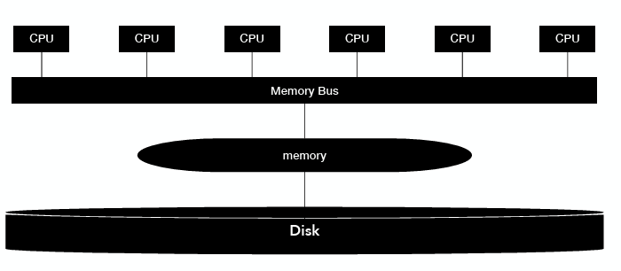
* **Shared-disk**:
  * Independent machines (own CPU and RAM) connected via network but read/write to a common central disk system
  * Commonely used in HPC for computationally intensive tasks
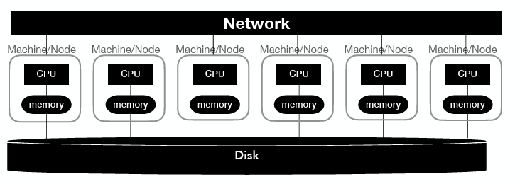
* **Shared-nothing**:
  * Each node is independent (own CPU, memory, and disk). Communicate only via the network
  * Most common architecture for big data systems
  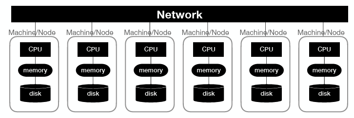

### Infrastructure deployments
* **On premises**
  * **Cluster computing**: homogenous commodity machines in a shared-nothing architectue connected via a local network (typically for large scale analysis)
* **In the Cloud**
  * **Cloud computing**: machines connected via IP network (typically different locations)
* **High-performance computing (HPC):** interconnected supercomputers with multiple CPU/GPUs in a disk-sahred architectured (computationally intensive scientific tasks)

### Cloud computing Service Models

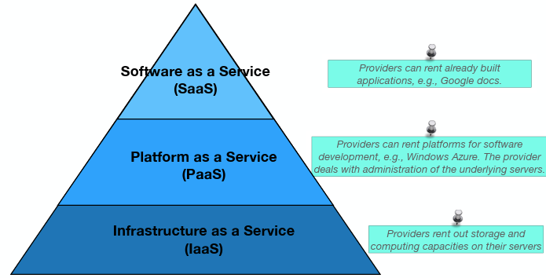
* **Infrastructure as a Service (IaaS):** providers rent out storage and computing capacities on their servers
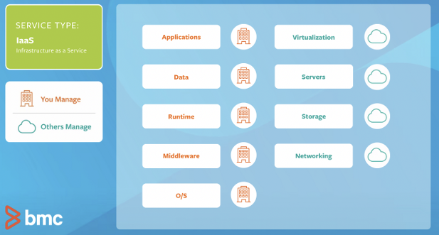
* **Platform as a Service (PaaS):** providers can rent platforms for software development. THe provider deals with administration of the underlying servers
  * Windows Azure, Google App Engine
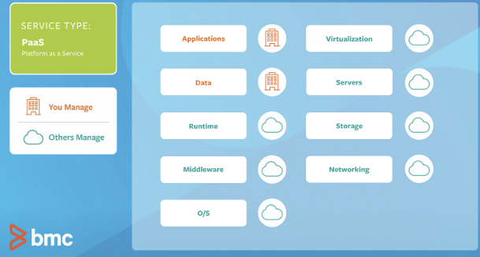
* **Software as a Service (SaaS):**  You rent finished applications. The provider manages everything (servers, code, maintenance).
  * Google Docs, Gmail
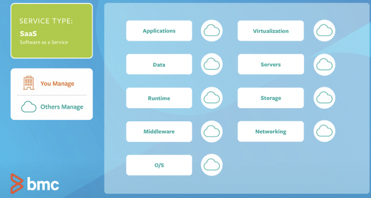
* **Function as Service (FaaS);** Also known as Serverless
  * You deploy single functions (small pieces of code) rather than a whole application.
  * Consumers can deploy and run code without having to manage any infrastructure via constrainers

Comparison with **On-premises**:
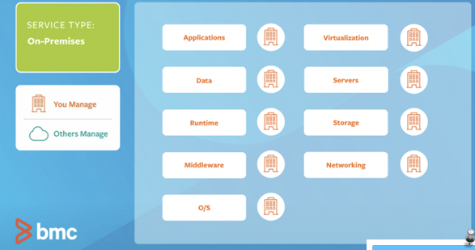

### Cluster Architecture
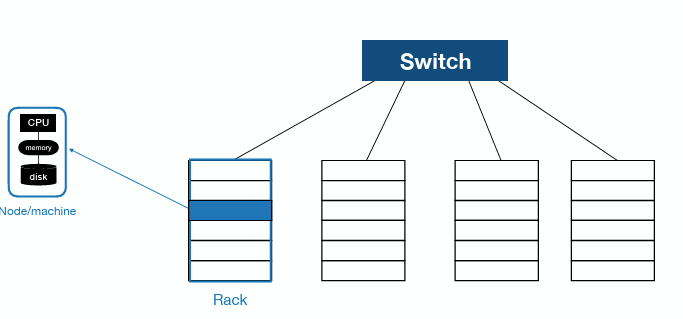
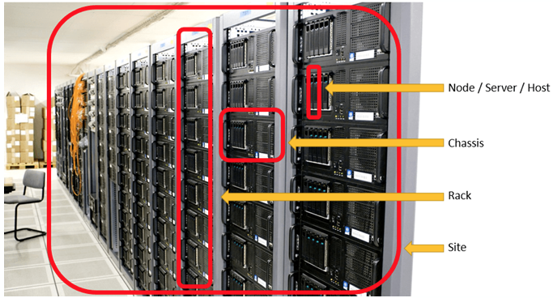

* **Node / Server / Host:** A single machine equipped with its own CPU, memory, and disk.
* **Chassis:** An enclosure or case that holds multiple nodes/servers together.
* **Rack:** A physical cabinet that stores multiple chassis/servers, typically connecting them via a "top-of-rack" switch.
* **Site:** A geographical location (data center) containing collections of racks.

### Question about Shared-nothing architecture

**A dataset arrives! How do we store it/distribute it?**

#### Data distribution across mutliple nodes
* **Partitioning**
  * 2 step process: 
    * Split data into (typically distjoint) subsets: partitions
    * Assign each parrtition to a different node (known as sharding)
  * Why: **Scalability**
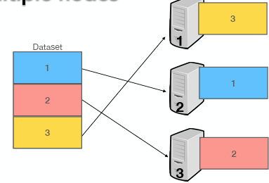
* **Replication**
  * Keep a copy of the same data on different nodes
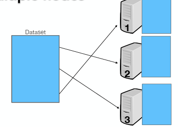

### Partitioning
**Goal of partitioning**:
* We want to distirbute the load evenly
* If a node receives much more data (skewed partitioning) than other, performance is decreased
* **Hotspot**: a node/partition with disproportionately high load

**Simplest way to do partitioning**:
* Randomly assign each data point to a node
  * *Question:* How do you know where a certain data point is located?

#### Range Partitioning
* Assume you have unique keys (key-value data model):
* Assign a continous range of keys to each partition
* Sort keys within each partition
* **Downside**: If data is not evenly distirbuted i.e ranges might not evenly spaced --> leads to **hotspots**
  
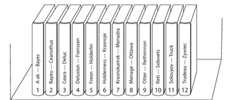

* A key-value model is commonly used in NoSQL databases a.k.a. key-value stores

#### Hash Paritioning
* Use a hash function on a key to determine the partition
* **Hash function**: 
    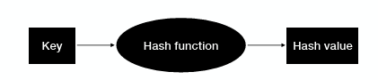
* A good function will distirbute kets evenly, even i the case of skewed data.
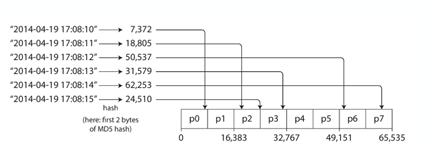

*Assume a range query. What is the problem?*
* Inefficient for range queries
* A hash function is designed to scatter data. Keys that are close together (like 20, 21, 22) are sent to completely different, random nodes.
* Because the system doesn't know which node holds which specific value in the range, it must query every single node in the cluster.

#### Hybrid Model (Partitioning in Cassandra)
* Use composite key: (k1,k2)
* **Partition Key (k1)**: Hashed to determine data placement across nodes.
* **Clusrtering Keys**: Values are stored in sorted order within each partition.
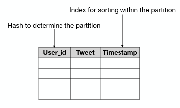

#### How to assign partition to nodes
* **Modulo Hashing**: Node ID = Hash(Key) % Total Nodes
* **Hash Range**: Value Range determies the node; P_i =($b_i \leq hash < b_j$)
  
**What if the number nodes N change?**

#### Why Rebalancing partitions
* Query throughput increases —> add more resources
* Dataset size increases —> add more resources
* Machines fail —> add new machines

Move data from one node to another —> rebalancing/repartitioning
**Requirements after rebalancing**:
* Load should be evenly distirbute
* System should continue to operate
* Minimize data movement (minimize network and disk I/O)

#### Rebalancing with fixed number of partitions

The number of partitions does not change, nor does the assignment of keys to partitions. The only thing that changes is the assignment of partitions to nodes.

* e.g., cluster with 10 nodes, 100 partitions per node
* If a new node is added, move partitions from other nodes until evenly distributed

#### Rebalancing with dynamic partitioning
* Works better for **range partitioning**
* When a partition exceed a configured fixed size, split into two partition.
* Vice verca; if a partition becomes too small, merge it with another

**Issue**:
* Since partitions are created only when a size threshold is hit, a small dataset might stay as a single partition
* In a 10-node cluster, 1 partition means 9 nodes sit idle while 1 node does all the work.
* Solution: Pre-spliting
  * Instead of starting with one empty partition, you define an initial set of empty partitions across all nodes.

#### Rebalancing proportionally to nodes
* Fixed number of partitions per node
* For stable number of nodes, the size of partitions increases proportionally to the dataset size
* When adding a new node, the node chooses randomly partitions from other nodes to split and assigns half of them to itself

#### Request routing: How to get access to the right node?
**3-main strategies**
* **Node-based routing**: The cleint contact any random node. The node knows which node has the data, and forwards the request to the correct one.
* **Routing Tier**: All requests go to a routing tier. Which knows the full partition, and routes the request.
* **Client-side Routing**: The client intself known the partition map.

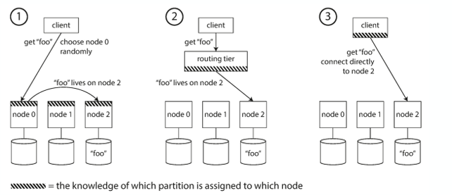

#### Zookeeper
**Zookeeper** acts as a source of truth
* ZooKeeper maintains the dynamic map of which partitions live on which physical nodes.
* Routing tiers or clients subscribe to ZooKeeper to receive instant updates when nodes join, leave, or rebalance.

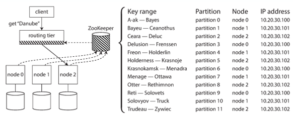

### Replication
* Keeping a copy of the same data on multiple machines connected via a network
* Assumprtion: dataset fits in 2 node

**Why?**:
* **Reduce latency**: keep data geographically close to your users
* **Increase avaialability**: System continues working even if some nodes have failed
* **Increase throughput** Scale out nodes that can serve read requests

**Problem**:
* The dataset changes!

#### Leader-based replication
* **Replica**: copy of the data
* How to ensure that all data ends up to all replicas
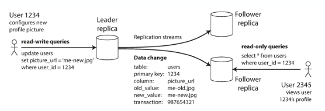

##### Synchronous vs. Asynchronous Replication

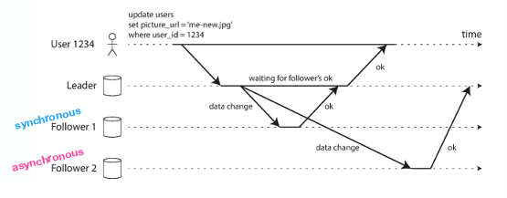

**Synchronous:**
* Follower has an up-to-date copy
* Bottleneck if the follower does not response (e.g., crashed)

**Asynchronous:**
* Higher write throughput
* Weak durability (as writes may be lost)

*What if a read happens from  from a “slow” follower*

##### Replication Lag
* Asynchronous follower that has fallen behind —> stale results —> inconsistency 
* **Eventual consistency**: database will be consistent at some point
  * However, stricter consistency models exist.

#### Consistency Models
**Read-Your-Own-Writes Consistency**
* **The Problem:** You post a comment, refresh the page, and it’s gone because your read hit a stale replica that hasn't synced yet.
* **Solutions:**
  * Read from Leader: Always route reads for the user's own data to the leader node
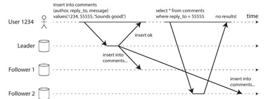

**Monotonic Reads Consistenc**
* **The problem:** You refresh a feed and see a post, but a second refresh makes the post disappear (moving backward in time) because you hit a fresh replica then a stale one.
* **Solution:** 
  * Replica Pinning: Ensure a specific user always reads from the same replica
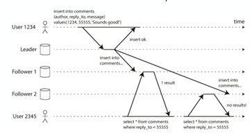

**Consistent Prefix Reads:**
* **The Problem:** Causality is broken; an answer appears before the question because different parts of the data are replicated at different speeds.
* **Solution**:
  * Causal Ordering: Ensure that if one write depends on another, they are always read in the same sequence.
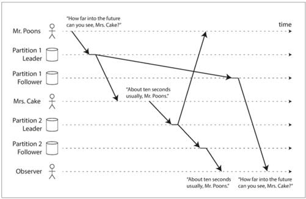

### Approached to replication
* **Single-leader replication**
  * Writes to the leader
  * Reads from any replica 
* **Multi-leader replication**
  * Writes to any of the multiple leaders
  * Reads from any replica
* **Leaderless replication**
  * Write to several nodes
  * Read from several nodes in parallel to update stale data

---
### Reflection Question
Would it be possible to combine partitioning and replication?
* If yes, how and what would be the reason?
* If not, why?

In this hybrid model, each record belongs to exactly one partition, but that partition is stored on multiple nodes.
* **Partition:** The dataset is split into chunks (shards) across different nodes for scalability.
* **Replicate:** Each individual chunk is copied onto other nodes to ensure it isn't lost if a node fails.
* A single physical node often acts as the Leader for one partition and a Follower for several others.

Results in system that is: **Scalable while remainly hihghy fault tolerant**

---

