# Lecture 3 (MapReduce & Hadoop)

## Distributed Systems to Big Data Systems

Working with distirbuted systems is totally different from writing software on a single computer

**Problems with distributed systems:**
* Non-deterministic behavior
* Partial failures
* Debugging becomes very hard
* High probability of variace in runtime/throughput performance

### Google Cluster Idea (2003)

* Failures are the norm
* Data is growing: either large files or billions of small files
* Append-only instead of overwritting
  * Random write are paractically inexistent

**Goal**: throughput and not peak performance 
  * Individual, single task vs. Batch 

### Need for new tools
**Distributed File Systems (DFS)**
  * Store petabytes of data in a cluster
  * Transparently handle fault-tolerance and replication
**Parallel Processing Platforms**
  * Offer a programming model that allows developers to easily write distributed applications
  * Alleviate developer from handling concurrency, network communication, and machine failured

## Distirbuted File System (DFS)

Files should be: enormous and rarely updates
  
* Stores very large data files efficinelty and reliable.
* Files are partitioned into ficed-sized chunks (e.g., 64MB)
  * Stored as Linux files
* Chunks are replicated (typically three times)

### Google File System (GFS) architecture
* Single master, multiple chunk servers
* Master (Coordinator)
  * maintains a map of where data lives (which chunk servers holds which specific chunk of a file)
* Chunk Servers (Workers)
  * Store actual data. Files are split into fixed-size chunks
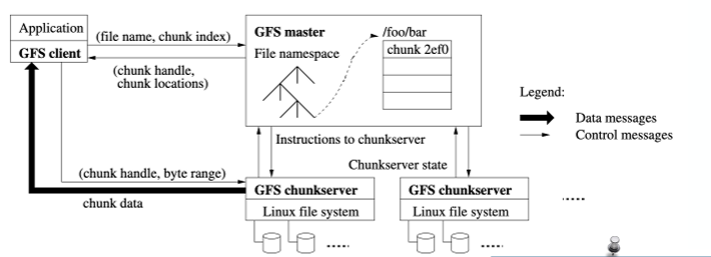

Master is a potential single point of failure / also a scalability bottleneck
* Solution: use shadow masters; secondary master servers that provide highly available, read-only access to the file system when the primary master fails

## Hadoop Distributed File System (HDFS)
* Distributed file systems help manage the storage across a network of machines
* HDFS is Hadoop's flagship filesystem

#### HDFS Block
* HFGS stores very large files
* Files are **split** into block-sized chunks (by default 64MB)
  
With this Block abstraction:
* **Files larger than a single disk:** By splitting a file into blocks, the pieces can be stored across many different machines. This means a single file can be larger than the storage capacity of any individual hard drive in the cluster.
* **Larger than disk blocks:** Standard filesystem blocks are tiny (kilobytes), but HDFS blocks are massive (64MB default).
* **Simplified storage:** Because the blocks are so large, there is much less metadata (file information) to manage.
* **Replication:** Each block is copied to multiple different nodes (usually 3). If one server crashes (fault tolerance), the data is still safe and accessible from a copy on another server (availability).

#### HDFS Architecture
Two types of HDFS nodes:
* One **namenode**; the master
* Multiple **datanodes**; (workers)


#### Namenode
* Manages the namespace: maintaining the hirarchy of files and folders.
* Critical information like the file names, directory structure, permissions, and file-to-block mapping
  * Stored persistently
* Block location; The exact location of which Datanode holds a specific block
  * Stored in memory/transiently


#### Datanode
* Stores and retrives data blocks
  * When ewequests from either clients or namenode
  * Also sends list of stored blocks periodically to namenode

#### Load Balancing 
A client sends a request saying "I would like to have block 4!".

* In HDFS, Block 4 does not exist on just one machine.
* To ensure fault tolerance, every block is replicate (copied), typically 3 times across different Datanodes.

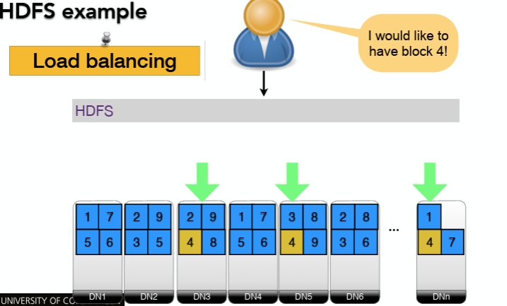

**Load Balancing**:
* Utilizing these replicas to prevent bottlenecks
* If Datanode  is busy serving other users, the client can retrieve block 3 from another datanode instead. 

### Replicas Placement/Strategy
**Take a typical cluster configuration**

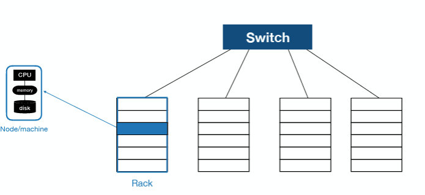

**Goal**:
* Reliability: Data survives even if a whole rack goes offline
* Write and read bandwidth: Minimizes "inter-rack" traffic (expensive) in favor of "intra-rack" traffic (fast)
* Block distirbution: Spreads blocks across the cluster 

The default strategy is: 
* First replica: placed on client node (maximixes write bandwidth)
* Second replica: Placed on a random node in a different rack (off-rack).
  * Ensures reliability; even if the entire first rack fails, the data is still safe
* Third: Placed on the same rack as the second, but on a different node.
* More replicas: Randomly placed

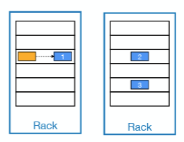

## MapReduce and Hadoop

### What is it?

**MapReduce**: A programming model
* Follows a funcional programming style
* Users specify Map and Reduce functions
* Expressive

**Hadoop**: An associated implementation, that executes the MapReduce model
* Automatically parallized
* Automatically handles complex distirbuted work: paralellization, data partitioning, load balancing and failure recovery.
* Can handle very large datasets in clusters of commodity computers

### MapReduce in a Nutshell
* The framework reads lots of data (splitting them into chucks)
* Map: Process a data item (key/value pair) and outputs intermediate results
* The system sorts and shuffles
* Reduce: Takes a key and a list of values, aggregating, summarizing, filter, transforms and produces a final result. 
* Write results back to storage

---

Simple API
* Map (key, value) —>  {ikey, ivalue} 
* Reduce (ikey, {ivalues}) —> (key’, value’) 

**Map Phase**: independent processes (mappers) which run in parallel
* Operate on chunks (blocks) of input data
* Outputs intermediate results

**Shuffle Phase**: Intermediate results are shuffled through the network

**Reduce phase**: Independent processes (reducers) which run in parallel
* Group intermediate results of the map phase
* Operate on the groups
* Output final result

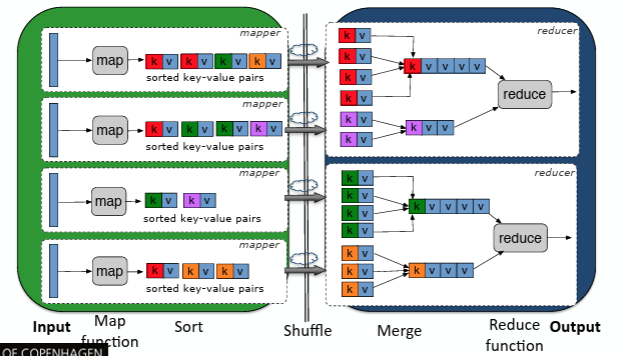

### Word Count Example

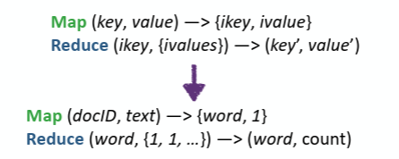
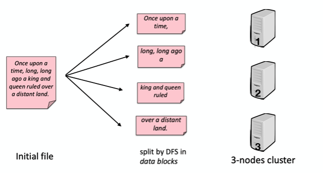
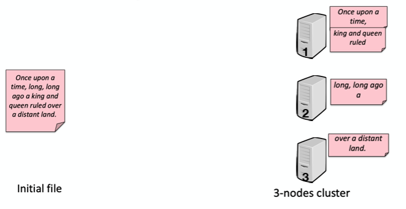
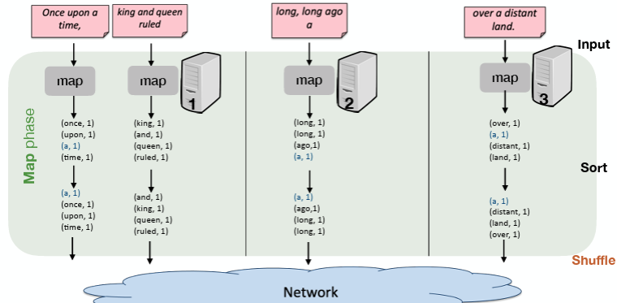
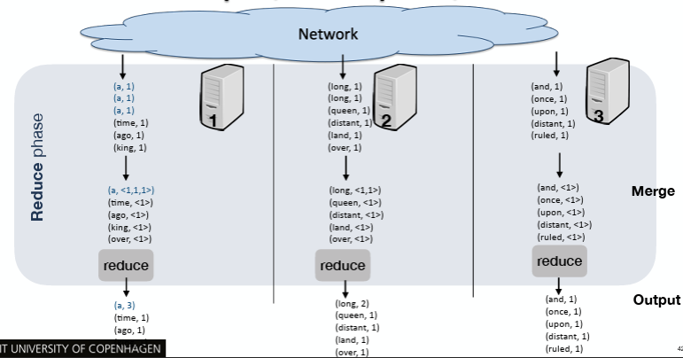

**WordCount Pseudocode**:
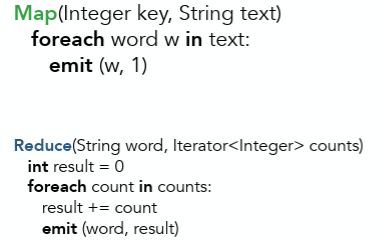

* Only 63 lines for a distirbuted/parallel application

---

* The system takes a large text file ("Once upon a time...") and splits it into data blocks across 3 different nodes
* Each node runs the Map function on its local text simultaneously. For every word found, emit (word, 1)
* Before the Reduce phase; Each node sorts its own list alphabetically (e.g., (a, 1) moves to the top)
* The system moves data across the network. It guarantees that all occurrences of a specific word (key) are sent to the same Reducer.
* The Reducers receive the grouped data as a key and a list of values: (word, [1, 1, 1...]) .
* The final output is a list of unique words and their total frequency across the entire original file.

### Reflection Time (Questions)

*Compute the total price of the products  for each product type available in store 10.*
* prodId, prodName, prodType, price, storeId
* select prodType, sum(price) from products where storeId = 10 groupby prodType
* How you would implement it in MapReduce?

```
map(products, <prodId, prodName, prodType, price, storeId>)
{
	if tuple[4] == 10 
		emit(tuple[2], tuple[3])
}

reduce(prodType, Iterator<Long> prices)
{
	long result = 0
	for p in price
		result += p
	emit(prodType, result)
}
```

### Combiner

* It acts as a "mini-reducer" that runs locally on the Mapper node immediately after the Map phase

Example: 
* instead of sending every single key-value pair across the network (e.g., sending (word, 1) three times), it pre-aggregates them locally into a single pair (e.g., (word, 3)).
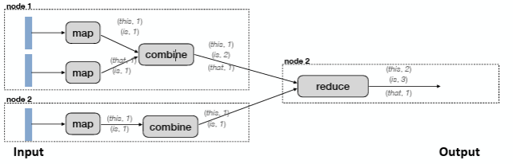

**Benefits**:
* Reduces network bandwidth
* Reduces work on Reduce phase
* Reduce function must however be **associative and commutative**. The math must still yield the same result whether alculated all at one or in partial batches

### SQL in MapReduce
* MapReduce is power enought to run basic SQL queries
  * Although that's not its original intention

#### Joins in MapReduce
Two main strategies:
* Symmetric hash join (repartition join)
* Replicated join (broadcast join)

#### Repartition Join

Best for: Joining two large datasets
* Map Phase: Emits the join column as the key and the full row as the value
* Shuffle Phase: The framework "repartitions" the data, grouping everything by the join key. This guarantees that all matching records from both tables end up at the same Reducer.
* Reduce Phase: The Reducer receives the lists for that key and performs the actual join (matching logic)


#### Broadcast join
Best for: Joining a large table with a small table
* The small table is copied ("broadcast") to every Mapper node
* Map Phase: Each Mapper holds the entire small table in memory. It reads chunks of the large table and performs the join locally (Map-side join)

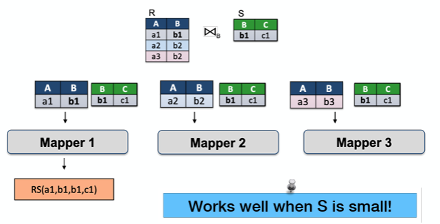

## Hadoop/MapReduce under the hood

### Parallelization in MapReduce
* Application of the user-defined Map() on a data item, is not influenced by computation by computations on other data items. (Often)

This allows it to be **embarassingly parallel**
* Implies we can re-order or parallelize execution
* Note: obviously not true when the Map() function has side-effects or a state

**This property forms the basis for MapReduce**

### Under the hood

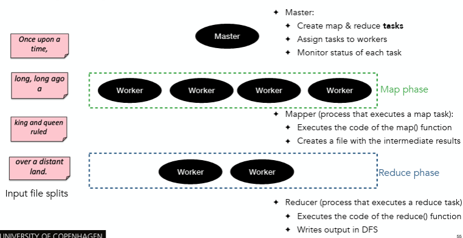

* **The Master (JobTracker):** The "boss." It creates map/reduce tasks, assigns them to workers, monitors progress, and handles failures
* **The Workers (TaskTrackers):** The "employees." They execute the actual code (Map or Reduce functions) and store results.
* **Mapper (process that executes a map task)**:
  * Workers read their assigned Input Splits (chunks of data)
  * They run the map() function and write intermediate results (temporary files) to their local disk
* **Reducer (process that executes a reduce task)**: 
  * Workers run the reduce() function on the sorted data.
  * They write the final ouptin the distirbuted file system 

### Hadoop Architecture

* **Jobtracker:** client communication, job scheduling, resource management, lifecycle coordination 
* **Tasktracker:** task execution and management

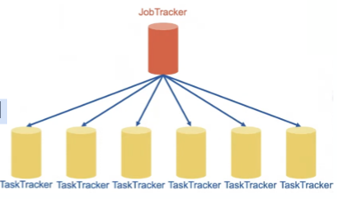
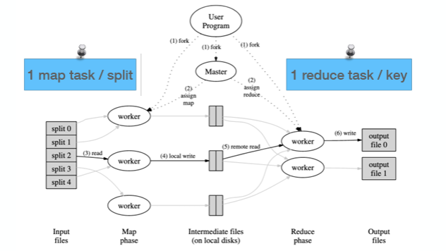
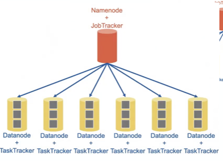

### Data locality
Goal: run map task on machine that stores input chunk
* Then map task reads data locally (local fetch)
* Thousands of machines can read at local disk speed; read rate not limited by network

### Different types of map tass based on locality

* Local map task (a)
* Rack-local map task (b)
* Off-rack map task (c)

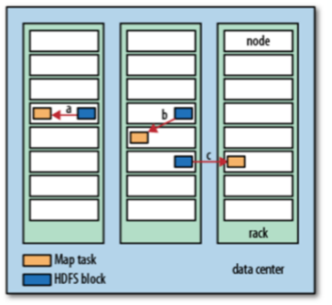


