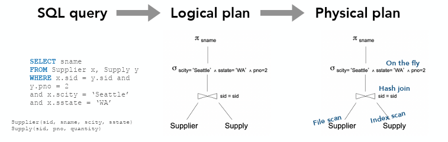
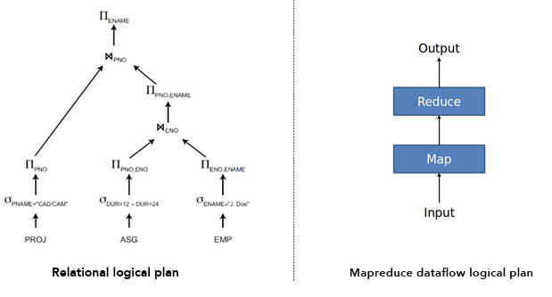
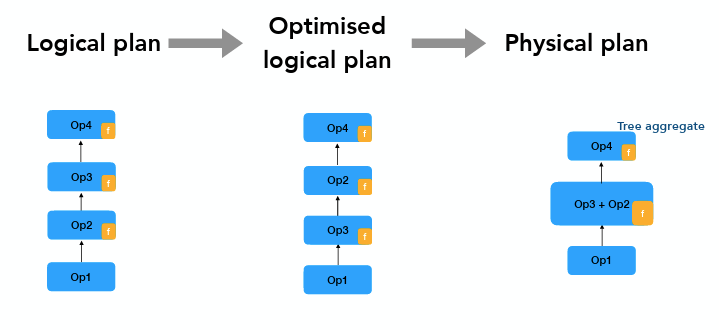
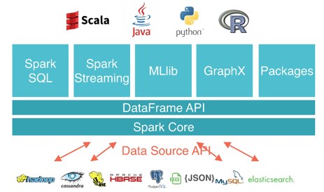
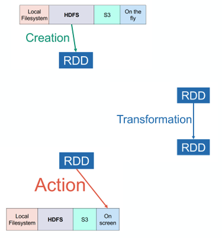
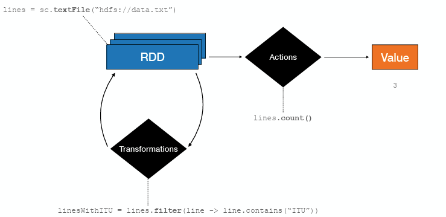
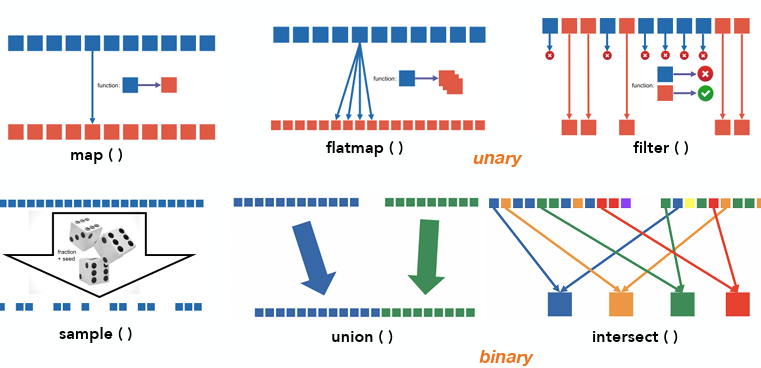
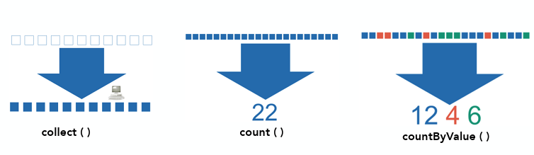
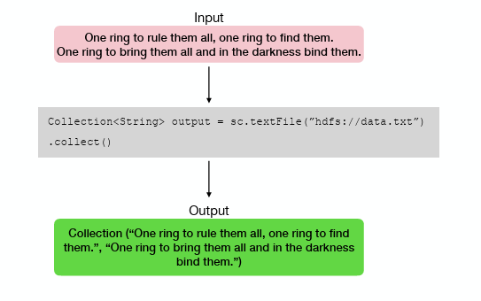

# Lecture 4 (Dataflow engines and Apache Spark)

## Problems with MapReduce
**Benefits**:
* Automatic Parallelization: Runtime automatically distributes processing across clusters.
* Fault Tolerance: Robust handling of machine or component failures during execution.
* Simplicity: Simple interface requiring only Map and Reduce function definitions

**Limitation**:
* Real-world applications often need multiple Map-Reduce jobs
* Programability
  * Complex logic requires chaining multiple jobs, which results in boilterplate/spaghetti code
  * Custom code even for common operations
* Performance
  * Heavy on disk (I/O heavy)
  * No execution optimization across multiple chained jobs

## How to improve MapReduce?

**Direction 1:** Higher-level languiages
* Write programs in higher-level language
* Programs are "transformed into" MapReduce job(s)
* This mainly addresses programability
* Examples: Hive, Pig Latin

**Direction 2:** Dataflow engines
* Build a more suitable execution Envrioment
* Adresses perfromance
* Apache Spark, Apache Flink

## Dataflow Programming

**Imperative Programming**
* There is a focus on control flow
* Data at rest; Data sits in memory variables while the program moves from line to line (control flow) manipulating it
* **Limitation:** Hard to parallelize

**Dataflow Programming**
* There is a focus on data flow; dependencies "Output B comes before Input A"
* Program at rest: Operators (code) stay defined in place, and data streams through them
* Modelled as directed acyclic graph (DAG)
  * Vertices = operators
  * Edges = inputs and outputs
  * Operators are "black boxes"

### Typical optimziation workflow in a database



* SQL Query (Declarative)
  * Users write code describing what data they want (not how)
* Logical Plan
    *  The system translates the SQL into a tree of mathematical operators (Relational algebra)
* Physical Plan
  * The specific execution strategy chosen by the optimizer

### Example (Logical) dataflow



### MapReduce as a dataflow

MapReduce is essentially a dataflow engine with only one valid pattern

* Two operators, fixed logical dataflow
  * Operators are parameterized by User Defined Functions (UDF)
  * The "Map" and "Reduce" stages are generic containers. You provide the specific logic (function f) that runs inside them.
* Automatic parallelization at runtime
  * At runtime, the engine determines the physical dataflow (e.g., creating 1,000 mapper instances and 50 reducer instances) based on data size.

### Beyond MapReduce
Dataflow engines push this idea further
* Keep UDFs
* Add more operators (filter, join, groupby)
* Improve implementation (processing data in memory rather than writing to disk after every step; a major bottleneck in MapReduce)
* Add logical/physical optimizations (reordering operations/choose the best algorithm for task) 

### Dataflow engines in a nutshell
* Programmers provide logical dataflow
  * operators, function parameters, connection
  * using high-level langauge (distinct from SQL)
* A dataflow engine creates a physical dataflow
  * includes logical optimization and physical optimizations
* This is executed on a cluster
  * With automatic parallelization and failure handling

#### Optimization workflow in a dataflow engine
**Logical Plan**: Chain of operators  (Op1 $\to$ Op2 $\to$ Op3 $\to$ Op4) defined by the user code.
**Optimized Logical Plan**: The engine restructures the graph for efficiency (e.g., reordering operators) without changing the result
**Physical Plan**: Specific implementations are chosen (e.g., replacing a generic aggregation with a "Tree aggregate"). Or operators are fused to reduce overhead.



## Apache Spark
* A "unified analytics engine for large-scale data processing"




### Spark's Goal
* Support Iterative Jobs: targeted at Machine Learning algorithms by enabling the reuse of datasets across parallel operations.
* Support Interactive Analytics: keeps data in memory for faster query responses.
* Retain MapReduce Strengths: maintains high scalability and fault tolerance.
* Fault Tolerance via Lineage: uses "lineage" (a history of transformations) to automatically reconstruct lost data partitions instead of reloading from disk.
* Increase Programmability: offers a functional programming interface to simplify code

### Core Abstraction: RDD

**Resilient Distributed Dataset**
* **Immutable:** Read-only, partitionned collections of objects 
* **Partitioned:** Data is split into chunks distributed across the cluster (stored in RAM or on disk)
* **Parallel:** Built through parallel coarse-grained transformations
* **Fault-tolerant:** Automatically rebuilt on failure using lineage (the history of how the RDD was built)

Developers write programs by defining operations on these distributed datasets.

### Spark Operations

* Creation (Data $\to$ RDD): Creates an RDD from external input data
* Transformations ($f(RDD) \to RDD'$)
  * Lazy Execution: Computation is not performed immediately
  * Examples: filter, map, groupBy
* Actions ($f(RDD) \to \text{object/value/action}$):
  * Triggers Computation: Forces the execution of the preceding transformations
  * Examples: count, collect, save



**Example**:



### Creating RDDs
* From Existing Collection: Parallelize a single-node collection (e.g., a List) already in memory (sc.parallelize(data))
* From External Sources: Reference an external dataset (e.g., HDFS, local file) (sc.textFile("hdfs://data.txt"))
* From Other RDDs: Created by applying a transformation to an existing RDD (lines.map(s -> s.length))

### Transformation

**Definition:** Operations that take an existing RDD and produce a new RDD.

**Lazy Execution:** They are not computed immediately; computation is deferred until an action is called

#### Common Transformations

**Unary (1 RDD):** takes a single RDD as input
* map(): Applies a function to each element, returning exactly one output element per input ($1 \to 1$)
* flatMap(): Applies a function to each element, returning 0, 1, or more output elements ($1 \to 0..N$)2
* filter(): Returns a new RDD containing only elements that satisfy a specific condition.
* sample(): Creates a random sample of the RDD based on a fraction and seed.
**Binary (2 RDDs):** takes two RDDs as input
* union(): Merges the elements of two RDDs into one.
* intersect(): Returns a new RDD containing only elements found in both input RDDs.
**Key-Value Pair Specific:**
* groupByKey(): Groups all values associated with a specific key ($(K, V) \to (K, \text{Iterable}[V])$)
* reduceByKey(): Aggregates values for each key using a user-defined function ($(K, V) \to (K, V)$)



### Actions

**Definition**: Operations that take an RDD and return a single value
* Triggers the computation of preceding lazy transformations

#### Common Actions
* reduce(func): Aggregates elements using a function (e.g., summing numbers) to produce a single result.
* collect(): Returns all elements from the distributed RDD.
* count(): Returns the total number of elements in the RDD.



### RDDs Examples




### Reflection Time (Question)

Compute the total price of the products  for each product type available in store 10. 

**How you would implement it in Spark using RDDs?**

Schema: prodId, prodName, prodType, price, storeId

SQL query:
```
select prodType, sum(price) 
from products
where storeId = 10
groupby prodType
```

Spark Implementation using RDDs:
```
lines = sc.textFile("hdfs://...products")         // 1. Load
    .map(s -> s.split(","))                       // 1. Parse
    .filter(rec -> rec[4] == 10)                  // 2. Filter Store 10
    .mapToPair(rec -> new Tuple2(rec[2], rec[3])) // 3. Key: Type, Val: Price
    .reduceByKey((a, b) -> a + b)                 // 4. Sum Prices
    .collect()                                    // 5. Action
```