# Lecture 5 (Spark under the hood)

## Recap

### Spark as a dataflow engine
* Spark has RDDs and operators
* Can be viewed as a dataflo0w engine
  * An RDD job corresponds to a logical dataflow
  * Transformations combine/add operators to dataflos
  * Actions compile and execute a dataflow

Note: An RDD is not really a collection of values.
* Instead a dataflow produces a collection of values when executed.

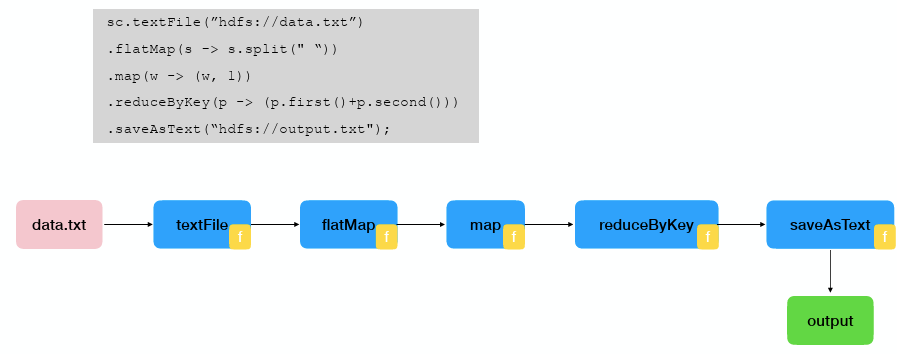

## Spark Under the Hood

### RDD is an Interface

* Abstract class in Scala (RDD[T])

Definition: An abstract class (RDD[T]) representing a distributed collection of items.

Purpose: Provides the information Spark needs to build an optimized parallel execution plan.

Consists of: 
1. List of partitions (= blocks/splits in MapReduce/Hadoop)
2. List of dependencies on parent RDDs (This forms the lineage, allowing Spark to reconstruct lost partitions in case of failure)
3. Function to compute a partition from its parents 
4. (Optional) a partitioner (hash, range); defines how elements are distributed across nodes
5. (Optional) preferred locations for each partition

#### Example: FilteredRDD

Definition: The specific RDD created when you apply a filter() transformation to an existing RDD
* Takes an RDD and filters it using a predicate  

1. Partitions: same as parent RDD
2. Dependencies: “one-to-one” on parent
3. Compute(partition): compute parent and filter it
4. PreferredLocations(partition): none (ask parent)
5. Partitioner = none

### Fault-tolerance via lineage

Spark uses the lineage information stored in RDDs (the list of dependencies and compute functions) to handle failure

* If a partition is lost (e.g., a node fails), Spark re-executes only the steps needed to reconstruct that specific partition, rather than restarting the entire job.

**Transparency:** This recovery process happens transparently to the user; the system automatically detects the failure and schedules the re-computation

### Spark Architecture

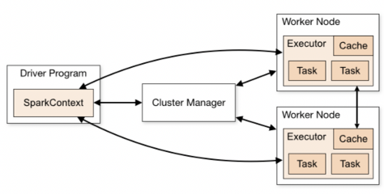

**Drive Program**
* The process running the main() function of the application
* Holds a SparkContext
* Submitas job to the Cluster Manager

**Cluster Master**
* Manages the cluster workers and launches executors

**Worker Nodes**
* Cluster workers are the machines in the cluster that perform the actual work
* Executors are tasks that run tasks
* Tasks can run in parallel (one per partition)

### Spark Execution Model

**Local Mode (Pseudo-cluster):**
* Single JVM: The entire application runs in a non-distributed manner within a single Java Virtual Machine on one computer

**Cluster Mode**
* Distributed: The standard deployment where the application is spread across multiple machines

### Spark Cluster Execution

This is the standard method to deploy Sprk in a private cluster
* Spark is agnostic to underlying cluster manager: Apache Mesos, Hadoop Yarn, Kubernetes etc.

* Driver by efault is where the client application is.

---

Spark applications are run as independent sets of processed, coordinated by a SparkContext in a driver program (process running main())

**Resource Allocation:**
The Driver connects to the Cluster Manager which allocates resources 

**Executors: **
Each worker in the cluster is managed by an executor
* The executor amanges tasks computation, as well as storage and aching on each machine. 
* Tasks are launched in separate threads, typically one per core but can be configured.

---

The application code is sent from the driver to the executors (happens whern there is an action)

**Communication:**
* Application code is sent from the Driver to Executors **only when an action occurs**
* The Driver must remain active to listen for and accept incoming connections from Executors throughout the application's lifetime

### Spark Terminology

**RDD (Resilient Distributed Dataset):** A distributed dataset containing extra information (like lineage) for fault tolerance and execution

**DAG (Directed Acyclic Graph):** A logical graph representing the sequence of RDD operations.

**Task:** The smallest unit of work; it runs in one executor and processes one partition of data.

**Job:** A collection of tasks triggered and executed when an action (like count() or collect()) is called.

**Stage:** A subset of tasks within a job that can run in parallel without network communication (i.e., no data shuffling is required).

### Execution Process

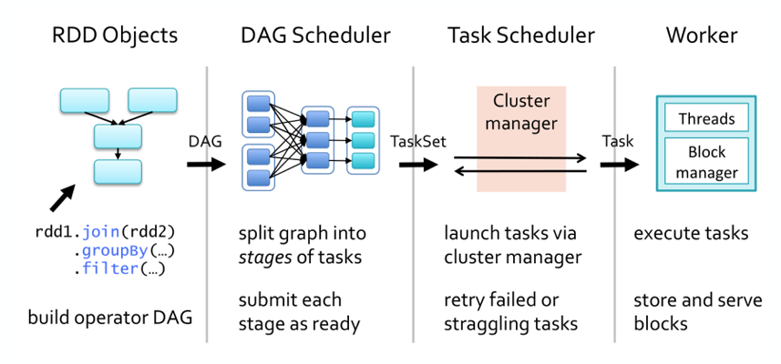

**RDD Objects**:
* User code (e.g., join, groupBy, filter) builds a logical graph of RDD objects and operations
**DAG Scheduler**
* Takes the DAG and splits the graph into stages of tasks
* Submits each stage for execution as soon as its parent stages are ready.
**Task Scheduler**
* Receives a TaskSet from the DAG Schedule
* Launches tasks via the Cluster Manager.
* Handles fault tolerance by retrying failed or "straggling" (slow) tasks
**Worker**
* Receives individual Tasks
* Executes tasks inside threads.
* Uses a Block Manager to store and serve data blocks.

### Execution Plans Concepts

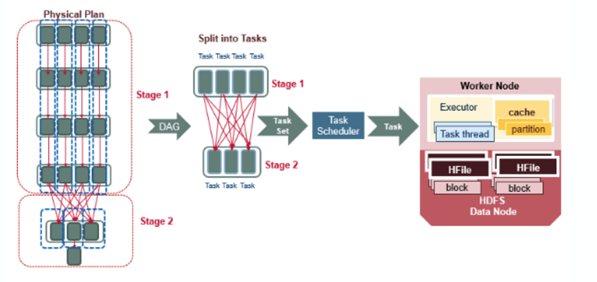

**Logical to Physical:** When an action (like collect) is called, Spark translates the logical RDD operations into a physical execution plan

Multiple operations can be merged into a single task.
* Each task fetches its input, performs some operations, and produces output

**Stages:** Tasks are grouped into stages
* Tasks wiothin a stage can be computed witohut data movememnt/shuffling
* Between stages, data movement is (often) necessary
  * A new stage is required when data must move across the network (shuffling)

**Pipelining:** Communication within tasks i.e within stages

**Network** Communicartes between stages requires network

**Storage:** Spark prioritizes buffering data in memory for speed, only writing to disk if the data is too large (unlike Hadoop MapReduce, which always writes to disk)

### Spark's Parallel Processing

* **Sorting:** Spark implements a parallel sort using range partitioning, distributing data so that ranges of values end up on specific nodes
* **Joins:** By default, Spark performs a parallel hash join, where data from both tables is hashed on the join key and sent to the appropriate nodes.
* **Grouping (groupByKey):** This operation repartitions the data across the cluster based on the grouping key (using a hash function by default, though this is customizable).
* **Pre-aggregation (reduceByKey):** Unlike groupByKey, reduceByKey aggregates data locally on each machine before shuffling it across the network. This significantly reduces network traffic.

Spark tracks how data is partitioned.
* **Local Joins:** If two datasets are already co-partitioned (partitioned by the same key in the same way), Spark can join them locally without moving data.
* **Skipping Shuffles:** If data is already partitioned by the required key, Spark "understands" this and skips the expensive shuffling step.

### Reusing Computation

Intermediate results can be cached.
* If you define an RDD and call .collect() on it twice, Spark actually runs the entire job two times .
* You can call .cache() (or .persist()) on an RDD to save its intermediate results

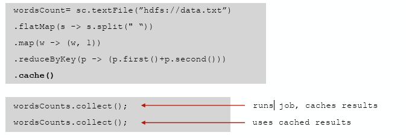

### Data Sharing in MapReduce vs. Spark

**MapReduce:** Shares data between steps by writing to HDFS (Disk). This is slow due to replication, serialization, and disk I/O.

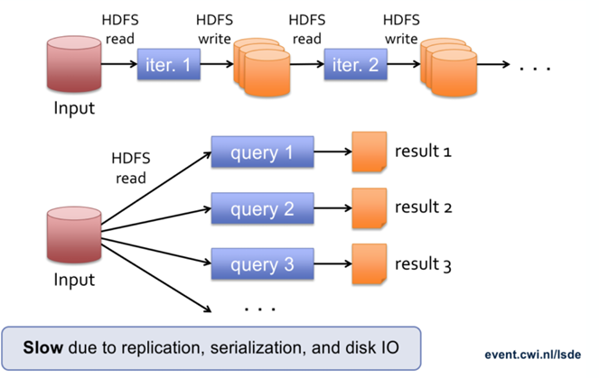

**Spark:** Shares data via Distributed Memory. This allows for one-time processing and is approximately 10x faster than using network and disk

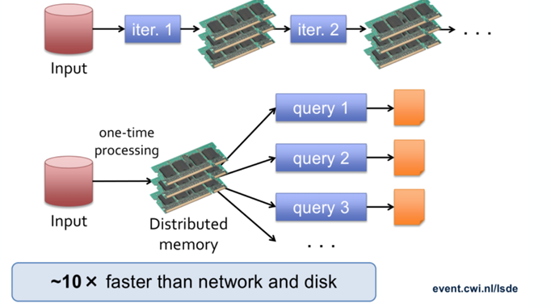

*What is meant by Distributed Memory?*
The large dataset is split into partitions (blocks). Each worker stores only the specific partitions assigned to it in its own local memory

### Log Mining Example

Load error messages from a log into memory, then  interactively search for various patterns

**The Takeaway**
By loading and filtering the relevant data into memory once, you can run multiple different queries on it almost instantly.
* Only the first .count() is expensive, as this is where the execution starts, and spark must read the data from disk. Any Subsequent .count are cheap, as SPark sees that the data is already stored in Cache, and skips reading from disk entiely and reads cirectly from RAM.

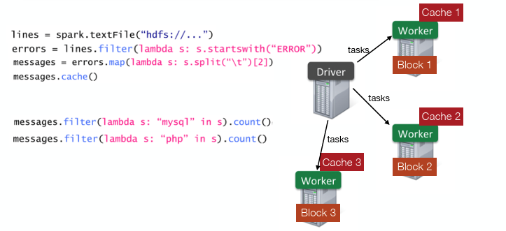

### Bike Sharing Example

**The Problem:**
You have a dataset of bike station readings (Station ID, time, # of bikes, # of free slots)

**Goal:**
Calculate the percentage of "critical situations" for each station.
* **Critical:** When a station has fewer than 3 free slots (it is full or nearly full)
* **Formula:** $\frac{\text{Count of Critical Readings}}{\text{Count of Total Readings}}$ per station 3.

---

**Naive Solution**:

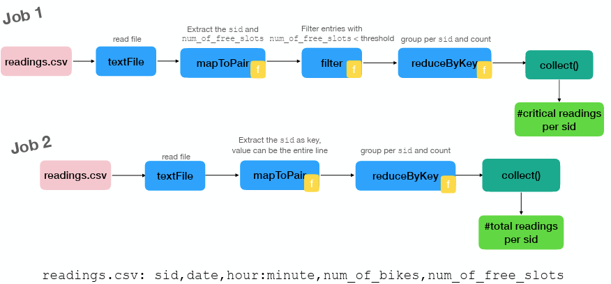

splits the work into two separate Spark jobs: Job 1 calculates numerator and Job 2 calculates denominator

The slides visually highlight the problem with this approach using execution plans (Slide 44-46):
* Double Disk I/O: Job 2 triggers a second full read from the same readings.csv (as Job 1)

**How can we optimize this?**
* Calculate both the "Critical Count" and the "Total Count" while reading the file from the disk only once
* If the station is Critical: You write down (1, 1)
* If the station is Safe: You write down (0, 1)
* Sum these up; example sum (2,3) and that station was critical 2 times out of 3 total readings

## Spark APIs

### Spark dataframes

**Dataframe**: an RDD of rows organised in named columns (conceptually equivalent to a table in a relational database)

* Similar to relational tables, pandas dataframes
* Created from file, RDD, etc.
* Variety of data types: vectors, text, images, …
* Special DSL; e.g., data.groupBy(”dept”).avg(”age”)
* Can push some operations to data sources (e.g., DBMS)
* Can be stored efficiently column by column

**Internals**
* Represented internally as a logical dataflow plan
* Lazyly executed
* OPtimized by a query optimized
* Schema inference (e.g., detecting integers vs strings vs. booleans)

**Schema inference**

Can infer schemas automatically from files like CSV or JSON (e.g., detecting integers vs strings) using inferSchema=True
* If no schema is provided or inferred, all columns default to strings.

### Spark's machine learning library (MLlib)

Spark includes a scalable library for machine learning containing algorithms for classification, regression, clustering (K-means), and recommendation systems.

**Key Algorithms:**
* Classification: Logistic regression, Naive Bayes, etc..
* Regression: Generalized linear regression, survival regression.
* Recommendation: Alternating Least Squares (ALS).
* Clustering: K-means, Gaussian mixtures (GMMs)

**The End-to-End ML Process (Pipelines)**
Spark MLlib standardizes the machine learning workflow into a Pipeline:
* Feature Transformations: Pre-processing steps like standardization, normalization, and hashing.
* Pipeline Construction: Chaining transformations and algorithms together into a single workflow.
* Evaluation & Tuning: Automatically evaluating models and tuning hyper-parameters.
* Persistence: The ability to save and load entire models and pipelines to disk

### Spark SQL

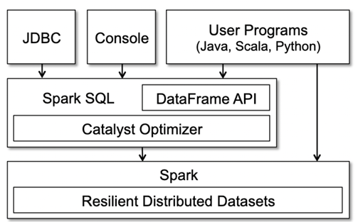

A library on top of spark.

* Spark SQL: A module that allows you to run SQL queries directly on DataFrames

* Unified Performance: Unlike RDDs (where Python is often slower than Scala), DataFrames in Python, Scala, and SQL all have nearly identical performance.

#### Spark's Optimization Process

Spark automatically optimizes your logical code into an efficient physical execution plan

Spark automatically optimizes your logical code into an efficient physical execution plan

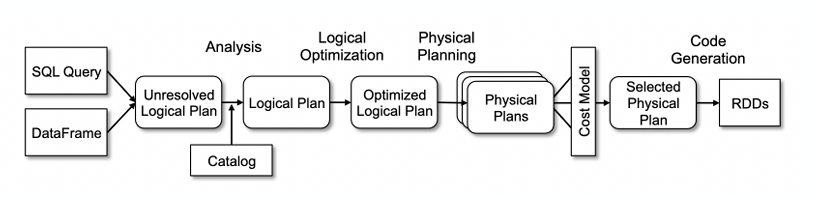

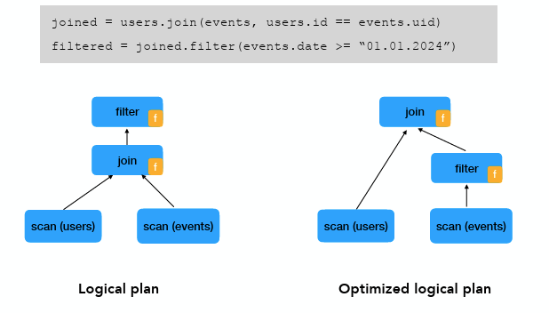

