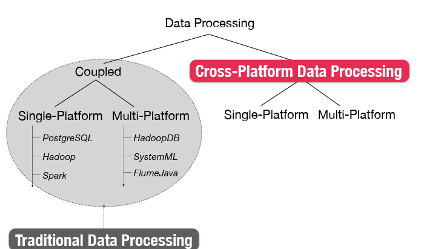
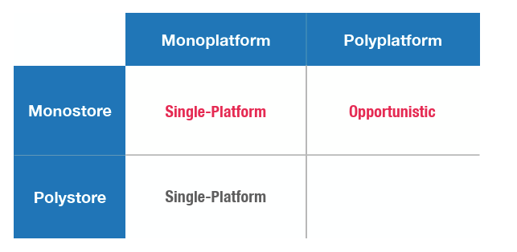
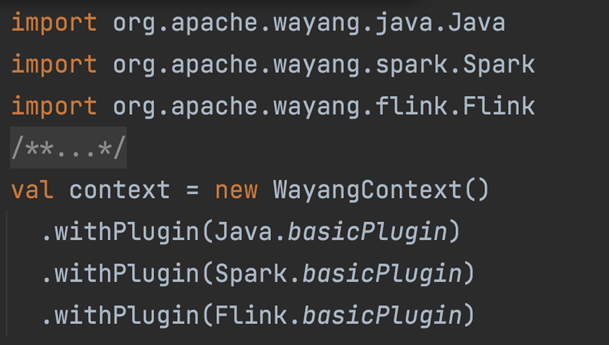
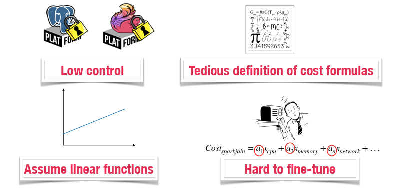
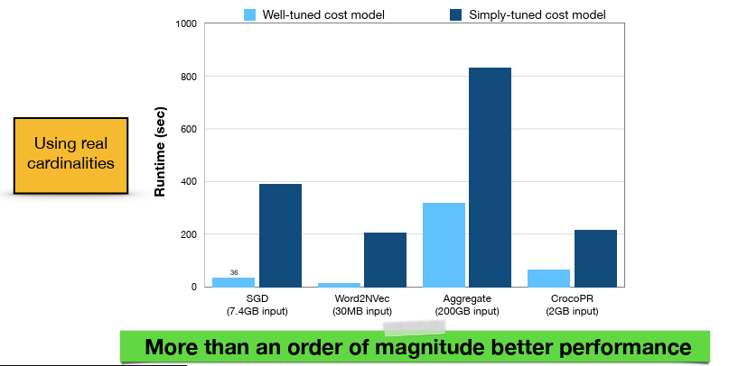

# Lecture 6 (Apache Wayang)

## Is Spark always a good choice?

No. While powerful, it is not ideal for every scenario.

### One size does not fit all
No single data processing platform can efficiently handle every type of analytics task

**Complexity:** The data landscape has grown into a "zoo of systems" specialized for different needs (e.g., relational, streaming, graph, text).

**Specialization:** Different tasks require different tools; forcing everything into one engine (like a "monostore") is often inefficient or impossible.

**Result:** Modern analytics often require Cross-Platform approaches, using multiple systems together (Multi-Platform or Polystore) to get the best performance and cost efficiency
* This concept highlights that 

### Data Processing Taxonomy
Classifies systems based on how they process data across platforms.

**Coupled:** The data storage and processing engine are tightly integrated (e.g., PostgreSQL).

**Decoupled:** The processing engine is separate from the storage layer (e.g., Spark processing data stored in HDFS).

**Single-Platform:** Uses only one platform to process a query.

**Multi-Platform:** Uses multiple platforms to process a query

### Cross Platform Data Processing

This expands on the "Decoupled" concept, focusing on how queries are executed across systems.

**Single-Platform:** The entire query runs on a single engine (e.g., Java or Spark).

**Multi-Platform:** A single query is split and processed across multiple engines. This is further divided into three subtypes
* **Opportunistic:** Using multiple platforms primarily to reduce costs (e.g., time, money).
*** Mandatory:** Using multiple platforms because a single platform cannot run the entire query (e.g., due to specific operator requirements).
* **Polystore:** Using multiple platforms because the data itself is physically stored across different storage engines (e.g., joining data from a CSV file with data in a database)

### System-Store Quadrant

### Challenges

1. **Decoupling Applications**: Applications are often tightly coupled to specific applications
2. **Data movement**: Moving data between platforms is costly and complex
3. **Automatic Cross-Platform Analytics**: Manually decyding which part of a query runs on which platform is difficult and prone to errors.
4. **Extensibility**: New data platforms and engines are constantly emerging, should allow for "plug in" without rewriting the core system.

### Idea Behind Apache Wayang

The core idea is to unify data analytics into a single framework

**Problem:** "One size does not fit all." Different platforms (Spark, Flink, Java) are better at different tasks, and developers often have to rewrite code to switch between them

**Solution:** Wayang acts as a cross-platform optimizer and coordinator. It decouples the application logic from the underlying execution engines, allowing you to run the same code on different platforms efficiently.

#### Playform Independence/Agnosticity

Wayang allows applications to be platform-agnostic.

**Write Once:** You write the application using Wayang's generic API (operators) without tying it to a specific engine.

**Run Anywhere:** You specify which platforms are available via plugins (e.g., .withPlugin(Spark.basicPlugin) or .withPlugin(Java.basicPlugin)) in the WayangContext.

**Automatic Selection:** Wayang automatically selects the best platform for the job

### How Apache Wayang Works

**Wayang Plan (Input):** The user defines a data processing flow using generic Wayang operators (e.g., Map, Filter). This plan is platform-agnostic

**Plan Inflation (Optimization):** The optimizer transforms the generic plan into an "Inflated plan" by mapping the generic operators to specific Execution operators available on the connected platforms (e.g., mapping a generic ReduceBy to SparkReduceBy or JavaReduceBy)

**Cost-Based Optimization:** The system calculates the cost for different execution strategies using a cost model that accounts for operator costs (CPU/Memory) and data movement costs (transferring data between platforms)

**Plan Enumeration** is the phase in the cost-based optimizer that identifies the most efficient way to execute a query.
* Uses pruning to dsicard expensie plans early

### Problems with cost-based optimizer

**Tedious Cost Formulas:** Creating accurate cost formulas for every operator on every platform is difficult and time-consuming

**Assume Linear Functions**: Optimizers often assume costs are linea

**Hard to fine-tune**: It is difficult to correctly adjust the weights (coefficients) of the cost formulas. 

### Effects of Cost Model Tuning

"Well-tuned cost model" can perform more than 10x faster than a "Simply-tuned" one, proving that poor tuning drastically hurts performance

### Learning Based Optimization

Instead of manually writing and tuning mathematical cost formulas, the system uses Machine Learning (ML)

**How it works:** The ML model analyzes the search space, physical operators, and execution plans to learn the costs

**Goal:** To eliminate the need for manual, tedious formula definitions and improve accuracy by learning from actual execution data

### Extensibility in Apache Wayang

Wayang separates Wayang Operators (generic, fine-granular operators like ReduceBy) from Execution Operators (platform-specific implementations like SparkReduceBy or JavaReduceBy)

**Mappings:** To add a new platform, you define mappings that translate the generic Wayang Operators into the specific Execution Operators available on that platform

