# ML Lifecycle 1
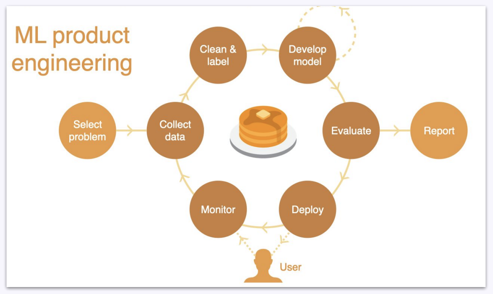
* Ml life cycle is an iterative process

ML lifecycle steps:
1. Look at the big picture
2. Get the data
3. Discover and visualize the data to gain insights
4. Prepare the data for Machine Learning algorithms
5. Select a model and train it
6. Fine-tune your model
7. Present your solution
8. Lanch, monitor, and maintain your system


## Look at the big picture
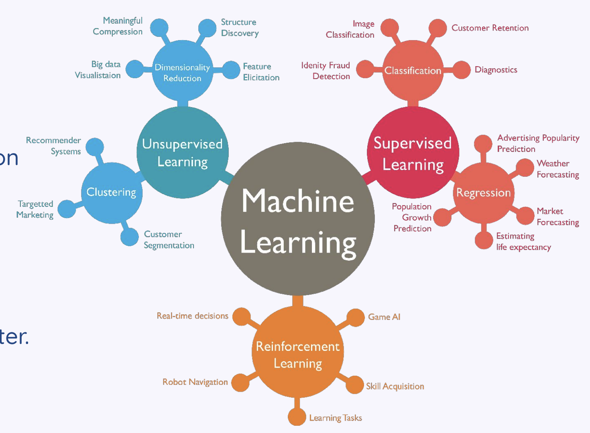

Machine learning
* **Supervised learning**
  * **Classification**
    * Identity fraud
    * Image classification
    * Customer retention
    * Diagnotics
  * **Regression**
    * Population growth prediction
    * Estimating life expectancy
    * Market forecasting
    * Weather forecasting
    * Advertising popularity prediction
* **Unsupervised learning**
  * **Dimensionality reduction**
    * Big data visulisation
    * Meaningful compression
    * Structure discovery
    * Feature elicitation
  * **Clustering**
    * Recommender systems
    * Targetted marketing
    * Customer segmentation
* **Reinforcement learning**
  * Real-time decisions
  * Game AI
  * Skill acqusistion
  * Learning tasks
  * Robot navigation


* Frame the problem
> Price prediction:
> - Supervised llearning
> - Multiple, univariate regression
> - Batch learning
* Find an evaluation criteria

## Get the data + initial inspeciton

* Create a working environment
* Get access to data
* Inspect (a subsample of) data
  * Pandas
    * DataFrame.info()
    * DataFrame.describe()
    * DataFrame.value_counts()
  * Matplotlib + pandas
    * DataFrame.hist()

## Splitting the test set
* Good models can generalize on unseen data.
* To understand how well the model generalizes, we split the data into:
  * **Training data**
    * for learning the model
  * **Test data**
    * generalization ability
    * the training data should have no statistical information from this test set

The test set needs to be separated **before** any preprocessing of the data that involves dataset statistics.
> For example, if you scale the data before you split into train and test the training data will contain information about the test data => data leakage

* Also pay attention to 
  * Randomness
  * Set the random number generator’s seed
  * Chaning datasets

### Data leakage
* Happens when data from outside the training dataset is used to create the model, but this future data will not be available when the model is used for prediction. 
* The model will perform well in testing and validation, but when used in production, it becomes entirely inaccurate.

### Splitting the test set
We sometimes need to ensure the test set is representative => **stratified sampling**

* from sklearn.model_selection import train_test_split
  * Set stratify=column
* from sklearn.model_selection import StratifiedShuffleSplit (for cross-validation)

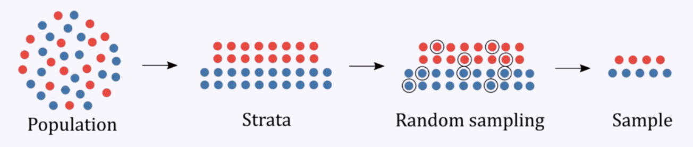

### Timeseries train/test split
Data should **not** be shuffled before splitting into train and test if there is temporal dependence.

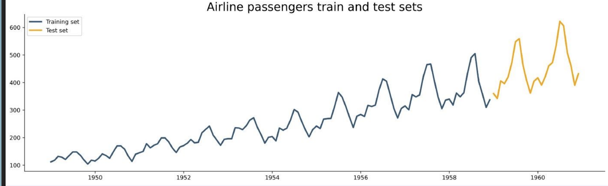

### k-fold cross validation
* The training dataset is partitioned into **k** equal sized sets
* k-1 sets are used for training and 1 subsample for validation
* The k results are averaged to produce a score
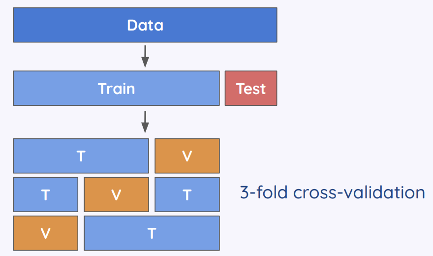

### Cross validation for time series data
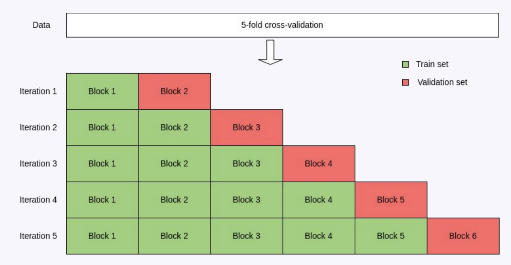
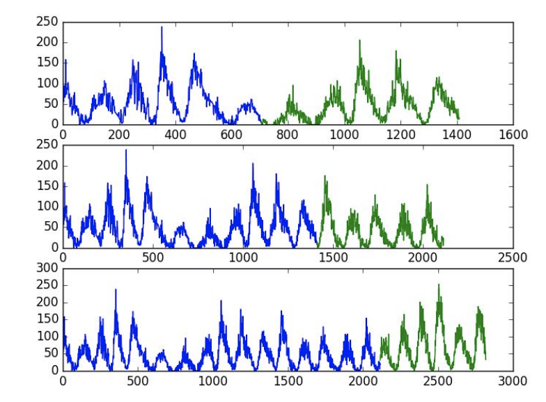

## Data visualisation
### Variability/spread
* Variance
* Standard deviation
* Median absolute deviation
* Interquartile range
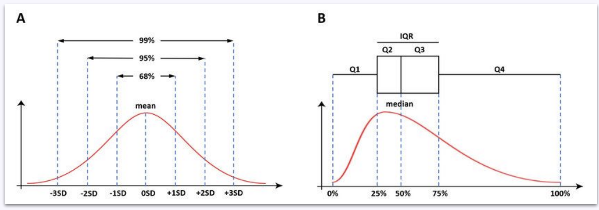
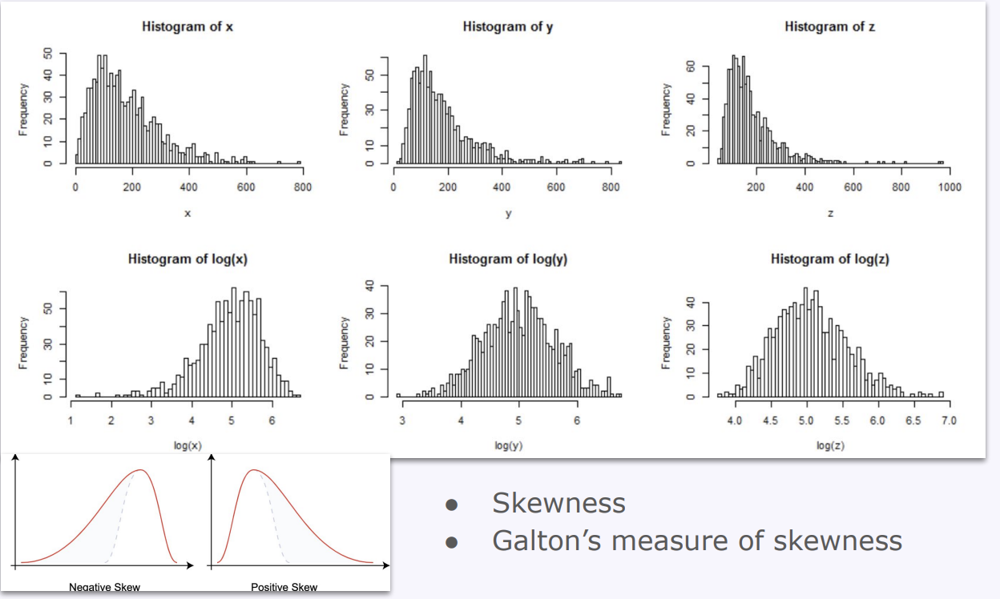

### Multivariate analysis/dependence
* Pearson’s correlation coefficient
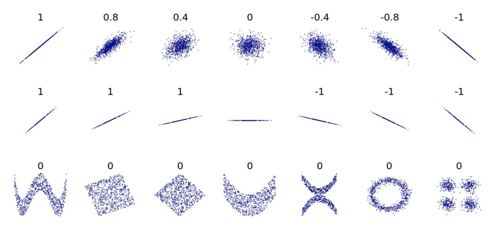

### Data exploration - summary statistics

* **Location**
  * data standardisation
* **Spread**
  * data standardisation; outlier detection
* **Shape**
  * identify imbalanced datasets; apply transformation
* **Dependence**
  * strength of associations between observations

## Data cleaning
Based on your data exploration you should first:
* Drop any columns/features that are not relevant to the task
* Combine datasets
  * pandas:
    * DataFrame.merge
    * DataFrame.resample
    * merge_asof
  * for timeseries make sure timestamps match:
    * downsample
    * upsample
* Drop any columns/features that are highly correlated

## Data preprocessing for machine learning
It is the steps taken to prepare data for analysis or a machine learning model

* A machine learning model is simply a **mathematical function**.
* Learning = finding this function that fits the input data
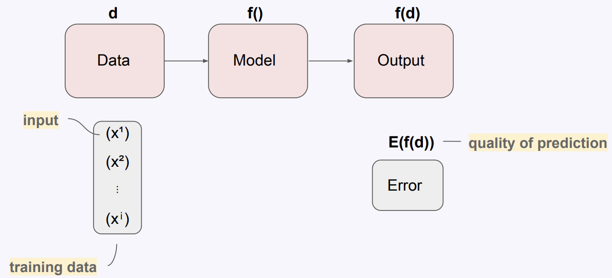

Therefore:
* missing data needs to be handled
* data needs to be represented numerically
* data comes from different sources => different scales => rescaling
* some of the data is noisy and not useful for learning 

> There are exceptions to these rules, mainly in the case of tree based models.

### Missing values
* Sources of missing values:
  * Survey non response
  * Sensor failure
  * Changing data gathering procedure
  * Database join

* Types of missing values: 
  * NaN values, 
  * empty strings, 
  * outliers

* First step: identify missing values
* Plotting the data can help identify hidden missing values

**Strategies for handling missing values**
* Discard columns/rows with missing values
  * discard rows (samples) when only a few values are missing
  * discard a column when most of the values are missing for that feature
* **Data imputation** = fill in the missing values
  * based on the other values for a particular feature or multiple features

**Data imputation**
Fill in the missing value with:
* a constant value or a randomly selected value
* the most frequent category for categorical data
* the mean, median or mode of a feature for numerical data
* the result of a predictive model
   * K-nearest neighbours
   * linear or polynomial interpolation

Forward/backward fill:
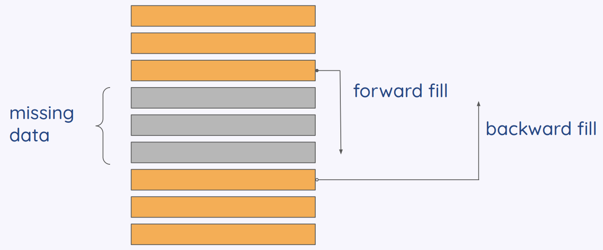

> **Any challenges using forward or backward fill in Spark?**
> * Forward/backward fill propagates values sequentially. Each row needs to know what the last non-null value was before it
> * => Order across the entire dataset
> 
> In Spark: data is split across multiple partitions on different machines. Each machine processes its partition independently in parallel. For very large datasets: partition data logically (for example by time).

**Conditional imputation**
Model one feature as a function of others
* Possible implementation:
  * iteratively predict one feature as a function of others
  * **bad computational scalability!**

**Imputation for prediction**
Typical assumption in statistics - data is missing at random =>  missingness independent from unseen values

* In applications => informative missingness: add indicator

### Outlier detection
Detecting instances that deviate strongly from the norm - for removal or for analysis.

* Tukey’s method
* Gaussian mixture models

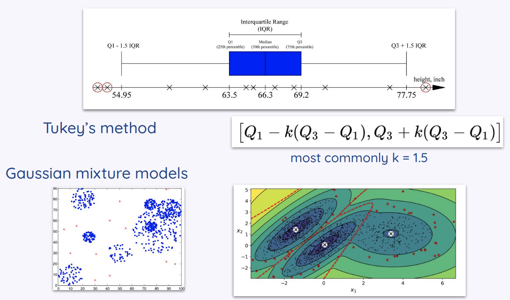

### Feature scaling
Many ML models fail if the features have different scales. (exception: some tree based models)
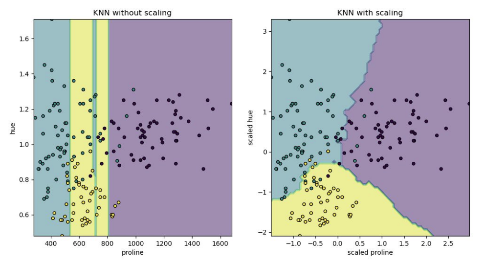

**Standardisation (Z-scoore normalization)**
* Standardization = subtracts the mean value and scales the data to unit variance
* less (but still) affected by outliers
**Max-Min normalization**
* Normalization = values are shifted and rescaled so that they end up ranging from 0 to 1

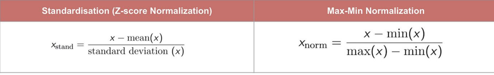

**Which to use?**
* **Tree-based models** (Random Forest, XGBoost, Decision Trees)
  * Scaling often not necessary (typically scale-invariant)
* **Linear models**, SVM, k-NN: 
  * standardization preferred
* **Neural networks**: 
  * either, standardization often preferred; normalization for bounded outputs
* **Outliers**: 
  * standardization
* **Need specific range**: 
  * normalization

### Feature encoding
Some models need data preprocessed to numerical values.
In these cases all features need to be encoded numerically.

**Feature encoding** = transforming features to a numerical format
* Label encoder
* Frequency encoder
* One hot encoder
* Ordinal encoder

> **Reminder**: here we are considering categorical data (ordinal or not). The number of categories (classes) is given by the data.

**Label encoder**
* Alphabetical label encoder:
  * Encode with a value between 0 and n_categories-1
* Manual label encoder
  * You can manually encode categories, using for example a dictionary.
  * Use this carefully!
  * Label encodings do not make sense for every type of category and prediction model.
  * Example: transforming the categories “cat”, “mouse”, “dog” into 0, 1, 2 in a regression task would allow for operations such as 0.5*dog = mouse.
 
**Frequency label encoder**
  * encode with a fraction = frequency of category

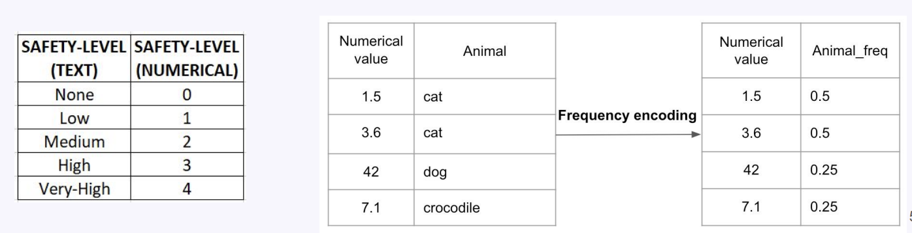

**One hot encoder**
* Encode features as a one-hot numeric array
* Creates a new binary column for each category
* The value for each column is either 0 or 1 => already scaled
* Not recommended for features with a large number of categories
  * as an alternative, can be applied together with dimensionality reduction


**Ordinal encoder**
* The features are converted to ordinal integers.
* This results in a single column of integers
* (0 to n_categories - 1) per feature.
* Only use when order matters!

### Feature generation
**Datetime**
* periodicity - capture repetitive patterns in the data
* pandas library has useful tools for handling datetime features

### Function transformers
You might need to implement a transformer from an arbitrary function
* for example if data is log-normally distributed - apply log transformation

## Sklearn terminology
* **Estimators** - any object that can estimate some parameters based on a dataset; example: nearest neighbours 
  * estimator = estimator.fit(data)
* **Transformers** - some estimators can also transform a dataset
  * Example: 
    * imputer
    * fit() to find the parameters
    * transform() to do the transformation
    * use fit_transform() for both
* **Predictors** - some estimators can also do predictions via predict().
  * Use score() to evaluate predictions

### Transformation pipelines
* Transformation steps need to be executed in the right order.
* Pipelines help with sequences of transformations.
* sklearn pipelines: All but the last estimator must be transformers.
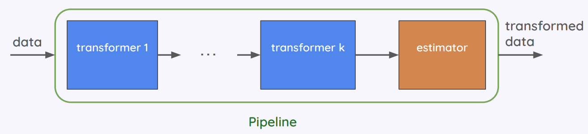

### Prediction pipelines
The test set must use identical scaling to the training set.
* Pipelines do this automatically.
```
X_train, X_test, y_train, y_test = train_test_split(X, y, test_size=0.2)

pipeline = Pipeline(...)
pipeline.fit(X_train, y_train)
pipeline.predict(X_test)
```

### Purposes of using pipelines
**Convenience and encapsulation**
* You only have to call fit and predict once on your data to fit a whole sequence of estimators.

**Joint parameter selection**
* You can grid search over parameters of all estimators in the pipeline at once.

**Safety**
* Pipelines help avoid leaking statistics from your test data into the trained model in cross-validation, by ensuring that the same samples are used to train the transformers and predictors.

## High-dimensional data
Many applications use data with hundreds or thousands of dimensions => many objects are very far away from each other

**The curese of dimensionality**
* Often data has much lower intrinsic dimensionality than its representation.

### Dimensionality reduction (DR)
* The assumption is that data lies on or near a lower dimensional subspace than its representation.

**Why reduce dimensions?**
* Remove redundant and noisy features
* Not all features are useful for a specific task
* Interpretation and visualization
* Easier storage and processing of the data

**Goal**: map a data vector from an original space to a new space with a lower dimension than the original, preserving the structure of the data
* high-dimensional space -> low-dimensional space

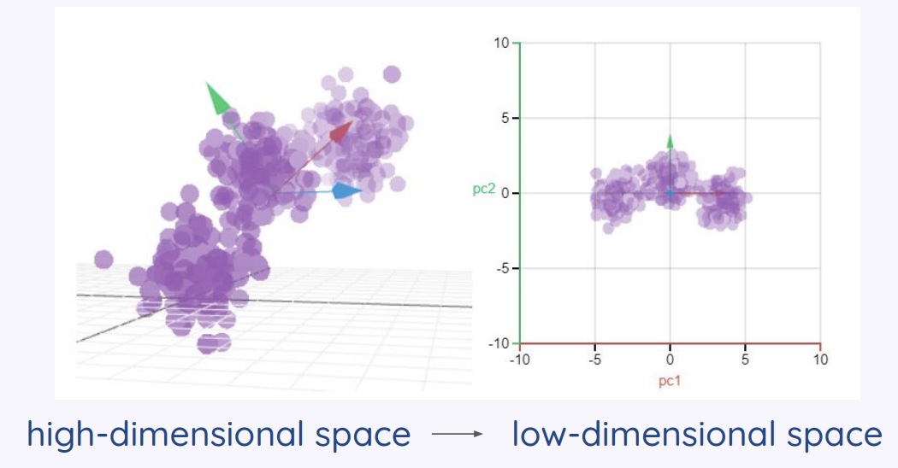

### Preserving structure
**Goal**: map a data vector from an original space to a new space with a lower dimension than the original, preserving the structure of the data

Tension between preserving local and global structure
* **local structure**: the low-dimensional representation preserves each observation’s neighborhood from the high-dimensional space
* **global structure**: the low-dimensional representation preserves the relative positions of neighborhoods from the high-dimensional space.

### Dimensionality reduction methods
**PCA**: Principal component analysis
**t-sne**: t-Distributed Stochastic Neighbor Embedding
**UMAP**: Uniform Manifold Approximation and Projection


### Principal components analysis (PCA)
**Idea**: find dimensions where data is most “spread out
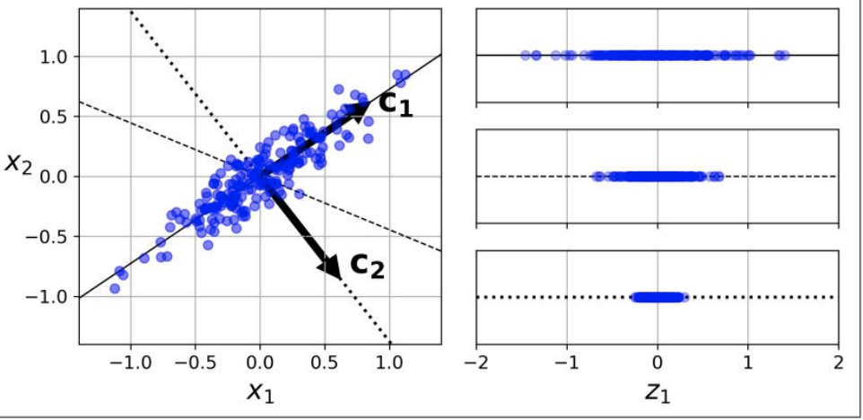

Orthogonal linear transformation that transforms the data to a new coordinate system such that:
* The greatest variance by some scalar projection of the data comes to lie on the first coordinate (called the first principal component)
* The second greatest variance on the second coordinate
* **Principal components** = sequence of unit vectors
* The directions of the vectors are given by best-fitting lines

> PCA has been shown to be effective in preserving the global structure of the data

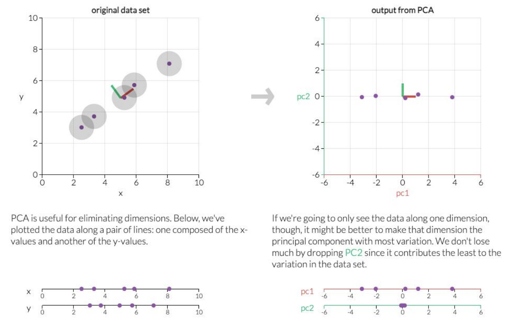

**PCA steps**
1. Compute covariance matrix of the features
2. Find the eigenvalues and eigenvectors
3. Project to new dimensions

**Covariance matrix**
* How spread out is the data in the given dimensions
* How one attribute changes based on another attribute
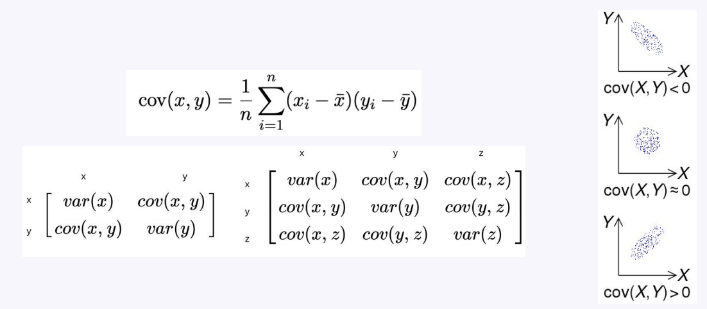

**Eigenvalues and eigenvectors**
* Eigenvector of a matrix = nonzero vector that changes at most by a constant factor when applied to that matrix
* Eigenvalue = the constant factor above


### PCA - Eigen faces
* We can use PCA to analuse facial features.
  * Combined with inference, we can create new faces - deep learning
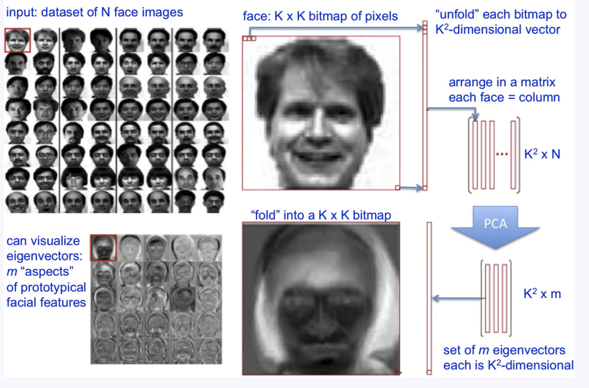

**Reconstructing the input**
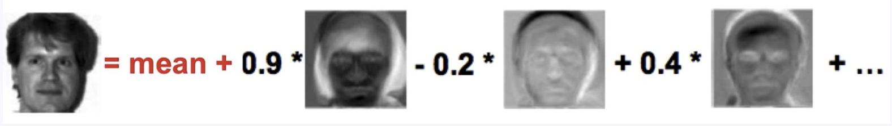
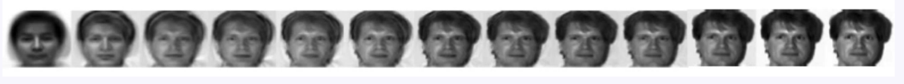

### PCA criticism
Efficiency on large datasets
* Incremental PCA
  * learning in a minibatch fashion
* Randomized PCA (not discussed)
  * compute the first few principal components

Interpretability
* Sparse PCA
  * PCs are combinations of just a few original variables

**Incremental PCA**
* PCA implementations generally support batch processing => the full dataset needs to fit into main memory
* Incremental PCA gives an approximation of the PCA components using **partial computations**
* Data is processed in a minibatch fashion
* The explained variance ratio is updated with each batch

**Interpretability**
* PCA: Low interpretability, since each eigenvector is a linear combination of all original features. 
* In medical applications PCs generated during exploratory data analysis need to supply interpretable modes of variation
* In scientific applications such as protein folding, each original coordinate axis has a physical interpretation, and the reduced set of coordinate axes should too.

### Sparse PCA
In PCA: the principal components are usually linear combinations of all input
variables

**Sparse PCA**: finds linear combinations of just a few input variables.

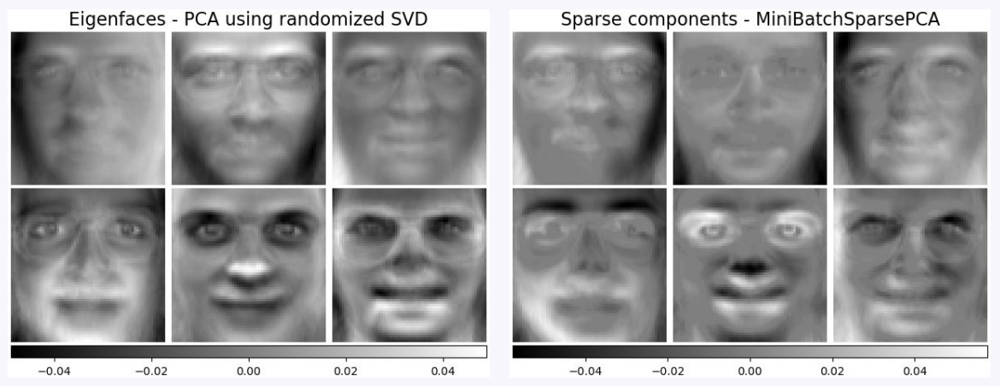

### PCA on MNIST dataset
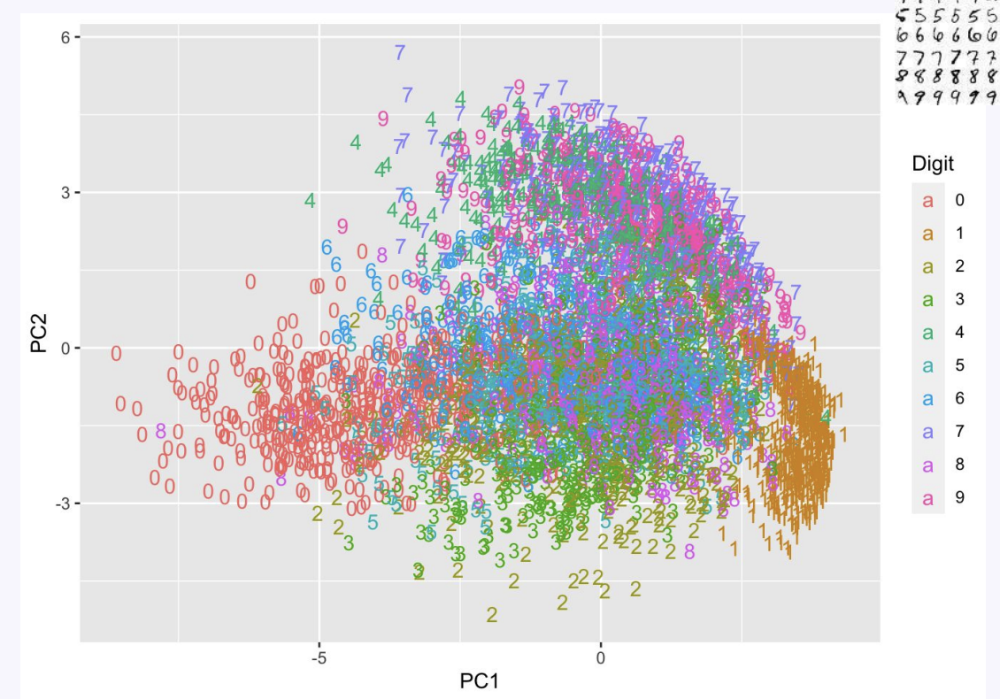

### t-SNE on MNIST dataset
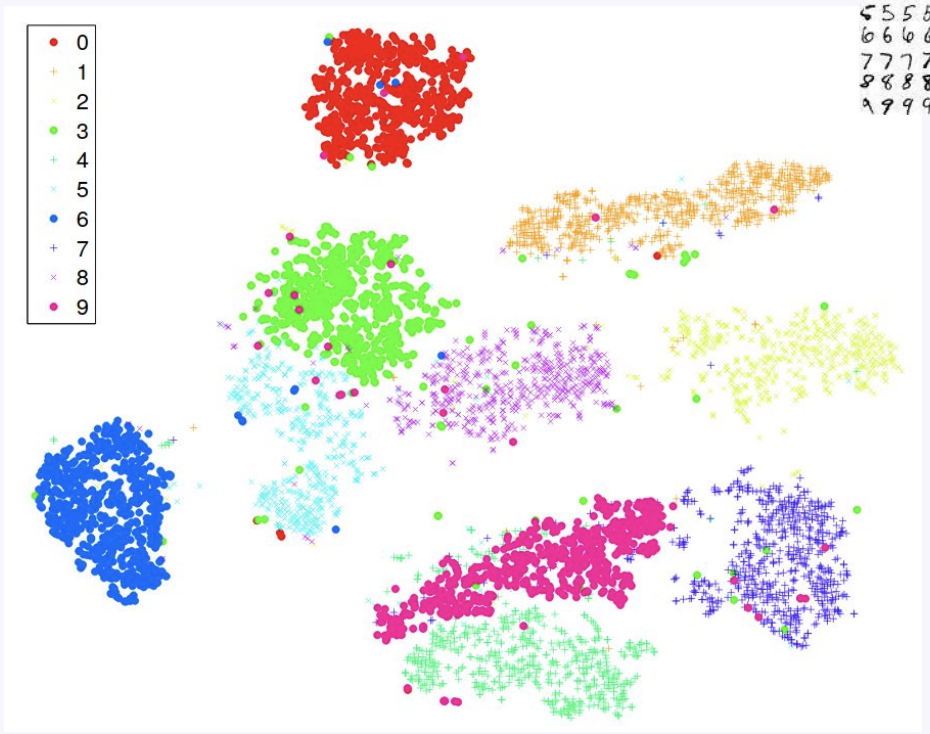

### t-Distributed Stochastic Neighbor Embedding (t-SNE)
PCA - global structure preserving method
* Cannot capture local non-linear structure
* => methods developed to preserve raw local distances between points
* Difficult because in high dimensions many raw distances are similar
* => preserve neighbourhoods

**t-SNE** is a non-linear technique that reduces the data to 2 or 3 dimensions such that similar objects are modeled by nearby points

1. First, put the points on a line in a random order
2. At each step, each point is moved on the line such that it is closer to its neighbours and far from dissimilar points.

Example:
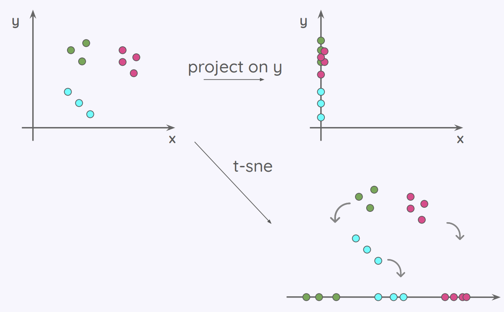
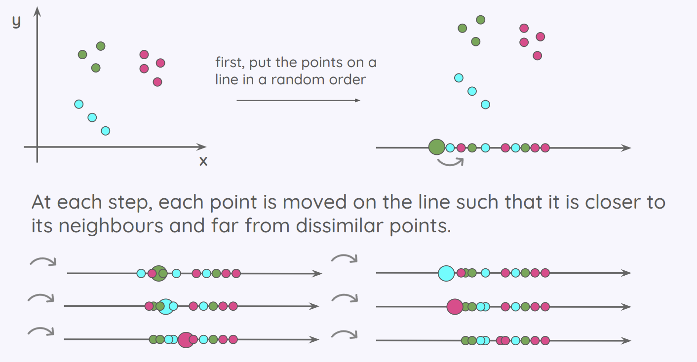

* t-SNE preserved local structure (neighbours)
* But struggles to preserve global structure -> instead of random initialization, use PCA

### Uniform Manifold Approximation and Projection (UMAP)
t-SNE is known to sometimes produce spurious patterns
* **UMAP** builds on t-SNE, improving:
  * efficiency (running time)
  * k-nearest neighbours accuracy
  * preservation of global structure

## Summary
* Building machine learning models = iterative process
* Data exploration and cleaning
* Pipelines - ensure transformations are done in order, consistently, without data leakage
* Preprocessing of high-dimensional data