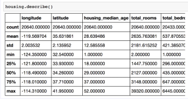
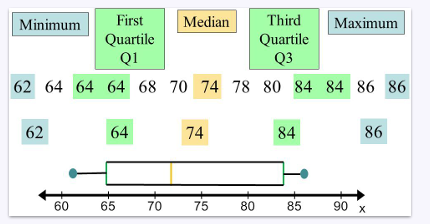
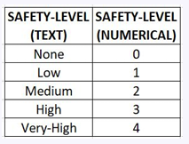
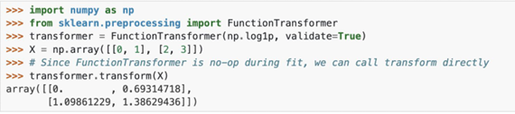

# ML Lifecycle 1

* Ml life cycle is an iterative process

ML lifecycle steps:
1. Look at the big picture
2. Get the data
3. Discover and visualize the data to gain insights
4. Prepare the data for Machine Learning algorithms
5. Select a model and train it
6. Fine-tune your model
7. Present your solution
8. Lanch, monitor, and maintain your system


## Look at the big picture


Machine learning
* **Supervised learning**: learns from labeled training data (input-output pairs) to predict outcomes for unforeseen data.
  * **Classification**: Predicts discrete categories or labels (e.g., "Yes/No", "Cat/Dog").
    * Identity fraud
    * Image classification
    * Customer retention
    * Diagnotics
  * **Regression**: Predicts continuous numerical values
    * Population growth prediction
    * Estimating life expectancy
    * Market forecasting
    * Weather forecasting
    * Advertising popularity prediction
* **Unsupervised learning**: unlabeled data to discover hidden patterns or structures without predefined answers
  * **Dimensionality reduction**: Reduces the number of features to simplify data while preserving essential information.
    * Big data visulisation
    * Meaningful compression
    * Structure discovery
    * Feature elicitation
  * **Clustering**: Groups similar data points together based on inherent characteristics.
    * Recommender systems
    * Targetted marketing
    * Customer segmentation
* **Reinforcement learning**: An agent learns to make decisions by performing actions in an environment and receiving feedback in the form of rewards or penalties
  * Real-time decisions
  * Game AI
  * Skill acqusistion
  * Learning tasks
  * Robot navigation


* Frame the problem
> Price prediction:
> - Supervised llearning
> - Multiple, univariate regression
> - Batch learning
* Find an evaluation criteria

## Get the data + initial inspeciton

* Create a working environment
* Get access to data
* Inspect (a subsample of) data
  * Pandas
    * DataFrame.info()
    * DataFrame.describe()
    * DataFrame.value_counts()
  * Matplotlib + pandas
    * DataFrame.hist()




## Splitting the test set
* Good models can generalize on unseen data.
* To understand how well the model generalizes, we split the data into:
  * **Training data**
    * for learning the model
  * **Test data**
    * generalization ability
    * the training data should have no statistical information from this test set

The test set needs to be separated **before** any preprocessing of the data that involves dataset statistics.
> For example, if you scale the data before you split into train and test the training data will contain information about the test data => data leakage

* Also pay attention to 
  * Randomness
  * Set the random number generator’s seed
  * Chaning datasets

### Data leakage
* Happens when data from outside the training dataset is used to create the model, but this future data will not be available when the model is used for prediction. 
* The model will perform well in testing and validation, but when used in production, it becomes entirely inaccurate.
* **Why is it bad?** its performance metrics will be artificially high, failing to reflect how it will perform in the real world

### Splitting the test set
We sometimes need to ensure the test set is representative => **stratified sampling**

* from sklearn.model_selection import train_test_split
  * Set stratify=column
* from sklearn.model_selection import StratifiedShuffleSplit (for cross-validation)


**Strata:** The population is divided into distinct subgroups (strata) sharing specific characteristics.

**Sampling:** Random sampling is performed within each stratum to create a final sample that mirrors the original population's distribution

### Timeseries train/test split
Data should **not** be shuffled before splitting into train and test if there is temporal dependence.


**Why?**:
* **Temporal Dependence:** Observations have a strict order
* **Preventing "Future" Leakage:** Shuffling mixes the data, potentially placing future data points in the training set and past data points in the test set. This allows the model to "cheat"

### K-fold cross validation

**Concept**:
* The training dataset is partitioned into **k** equal sized sets
* k-1 sets are used for training and 1 subsample for validation
* The k results are averaged to produce a score


**Why**:
* Averaging Scores: As scores are averaged, it produces a more robust and stable performance metric.
* Maximizing Data Usage: Every data point is used for training k-1 times and 1 time for validation. Instead of 20% are set aside and never used to train the model.
* Avoiding Overfitting: We get a better sense of how the model generalizes to unseen data (as it is trained and validated on different subset of data multiple times)

### Cross validation for time series data


Standard k-fold cross-validation cannot be used because time-series data has a strictly defined order (temporal dependence).

**Therefore:**
* Instead of random folds, the training set expands sequentially over time while the validation set always follows immediately after:

## Data visualisation

A critical step in the Machine Learning lifecycle (Step 3) to gain insights, discover patterns, and inspect data quality before modeling.

### Location
* Mean: The average of the data points
* Median: The middle value that separates the higher half from the lower half
* Mode: The most frequently occurring value in the dataset
* Qurtiles: Values that divide the data into four equal parts 



### Variability/spread
* Variance: The average of the squared differences from the mean (how spread compared to their average)
* Standard deviation: The square root of the variance 
* Median absolute deviation: A robust measure of variability calculated as the median of the absolute deviations from the data's median
* Interquartile range: The range between the first and third quartiles ($Q3 - Q1$). So The spread of from 25th percentile to 75th percentile


### Shape
* Skewness: Measures the asymmetry of the data distribution.
  * Positive Skew: Tail extends to the right (mean > median).
  * Negative Skew: Tail extends to the left (mean < median)
* Galton's measure of skewness


### Multivariate analysis/dependence
* Pearson’s correlation coefficient: Measures the strength and direction of the linear relationship between two variables. It ranges from -1 (perfect negative correlation) to +1 (perfect positive correlation), with 0 indicating no linear correlation


### Data exploration - summary statistics

* **Location**
  * data standardisation
* **Spread**
  * data standardisation; outlier detection
* **Shape**
  * identify imbalanced datasets; apply transformation
* **Dependence**
  * strength of associations between observations

## Data cleaning
Based on your data exploration you should first:
* Drop any columns/features that are not relevant to the task
* Combine datasets
  * pandas:
    * DataFrame.merge
    * DataFrame.resample
    * merge_asof
  * for timeseries make sure timestamps match:
    * downsample
    * upsample
* Drop any columns/features that are highly correlated
  * They provide redundant information

## Data preprocessing for machine learning
It is the steps taken to prepare data for analysis or a machine learning model

* A machine learning model is simply a **mathematical function**.
* Learning = finding this function that fits the input data


Therefore:
* missing data needs to be handled
* data needs to be represented numerically
* data comes from different sources => different scales => rescaling
  * Scaling ensures all features contribute equally.
* Some of the data is noisy and not useful for learning 
  * "Garbage in, garbage out."

> There are exceptions to these rules, mainly in the case of tree based models.

### Missing values
* Sources of missing values:
  * Survey non response
  * Sensor failure
  * Changing data gathering procedure
  * Database join

* Types of missing values: 
  * NaN values, 
  * empty strings, 
  * outliers

* First step: identify missing values
* Plotting the data can help identify hidden missing values

**Strategies for handling missing values**
* Discard columns/rows with missing values
  * discard rows (samples) when only a few values are missing
  * discard a column when most of the values are missing for that feature
* **Data imputation** = fill in the missing values
  * based on the other values for a particular feature or multiple features

**Data imputation**
Fill in the missing value with:
* a constant value or a randomly selected value
* the most frequent category for categorical data
* the mean, median or mode of a feature for numerical data
* the result of a predictive model
   * K-nearest neighbours
   * linear or polynomial interpolation

* Forward/backward fill:

  * These are imputation strategies used to fill missing values, particularly in time-series data where order matters.
  * Forward Fill (ffill): Propagates the last valid observation forward to fill the missing gap.
  * Backward Fill (bfill): Uses the next valid observation to fill the gap backwards.

> **Any challenges using forward or backward fill in Spark?**
>
> **Sequential Dependency:** Forward and backward fill require strictly ordered data because each row depends on the value of the previous (or next) row to fill missing gaps.
> => Order across the entire dataset
> 
> In Spark: data is split across multiple partitions on different machines. Each machine processes its partition independently in parallel. 
> 
> Because the data is broken up, a "missing value" on one machine might need a "fill value" that exists on a completely different machine.
> 
> **Solution:** You must logically partition the data (e.g., by time) so that all sequential data required to fill a gap ends up on the same machine
>

#### Conditional imputation
Model one feature as a function of others

It treats the column with missing values as a target (label) and uses the other columns as features to train a model

* Possible implementation:
  * iteratively predict one feature as a function of others
  * **bad computational scalability!**

#### Imputation for prediction
**The Problem:** Standard imputation assumes data is "missing at random" (the missingness is just bad luck). However, in real applications, the fact that data is missing often carries meaningful information (e.g., a sensor failing only at high temperatures).

**The Solution:** To capture this, you add an indicator column (binary flag) that explicitly tells the model which values were originally missing.

### Outlier detection
The process of identifying data instances that deviate strongly from the norm. These can be removed (to clean data) or analyzed (if the anomaly is the target, e.g., fraud)

* **Tukey’s method:** Uses the Interquartile Range (IQR) to define a "normal" range
* **Gaussian mixture models:** assumes data is generated from a mixture of several Gaussian distributions (clusters). An outlier is instances that have low probability of belonging to any of the clusters. 


### Feature scaling
Many ML models fail if the features have different scales. (exception: some tree based models)


**Standardisation (Z-scoore normalization)**
* Standardization = subtracts the mean value and scales the data to unit variance
* less (but still) affected by outliers
**Max-Min normalization**
* Normalization = values are shifted and rescaled so that they end up ranging from 0 to 1


**Which to use?**
* **Tree-based models** (Random Forest, XGBoost, Decision Trees)
  * Scaling often not necessary (typically scale-invariant)
* **Linear models**, SVM, k-NN: 
  * standardization preferred
* **Neural networks**: 
  * either, standardization often preferred; normalization for bounded outputs
* **Outliers**: 
  * standardization
* **Need specific range**: 
  * normalization

### Feature encoding
Some models need data preprocessed to numerical values.
In these cases all features need to be encoded numerically.

**Feature encoding** = transforming features to a numerical format
* Label encoder
* Frequency encoder
* One hot encoder
* Ordinal encoder

> **Reminder**: here we are considering categorical data (ordinal or not). The number of categories (classes) is given by the data.

#### Label encoder

**Alphabetical**: Assigns an integer value (0 to $n-1$) to categories (alphabetically)
* (e.g., "High" $\rightarrow$ 0, "Low" $\rightarrow$ 1, "Medium" $\rightarrow$ 2)1




**Manual**: You define the specific mapping (e.g., {"Low": 1, "High": 2}) using a dictionary.
* Should be used carefully, l.
* Example: transforming the categories “cat”, “mouse”, “dog” into 0, 1, 2 in a regression task would allow for operations such as 0.5*dog = mouse.

**Frequency**: Replaces a category with a number representing how often it appears in the dataset (e.g., if "Red" appears in 20% of rows, it becomes 0.2).


**One hot encoder**: Encode features as a one-hot numeric array
* Creates a separate binary column (0 or 1) for every single category
* The resulting values are already scaled (0 or 1).
* It is not recommended for features with many categories (high cardinality) as it creates too many new columns. If used, it is often paired with dimensionality reduction.


**Ordinal encoder**:  Converts features to a single column of integers (0 to $n-1$).
* This results in a single column of integers
* (0 to n_categories - 1) per feature.
* Only use when order matters! Assigns numbers based on a meaningful, inherent rank or hierarchy in the data

### Feature generation
**Datetime**
* periodicity - capture repetitive patterns in the data
* pandas library has useful tools for handling datetime features

### Function transformers
You might need to implement a transformer from an arbitrary function
* for example if data is log-normally distributed - apply log transformation



## Sklearn terminology
* **Estimators**:any object that can estimate some parameters based on a dataset; example: nearest neighbours 
  * estimator = estimator.fit(data)
* **Transformers**: A specific type of estimator that can also modify or transform the dataset.
  * Example: 
    * imputer
    * fit() to find the parameters
    * transform() to do the transformation
    * use fit_transform() for both
* **Predictors**: Estimators that are capable of making predictions on new data; via predict().
  * Use score() to evaluate predictions

### Transformation pipelines
* Ensures that all data preprocessing steps (like imputation, scaling, etc.) are executed in the correct order and consistently on both training and test data.
* Pipelines help with sequences of transformations.
* sklearn pipelines: All but the last estimator must be transformers.


#### Custom Transformers
Some transformations should be done only on particular columns. 
* Use ColumnTransformer to apply specific transformations to specific columns.

Example: You can create a pipeline that applies median imputation to numerical columns and One-Hot Encoding to categorical columns, all within a single object.

### Prediction pipelines
The test set must use identical scaling to the training set.
* Pipelines do this automatically.
```
X_train, X_test, y_train, y_test = train_test_split(X, y, test_size=0.2)

pipeline = Pipeline(...)
pipeline.fit(X_train, y_train)
pipeline.predict(X_test)
```

### Purposes of using pipelines
**Convenience and encapsulation**
* You only have to **call fit and predict once** on your data to fit a whole sequence of estimators.

**Joint parameter selection**
* You can **grid search** over **parameters of all estimators** in the pipeline at once.

**Safety**
* Pipelines help **avoid leaking statistics** from your test data into the trained model in cross-validation, by ensuring that the same samples are used to train the transformers and predictors.

## High-dimensional data

Many modern datasets have hundreds or thousands of features (dimensions). In such high-dimensional spaces, data points become very sparse ("far away from each other"), making it difficult for models to find patterns efficiently.

**The curese of dimensionality**
* Often data has much lower intrinsic dimensionality than its representation.
* Often, the data's "true" structure is much simpler than its representation suggests

### Dimensionality reduction (DR)
* A technique to map data from its original high-dimensional space to a lower-dimensional space.

**Assumption:** The data lies on or near a lower-dimensional subspace

**Why reduce dimensions?**
* Efficiency: Reduces storage requirements and speeds up processing.
* Quality: Removes redundant and noisy features that don't help the specific task.
* Insight: Allows for visualization (by compressing to 2D or 3D) and better interpretation of the data

**Goal**: map a data vector from an original space to a new space with a lower dimension than the original, preserving the structure of the data
* high-dimensional space -> low-dimensional space


### Preserving structure
**Goal**: map a data vector from an original space to a new space with a lower dimension than the original, preserving the structure of the data

**How can we quantify how well structure is preserved?**

**The Tension:** It is difficult to preserve everything, so methods usually prioritize one of two types of structure:
* Local Structure (Neighborhoods):
  * Focuses on keeping similar points close together
  * Ensures that if points are neighbors in the high-dimensional space, they remain neighbors in the low-dimensional space.
  * Algorithm: t-SNE is designed specifically to preserve this.
* Global Structure (Relative Positions):
  * Focuses on the overall layout and distances between distant groups.
  * Ensures that clusters far apart in the original space stay far apart in the new space.
  * Algorithm: PCA is effective at preserving this global view.

### Dimensionality reduction methods
**PCA**: Principal component analysis
**t-sne**: t-Distributed Stochastic Neighbor Embedding
**UMAP**: Uniform Manifold Approximation and Projection

### Principal components analysis (PCA)
PCA is a dimensionality reduction technique that identifies the directions (dimensions) where the data is most "spread out" (has the highest variance)


**How it works**:
It performs an orthogonal linear transformation to create a new coordinate system where:
* 1st Principal Component (PC1): The dimension capturing the greatest variance in the data.
* 2nd Principal Component (PC2): The dimension capturing the second greatest variance (orthogonal to the first).
* Principal Components: These are sequences of unit vectors that follow the "best-fitting lines" through the data

> PCA has been shown to be effective in preserving the global structure of the data


**PCA steps**:
1. Compute covariance matrix of the features
2. Find the eigenvalues and eigenvectors
3. Project to new dimensions

#### Covariance matrix
Purpose: It is the first step in PCA. It quantifies how the data is distributed.

**What it measures:**
* Spread: How spread out the data is within the given dimensions (Variance).
* Relationship: How one attribute changes in relation to another (Covariance)


#### Eigenvalues and eigenvectors
**Purpose:** Step 2 of PCA involves computing these from the covariance matrix to find the "principal components

* Eigenvector ($u$): A non-zero vector that does not change direction when a linear transformation (the matrix) is applied to it; it only changes in scale (length)
* Eigenvalue ($\lambda$): The constant factor by which the eigenvector is scaled7. In PCA, this represents the amount of variance explained by that principal component


### PCA - Eigen faces
* We can use PCA to analuse facial features.
  * Combined with inference, we can create new faces - deep learning


**Reconstructing the input**


### PCA criticism
#### Effieciency on large datasets 

**The Problem:** Standard PCA requires batch processing, meaning the entire dataset must fit into the main memory at once to compute the covariance matrix

**Solution**: Incremental PCA
* How it works: It processes data in mini-batches (small chunks) rather than all at once.
* Mechanism: It performs partial computations to approximate the Principal Components, updating the explained variance ratio with each new batch.
* Benefit: Allows PCA to be run on datasets too large to fit in memory

**Another Solution**: Randomized PCA (Not discussed)
* Compute the first few principle components

#### Interpretability

**The Problem:** Standard Principal Components are linear combinations of all original input variables. This makes it difficult to interpret what a specific component represents physically

**The Solution:** Sparse PCA
* Finds linear combinations of just a few input variables
* Benefit: Creates more interpretable components by isolating the influence of specific features


### PCA on MNIST dataset


### t-SNE on MNIST dataset


### t-Distributed Stochastic Neighbor Embedding (t-SNE)

**The Problem:** Linear methods like PCA preserve global structure (overall shape) but often fail to capture local non-linear structure (complex relationships between close neighbors)

**The Solution:** t-SNE focuses on preserving neighborhoods. It ensures that points which are similar in high-dimensional space remain close in the low-dimensional space (2D or 3D)


**t-SNE** is a non-linear technique that reduces the data to 2 or 3 dimensions such that similar objects are modeled by nearby points

**How it works**:
* Initialization: Places points randomly (e.g., on a line or 2D plane).
* Optimization: At each step, it moves points to be closer to their similar neighbors and farther from dissimilar points


* t-SNE preserved local structure (neighbours)
* But struggles to preserve global structure -> instead of random initialization, use PCA.

### Uniform Manifold Approximation and Projection (UMAP)
t-SNE is known to sometimes produce spurious patterns

**Concept:** A newer technique designed to address the limitations of t-SNE.
* **UMAP** builds on t-SNE, improving:
  * efficiency (running time)
  * k-nearest neighbours accuracy
  * preservation of global structure
  
**Reliability:** It uses deterministic initialization (Spectral Embeddings) rather than random, making results more reproducibl

## Summary
* Building machine learning models = iterative process
* Data exploration and cleaning
* Pipelines - ensure transformations are done in order, consistently, without data leakage
* Preprocessing of high-dimensional data