# ML lifecycle 2 - Training models on big data

## Decision trees
Versatile, "white box" models used for both classification and regression

These models split data based on features to classify or regress. The split order is determined by metrics like **Gini index** or **Entropy** (which measure how "mixed" the classes are).

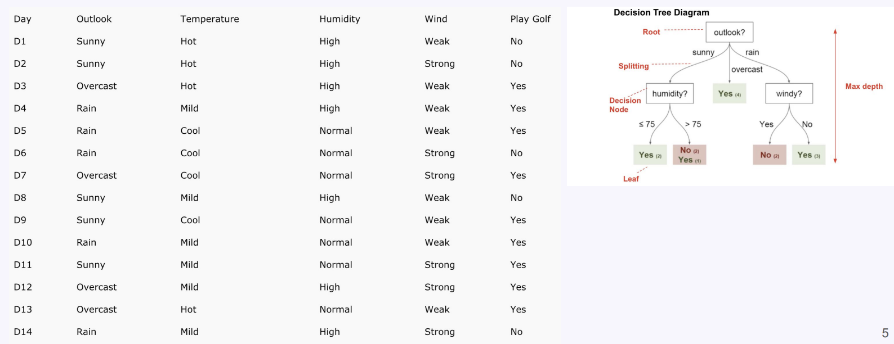

To find the order of building trees, compute either:
* Gini index
* Entropy

Each is 0 when all instances belong to the same class.
Intuitively, they show how informative a feature is.

### Decision trees limitations
**Overfitting**: Over-complex trees can fit noise in the training data.
* Solution: Pruning, setting a minimum number of samples required at a leaf node, or limiting depth of the tree

**Instability**: Small variations in data can result in completely different trees
* Solution: Use Ensembles (combining multiple trees).

**Not Globally Optimal:** Trees use heuristic (greedy) algorithms, which do not guarantee the globally best tree (an NP-complete problem)

**Bias:** Dominant classes can lead to biased trees
* Solution: Balance the dataset before fitting the model.

### Ensemble models in ML
**Ensemble Learning:** The practice of using multiple learning algorithms to obtain better predictive performance than could be obtained from any of the individual models

Two ensemble methods: **Bagging** and **Boosting**:
* **Bagging** (Bootstrap Aggregation): Trains models (like Random Forests) in parallel on random subsets of data. It reduces variance.
  * Training: Each collection of subset data is used to train a separate model
  * Aggregation: The final prediction is the average of all the individual model predictions

* **Boosting**: Trains models sequentially. Each new model attempts to correct the errors (residuals) of the previous one.
  * The final prediction is a weighted sum of all the predictions (unlike the simple average in bagging).

Example:
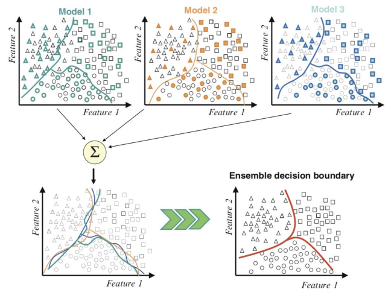

---

**Bagging** (Bootstrap aggregation)
* Create several subsets of data from training sample chosen randomly with replacement
* Each collection of subset data is used to train a model
* Take average of all the predictions
* Random forest: sample features 
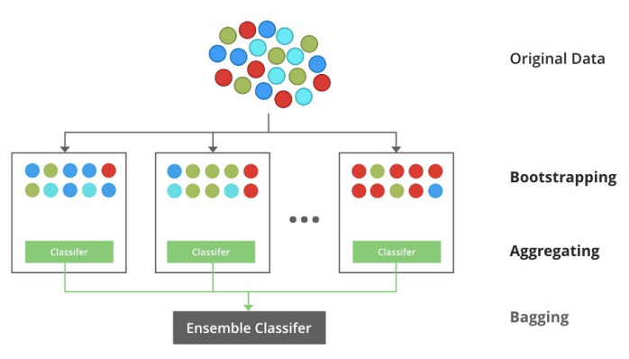

**Boosting**
* models are learnt sequentially, each one improving on the previous error
* improve performance on instances where the previous model performed poorly
* final prediction is a weighted sum of all of the predictions 
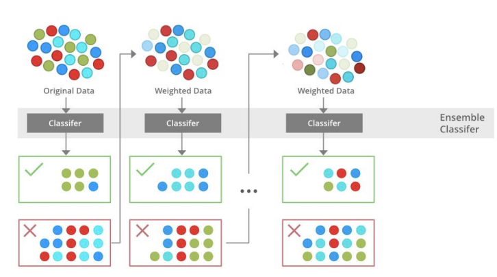

### Extreme Gradient Boosting (XGBoost)
**Extreme Gradient Boosting** = a framework for distributed ML

#### Predicting drug effectiveness example

* **Residuals**: The model starts with an initial prediction (e.g., 0.5). Subsequent trees are built to predict the residuals (the difference between the actual value and the prediction) rather than the target value itself.
* **Similarity Score**: XGBoost uses a similarity score to evaluate splits, calculated as:
  * $$Similarity Score = \frac{(Sum~of~Residuals)^2}{Number~of~Residuals + \lambda}$$
  * $\lambda$ is a regularization parameter9. 
* **Gain**: The best *split* is chosen by maximizing the Gain, which compares the similarity scores of the left and right children against the root.
* **Optimizations**: XGBoost utilizes **cache-aware** access, **out-of-core** computing (using disk space for large data), and **distributed computing** to handle big data efficiency.

**Residual**:
* A **residual** represents the "error" or the missing piece of information that the current model failed to capture.
* In the picture above it is the loss function (the distince from the yellow dots to the prediction).
* $$\text{Residual} = \text{Actual Value} (y) - \text{Predicted Value} (\hat{y})$$

**Improving the prediction by moving the threshold**
Clustering residuals, set the decision threshold to 15
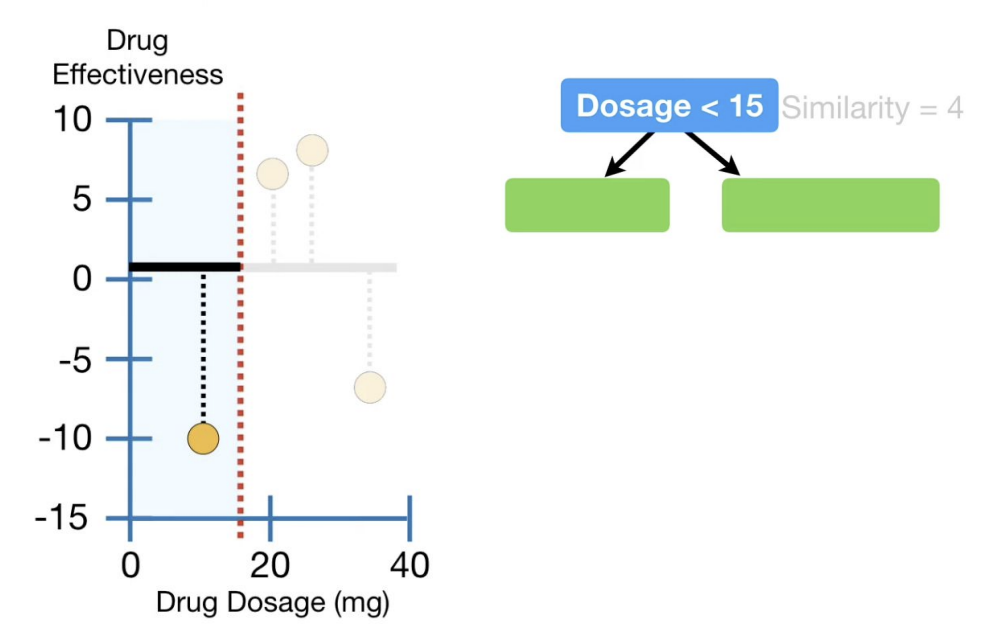
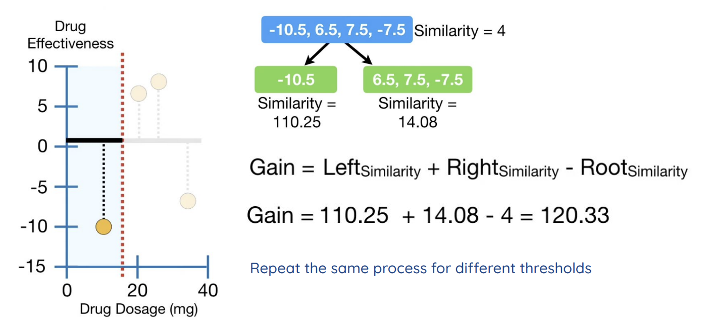

Consider a different decision threshold to 22.5
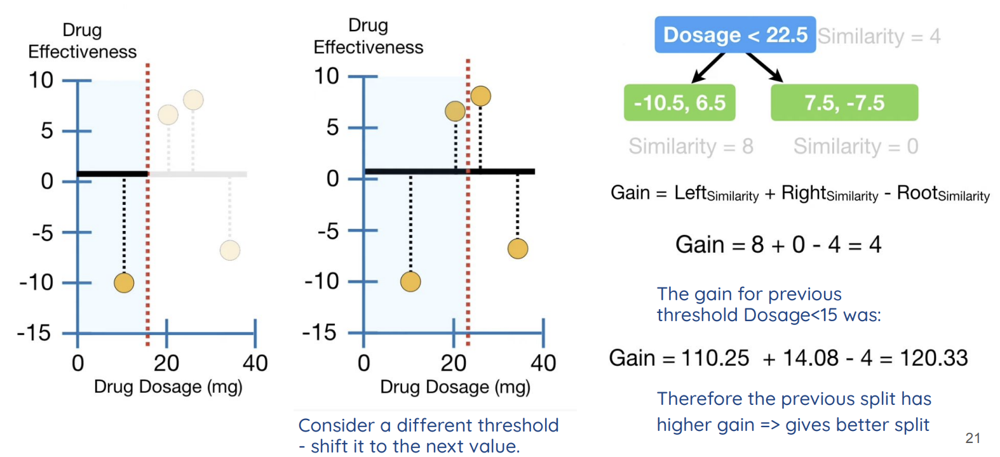
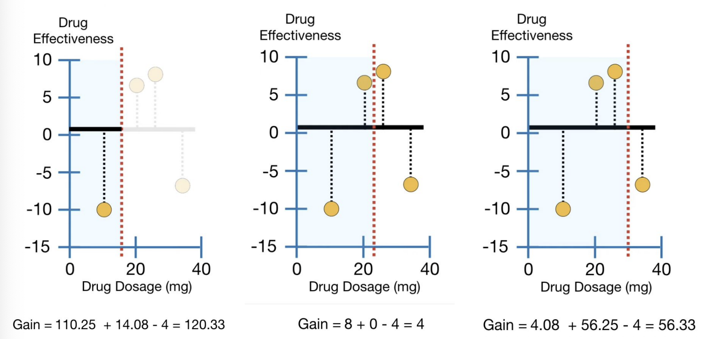

**Learning on large datasets**
* For very large datasets: Split the data into partitions.

* Combine the values from each partition to find an approximate histogram.
* The approximate histogram is used to calculate approximate quantiles.
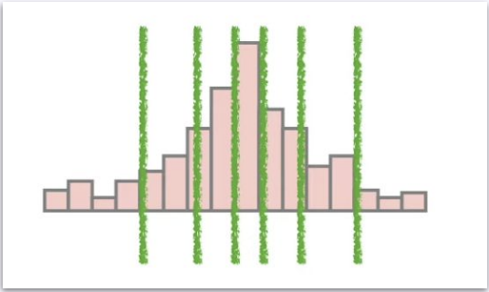

**Performance comparison**

* XGBoost is a very strong model, as it gives the highest prediciton power, with a very low training time.

**XGBoost features**:
* Cache awareness and out-of-core computing
* Regularization to avoid overfitting
* Tree pruning using depth-first approach
* Efficient handling of missing data
* Parallelized tree buildin
* In-built cross-validation capability

## Support vector machines (SVM)
* **Goal**: Find a hyperplane that separates classes with the maximum margin
* **Kernels**: SVMs use the "kernel trick" to map non-linearly separable data into higher-dimensional spaces where they become separable
* **Use Case**: They are powerful for small-to-medium datasets and high-dimensional problems but scale poorly ($O(n^2)$ to $O(n^3)$) with large numbers of samples
  * It is okay when the number of dimensions is large, but not when n is large.

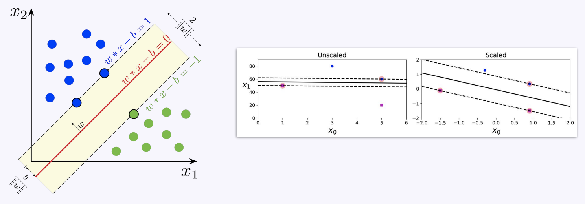

**Kernel trick**
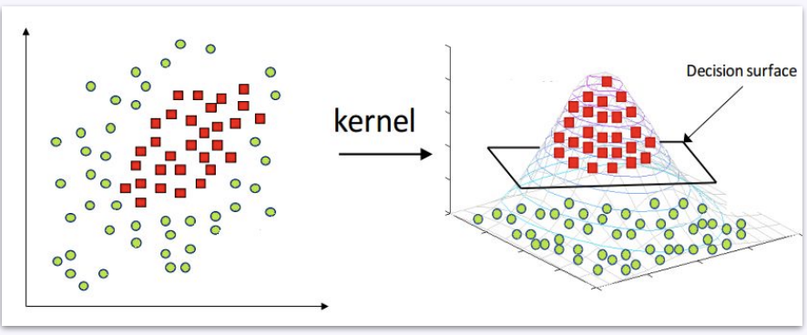
* Use the kernel trick for data that is not linearly separable - data might be separable in a higher dimensional space

**Soft margin classification**
* Allows a few instances to intersect the boundary band
* **Hard margin** => no instances to intersect the boundary band.
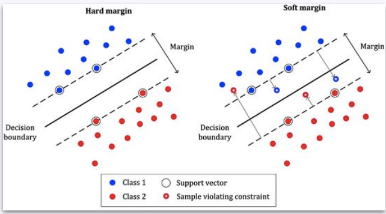

**SVMs are usefull**
* Small to medium datasets (< 10,000 samples)
* High-dimensional, low-sample problems
* When you have good kernel knowledge for your domain
* When you need strong theoretical guarantees

**Computational efficiency**
* Working with large datasets and want to apply SVM:
  * **Linear case** -> use LinearSVC in sklearn (can scale almost linearly to millions of samples and/or features)
  * **Bagging** -> train SVMs on samples of the dataset
  * **Kernel approximation** -> approximate the feature mappings that correspond to certain kernels 

## Neural networks
* **Structure**: Composed of layers of neurons: Input $\rightarrow$ Hidden Layers $\rightarrow$ Output15
* **The Neuron**: Performs a weighted sum of inputs plus a bias ($\sum w_i x_i + b$) and passes it through an Activation Function.
* **Activation Functions**: These introduce non-linearity (e.g., Sigmoid, ReLU). Without them, a neural network is just a linear regression model, regardless of depth
* **Backpropagation**: The algorithm used to train networks. It calculates the error contribution of each connection and updates weights using gradient descent

**Fully connected neural network**
* All nodes are connected
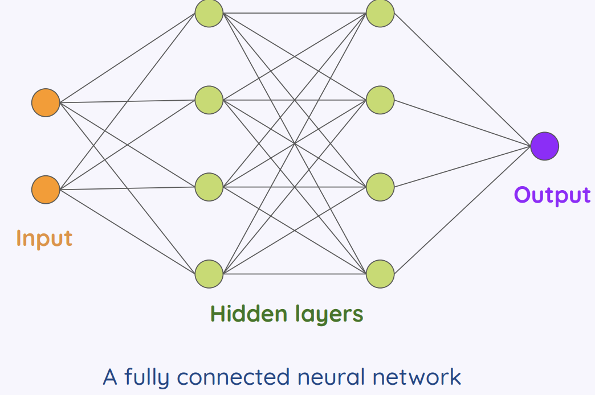

**Inside a neuron**
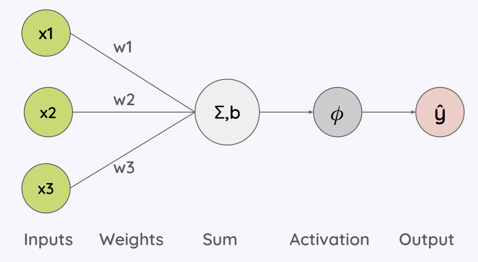
* Operations inside a neuron: multiply each input ($x_i$) with the corresponding weight ($w_i$), add them up, add bias, and apply an activation function.

### Linear vs. non-linear

**Linear Transformations:**
* These involve simple linear combinations of inputs, such as multiplying by a scalar and adding a constant.
* $2*x_1 + 4$
* $5*x_2 - 2$
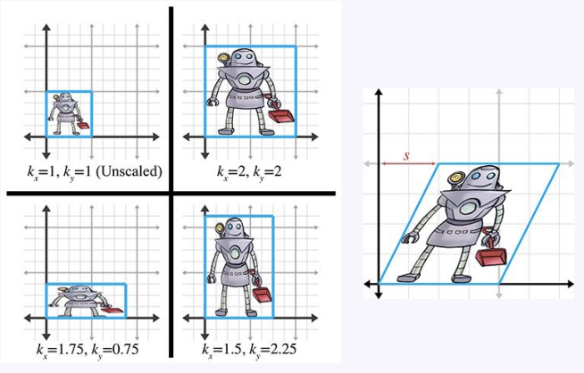

**Non-linear transformations:**
* These functions introduce non-linearity, allowing the network to learn complex patterns and decision boundaries
* $max(2*x_1,0)$
* $1/(1+exp(-x_2))$

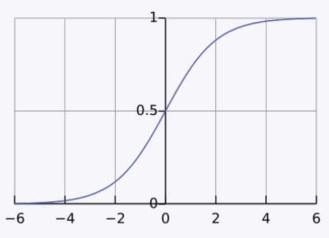

### Learning a function
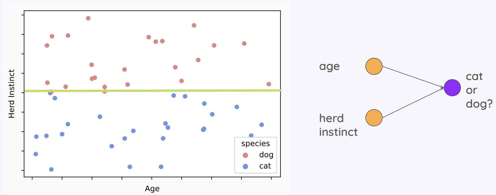
* **Adding non-linearity**: everything under the decision boundary is classified as a cat and every data point above is of class dog.

### Deep neural networks
* In short: Take a complex/messy dataset and transforms it through multiple layers (deep) into  a simplified structure where classification becomes easy.  
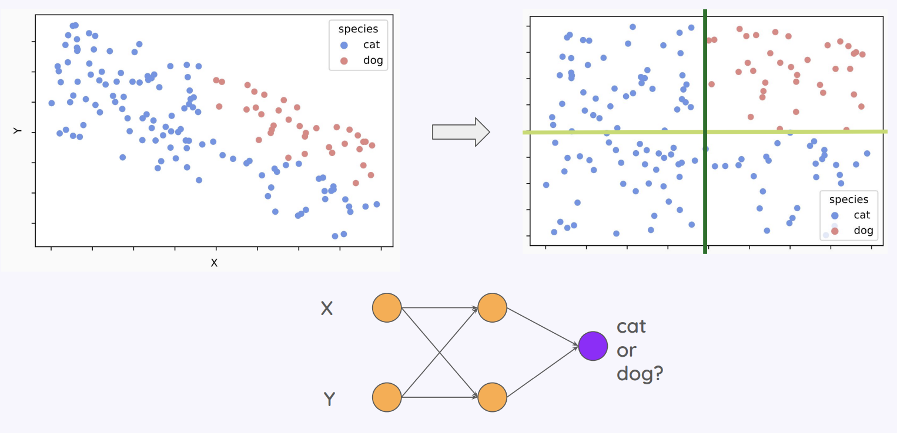

The Challenge (Left side of figure)
* The figure on the left shows a scatter plot with two classes of data: cats (blue dots) and dogs (red dots).
  * **Non-Linear Data**: Notice that the blue and red dots are mixed in a diagonal, almost spiral-like pattern. You **cannot draw a single straight line** to separate them perfectly.
  * **Input**: The "X" and "Y" axes represent the input features (e.g., Age vs. Herd Instinct) fed into the network.

The Solution (Right Side of Figure)
* The diagram on the right represents the Deep Neural Network architecture.
  * **Structure**: It consists of an input layer (X, Y), multiple hidden layers (the middle orange nodes), and an output node (purple).
  * **Deep Learning**: Unlike a simple linear model, this network has multiple layers ("deep"), which allows it to learn complex patterns.

What is Happening? (The **Transformation** and **rotation**)
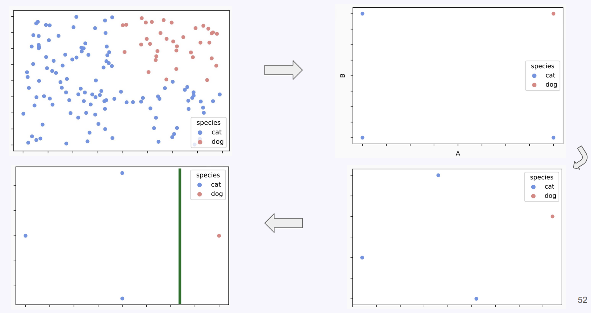
* **Warping Space**: The hidden layers of the network apply non-linear transformations (using activation functions) to the input data.
* **Unraveling the Data**: As the data passes through the layers, the network effectively "warps" or "unrolls" the complex spiral pattern. By the time the data reaches the final layer, **the network has transformed the space** so that the cats and dogs are **linearly separable**.
* **Final Decision**: The output layer can then **easily draw a straight line** (a decision boundary) to distinguish between the two classes, solving a problem that was impossible for a simpler model.

### Universal Approximators
**Universal Approximation Theorem**: An arbitrarily wide Neural Network can approximate any continuous function on a specified range of inputs.
* Initialize the parameters (eg. weights and bias)
* Apply the transformations
* Calculate how close is the output to the desired output
* Based on the prediction error, tweak the parameters, so that the error decreases and repeat

### Backpropagation in neural networks
**Backpropagation** is the algorithm that finds out how much each output connection contributes to the error and uses an optimizer (such as Gradient Descent) to tweak each weight and bias in order to decrease the order. 

Example:
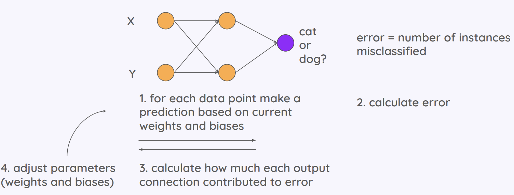
1. For each data point make a prediction based on current weights and biases
2. Calculate error
   1. error = number of instances misclassified
3. Calculate how much each output connection contributed to error
4. Adjust parameters (weights and biases)

## Ditributed model training
When datasets or models are too large for one machine, training is distributed.

Distributed training involves spreading training workload across multiple **processors** or **worker nodes** (may be a virtual or physical machine).
* Can improve training speed and accuracy
* Can be used in: 
  * Data parallelism
  * Pipeline parallelism
  * Parameter server training

* **Data Parallelism**: The model is **replicated** across multiple GPUs. Each GPU processes a different batch of data, and gradients are aggregated (synced) to update the model.
* **Fully Sharded Data Parallelism (FSDP)**: Instead of replicating the entire model on every GPU (which wastes memory), FSDP shards (splits) model parameters, gradients, and optimizer states across workers. This allows for training much larger models

### Deep learning on one machine, one GPU
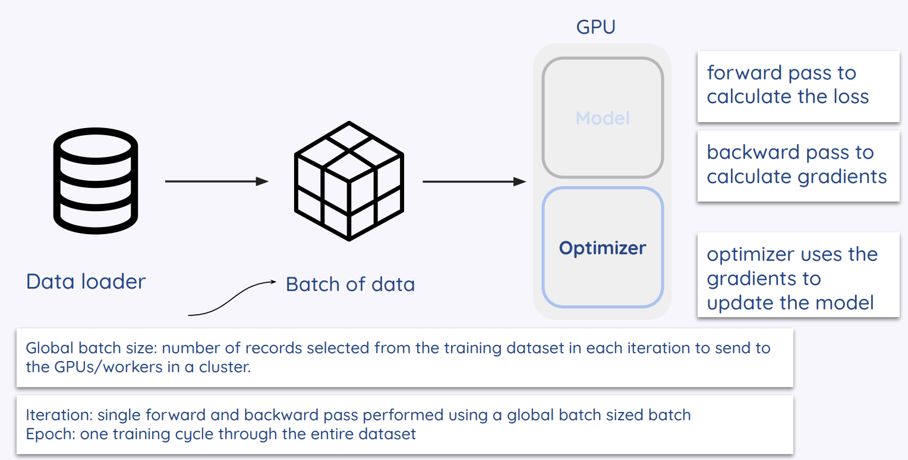
**Global batch size**: number of records selected from the training dataset in each iteration to send to the GPUs/workers in a cluster. 
**Iteration**: single forward and backward pass performed using a global batch sized batch
**Epoch**: one training cycle through the entire dataset
**Forward pass**: calculate the loss
**Backward pass**: calculate gradients
**Optimizer**: uses the gradients to update the model

### Data parallelism - Training on multiple GPUs
**Data parallelism** example: each processor will get a batch of the data
* Each GPU has a local copy of the model: same model parameters, optimizer parameters, random seed etc. 

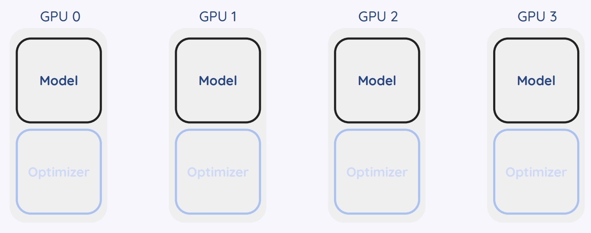

* **Different Data**: The training dataset is split into batches, and each GPU processes a different batch of data simultaneousl.

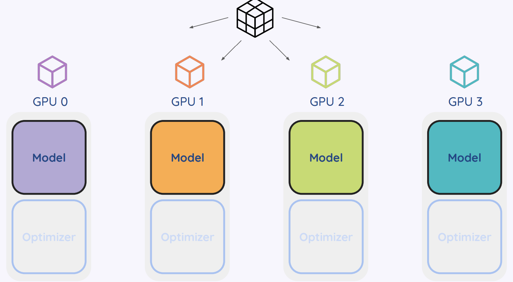

* **Optimizer**: Use local copies of the **same optimizer**, but they are synchronized to act as one.
  * **Local Copies**: Just like the model, each GPU has its own local copy of the optimizer parameters.
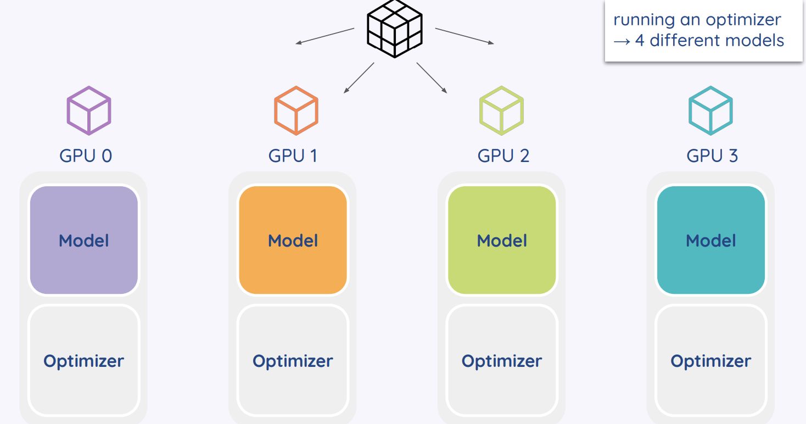

**Gradients aggregation**
* Gradients from all the replicas are aggregated, so everyone shares the same information

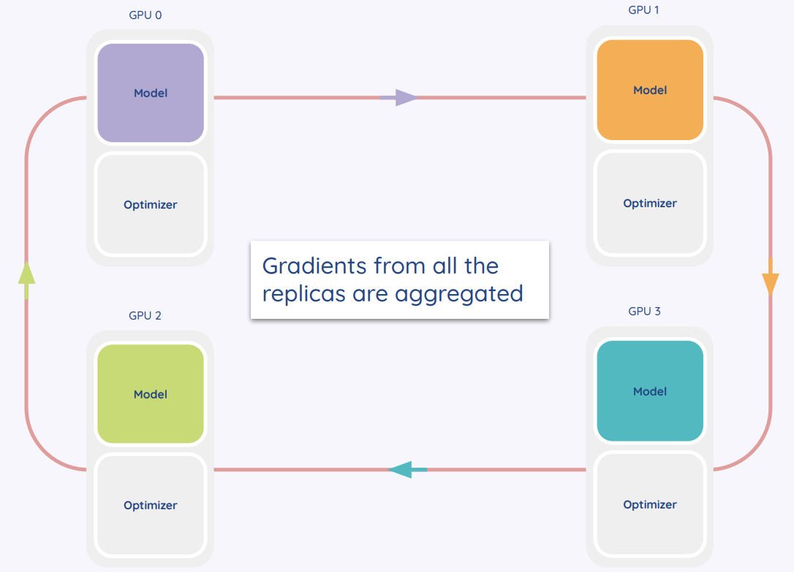

**Synchronized replicas**:
1. Each GPU calculates gradients based on its own data batch
2. These gradients are aggregated (synced) across all GPUs so everyone shares the same information.
3. Because the gradients are synchronized before the update step, every local optimizer applies the same update to its local model copy.

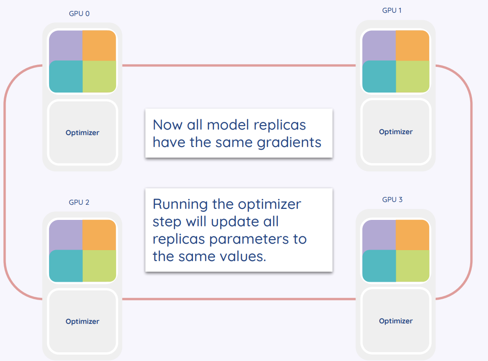

**Tools - for Data parallelism for deep learning**
* **Pytorch Data Parallel (DP)**: distribute the data across multiple GPUs on a single machine
* **Pytorch Distributed Data Parallel (DDP)**: training models across multiple processes or machines
* **Tensorflow MirroredStrategy**: single machine with multiple GPUs
* **Tensorflow MultiWorkerMirroredStrategy**: extends MirroredStrategy to distribute training across multiple machines. Each worker has access to one or more GPUs.
* **Tensorflow TPUStrategy**: designed specifically for training models on Google's Tensor Processing Units (TPUs).

**Summary**
* You have multiple physical copies of the **same model** and **same optimizer** running in parallel on different data slices, but they are mathematically forced to stay identical through synchronization.

### Fully sharded data parallelism - Training on multiple GPUs
Model parameters, optimizer states and gradients across are **distributed across workers**.
* No replicas like data parallelism.

Results:
* Smaller GPU memory footprint, possible to train very large models but increased communication costs

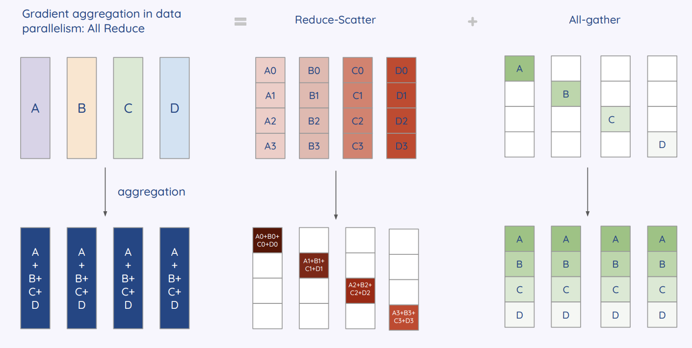

**Data parallelism vs. Fully sharded data parallelism**
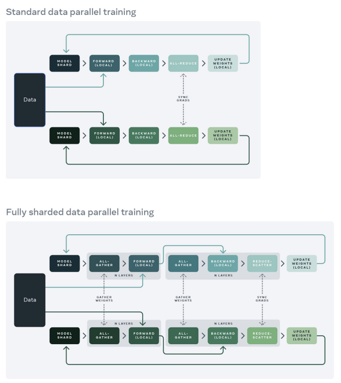