# Lecture 9 (ML lifecycle III)

## Recap ML Lifecycle

**Workflow Stages:** The lifecycle consists of seven key stages: Data Preparation, Exploratory Data Analysis, Feature Engineering, Model Training, Model Validation, Deployment, and Monitoring.

### Data preprocessing

The process involves combining multiple datasets, handling missing data (e.g., using SimpleImputer), scaling features (e.g., StandardScaler), and applying feature transformations.

**Evaluation**:
The lifecycle relies on splitting data into training and testing sets and utilizing cross-validation to ensure robust model assessment.

**Pipelines**: 
Pipelines chain multiple processing steps (transformers) and a final model (estimator) into a single object.

### Pipelines

**Purpose:** It automates the workflow (preprocessing + prediction), simplifies code, and prevents errors like data leakage.

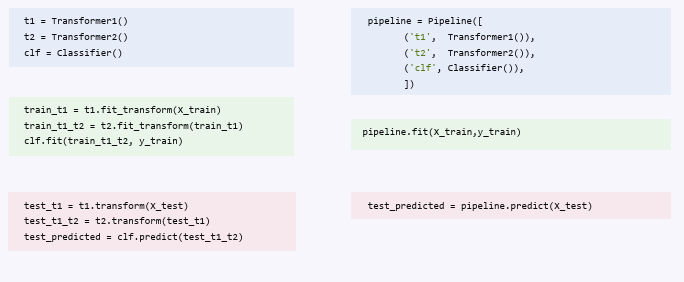

### Model Building
**Decision Trees & Ensembles:** Includes models like XGBoost, which is an ensemble of trees optimized for big data.

**SVM (Support Vector Machines):** Computationally expensive for big data, though some optimizations exists

**Neural Networks:** Composed of linear transformations with added non-linearity (activation functions)
* For large-scale deep learning, distributed training is used, utilizing strategies like data parallelism or fully sharded data parallelism

## ML challenges

**Experimentation:** Unlike traditional software which builds towards defined functional features, ML development is experimental and aims to optimize specific metrics (e.g., accuracy).

Performance is strictly tied to the quality and nature of the training data.

### Experimentation

* Try out different transformations (scalers, data imputation etc.)
* Tuning hytperparameters (for example with NN: define number of layers, neurons, activation function etc.)

**Findind the best parameters is a complex process**

### Model Development

**Traditional Software Development vs. ML development**
Traditional software often has a defined set of product features to be built.
ML development tends to revolve around experimentation.
* New datasets
* Models
* Software libraries
* Tuning parameters

**Example of experimentation with grid search and cross-validation**:

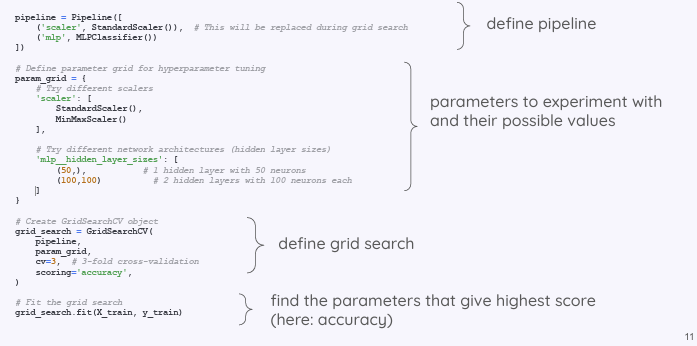

## Mlflow

**Definition**: An open source platform for maanging the end-to-end machine learning lifecycle. 

* Tracking experiments (MLflow Tracking)
* Packaging ML code in a reproducble form (MLflow Projects.)
* Deploy models (MLflow Models)
* Collaboratively manage the full lifecycle, using the Model Registery. 
  * Model versioning
  * Stage transitions 
  * Annotations

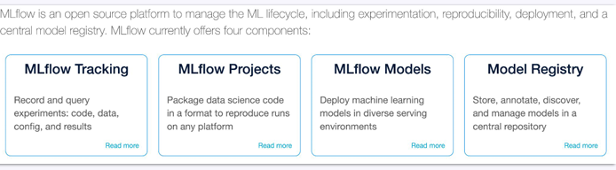


### MLFlow Tracking

MLflow Tracking is organized around the concept of runs (executions of data science code) which record:
* Code version
* Start and end time of the run
* Source (name of the file to launch the run)
* Input parameters
* Metrics

Runs can be recorded locally, in a database, remotely (tracking server)

#### Tracking Runs
Initiate an MLflow run context to start a new run that we will log the model and metadata to.

Log model parameters and performance metrics.

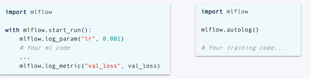

#### MLflow Tracking - experiment

An experiment groups together runs for a specific task. 

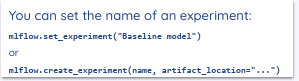

#### MLflow Tracking - overview

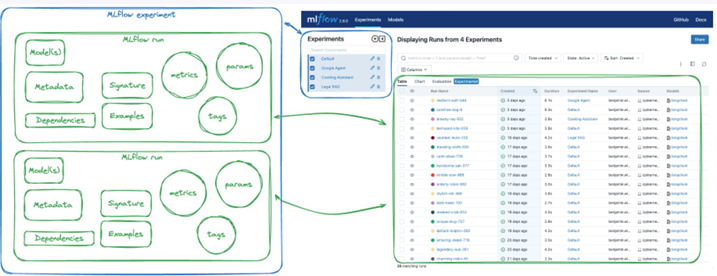

#### MLflow - How to do Tracking

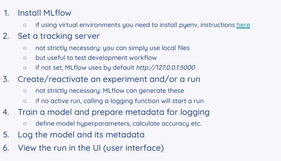

####  MLflow Tracking Server


**Server Definition**: A server is a hardware device or piece of software which manages access to a resource or service in a network.

The host (--host 127.0.0.1) and port (--port 8080) are network settings that determine where the MLflow tracking server runs and how it can be accessed.

127.0.0.1 = loopback address/localhost: This IP address is reserved for loopback purposes and is not used to communicate with other devices like a real IP address. 

Port = a number that identifies a connection endpoint; it help to direct data to a particular service. 

Ports help differentiate multiple services running on the same machine


#### Logging
* **Parameters:** Key-value pairs representing configuration settings (e.g., learning rate, start/end time)
* **Metrics**: Numerical values used to evaluate the model's performance (e.g., loss, accuracy, Mean Absolute Error).
* **Datasets**: Information about the data used for training or testing. To load the actual dataset later, you must log the dataset path or source (URL/cloud instance).
* **Artifacts**: Output files generated by the run. These can be saved locally or remotely. Examples include:
  * Images
  * Data files and HTML description
  * Model weights
* **Models**: The trained model itself is logged as an artifact. This log includes:
  * Dependencies: Information required to restore the model environment, such as the conda environment (YAML file), Python version, or pip requirements.
  * Storage Format: The model is stored as either a serialized object (e.g., a pickled Scikit-learn model) or a Python script/notebook containing the model 

#### MLflow model flavors

"Flavors" are conventions that help different tools understand and work with your model.

**Purpose:** They allow you to write tools that function with models from any machine learning library (like Scikit-learn, XGBoost, or TensorFlow) without needing to create specific integrations for each on

Each flavor defines standardized  load_model(), predict() methods regardless of their underlying library.

Built-In Model Flavors:
* Python Function (python_function)
* Scikit-learn (sklearn)
* XGBoost (xgboost)
* Spark MLlib (spark)
* Keras (keras)
* Transformers (transformers) (experimental)

**Sklearn Example**

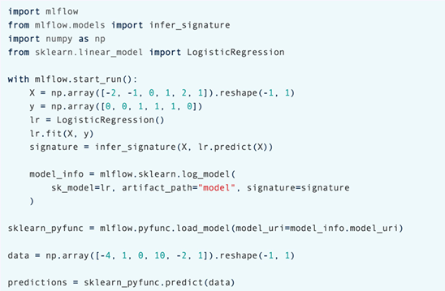

It highlights MLflow's "flavors" by loading the model back as a generic Python function (mlflow.pyfunc.load_model) to generate predictions, allowing tools to use the model without needing specific Scikit-learn integration .


### MLflow Registry

MLflow Registry is a centralized repository that provides a user interface and APIs to manage the full lifecycle of MLflow models.
* Allows registering MLflow Models into the registry
* Allows Registering and Loading model

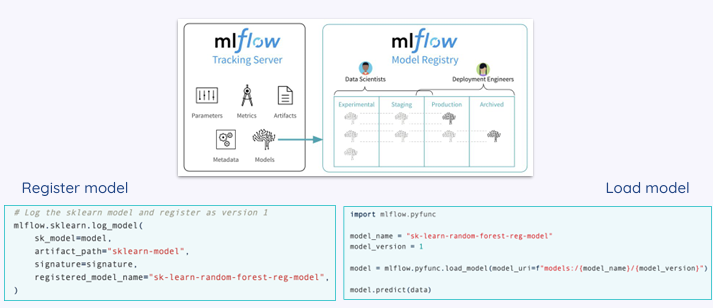

### Overview of MLflow Model

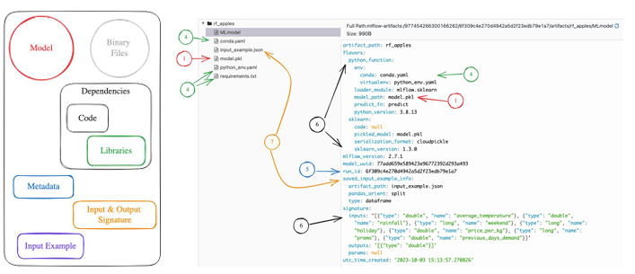

an MLflow Model is stored as a directory containing the model itself along with all necessary metadata and dependencies to ensure it can run.

* Binary Files: The actual serialized model object
* Metadata
* Dependencies: Files required to recreate the environment where the model runs
* Input & Output Signature: A file (e.g., input_example.json) i.e Input Example, containing sample data to help users understand the valid input format

### Deployment

After training your machine learning model and ensuring its performance, the next step is to make the models available.

**Definition**: integrating a trained machine learning model into a production environment where it is ready to start serving predictions

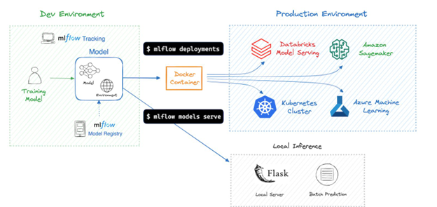

#### Serving vs. Deploymeny

**Deployment:** The broader process of moving the model to a destination environment (target) such as a local server, cloud service (AWS, Azure), or Kubernetes cluster

**Serving:** The specific process of making a model accessible to end users or applications, often via a REST API or web service

**Goal:** To get the model into an environment where it's ready to start serving predictions, but not necessarily actively doing so.

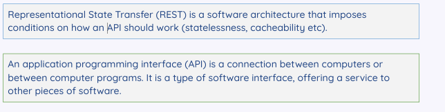

#### Serving a MLflow Model

To serve the model to a local REST API endpoint run the following command:
```
mlflow models serve -m model
```

To use the model, we send data (in json format) to the server running MLFlow:
```
curl http://127.0.0.1:5000/invocations -H 'Content-Type: application/json' -d '{"dataframe_records":[{"Time":"2025-01-10T15:0:00Z"}]}'
```

### Virtual Machines

Deployment often uses Virtual Machines (VMs) to ensure the model runs consistently across different hardware.

**Definition**: Virtual machine is an emulation of a computer system (OS, hardware)

Virtualization: "Freezes" the entire system (OS, libraries, ML code) into an isolated package.
* Run the whole package on top of the operating system of the production machine

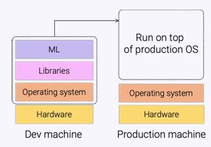

Hypervisor: A software layer that allows multiple VMs (with different operating systems) to run on a single piece of hardware
* The Hypervisor splits the hardware resources of the machine across multiple virtual machines
* Hypervisor can be installed directly on Hardware (Type 1) or on host OS (Type 2)

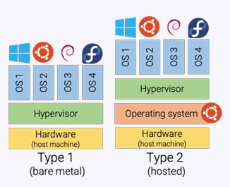

### MLFlow Projects

**Structure:** A project is simply a directory of files or a Git repository that contains your code and a specific configuration file.

**MLproject file**: This file (typically YAML) defines the project's properties and tells MLflow how to execute the code:
* Name: The name of the project.
* Environment: The software environment required to run the code (e.g., Conda, Virtualenv, or Docker containers)
* Entry Points: The specific commands that can be run within the project, along with their parameters

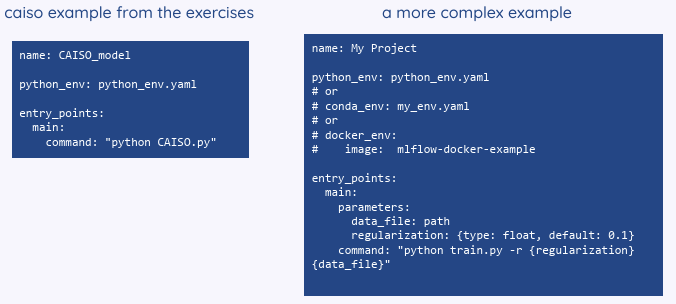

#### Running MLflow projects

You can execute an MLflow project in two ways:
* Command Line: mlflow run project_URI.
* Python API: mlflow.projects.run(project_URI)

#### Deploying MLflow with VMs on Azure

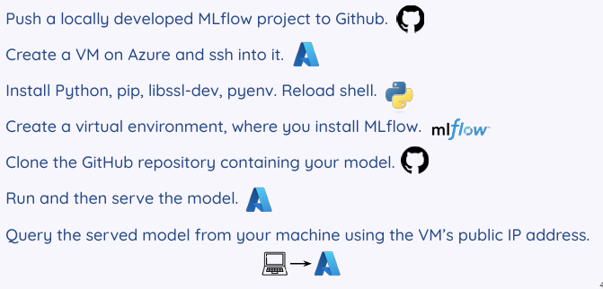

## MLflow Overview

MLflow provides a unified platform to navigate model development, deployment, and management:
* Experiment Management: MLflow Tracking
* Reproducibility: MLflow Projects
* Deployment Consistency: 
* Model Management: Model Registry
* Library Agnosticism: Library Agnoticism

## Reproducibility Issue in ML research

ML results are hard to reproduce:
* Underspecification: Metrics used to report results are not fully defined
* Improper Statistics: Incorrect use of statistical methods to analyze results.
* Selective Reporting: Only reporting favorable results.
* Data Issues: Lack of access to the original training data or differences in data distribution.
* Code Availability: The necessary code to run the experiment is unavailable or contains errors
  
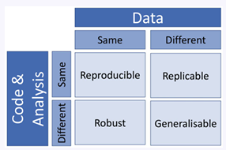

**Training the same mode, wiuth the same hyperparameters can give different results**

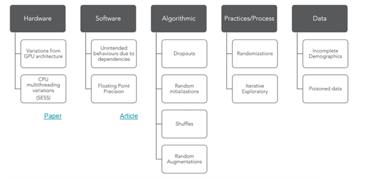

**Hardware:** Variations in GPU architecture or CPU multithreading.

**Software:** Unintended behaviors caused by software dependencies or floating-point precision differences.

**Algorithmic Randomness:** Factors like random initializations, data shuffling, dropouts, and random augmentations.

**Process:** Exploratory iterations and randomizations in the workflow.

**Data:** Issues such as incomplete demographics or poisoned data.

## ML Systems Fail Silently
* Normal Software Fails Loudly: crashes or displays a clear error message to the user.
* ML Systems Fail Silently: Machine learning systems often continue to run and generate predictions without crashing, even when those predictions are incorrect or nonsensical.

### Monitoring ML Systems

Because these failures are silent, you cannot rely on crash logs to detect them. Instead, you must implement Monitoring, which is the act of tracking and logging metrics to determine when something is going wrong

**Monitoring**: = the act of tracking, measuring, and logging different metrics that can help us determine when something goes wrong.

Metrics that convey the health of an ML system:
* **operational metrics** (latency, throughput, the number of prediction requests, CPU/GPU utilization, memory utilization etc)
* **ML specific metrics**:
  * Accuracy related: Measuremnt of performance
  * Predictions: Monitoring the actua outputs generated by the model
  * Features: Tracking the processed input variables fed into the model
  * Raw inputs: Monitoring the original, unprocessed data coming into the system.

## Data Distirbution Shift

Data Distribution Shift occurs when the data a model works with changes over time.

**Two types**:
* Source Distribution: The data the model is trained on.
* Target distribution = data the model runs inference on (predictions)

**Concepts**:
* X = inputs to a model
* Y = outputs 

In supervised learning, the training data can be viewed as a set of samples from the joint distribution P(X, Y). We model P(Y|X):
* Example:  "Given this specific picture ($X$), what is the probability it is a Cat ($Y$)?

The joint distribution P(X, Y) can be decomposed in two ways: 
* P(X, Y) = P(Y|X)P(X) 
* P(X, Y) = P(X|Y)P(Y)

### Covariate Shift

* The distribution of inputs $P(X)$ changes.
* The conditional probability of a label remains the same i.e $P(Y|X)$ remains the same.
* Example: The input data looks different, but the rule for classifying it hasn't changed.

### Label Shift

* The distribution of outputs $P(Y)$ changes.
* The conditional distribution $P(X|Y)$ remains the same.
* Example: The proportion of a certain class (e.g., positive cases) changes, but the features for that class stay the same

### Concept Drift
* The conditional distirbution $P(Y|X)$ changes.
* The input distribution $P(X)$ remains the same
* Example: Same input, different output

### Detectomg Data Distirbution Shifts

To determine if the source and target distributions are different, you can:
* **Compare Statistics**
  * Compute metrics like mean, median, variance, quantiles, or skewness for both training and production data.
  * Limitation: Inconclusive; distributions can differ even if these stats are the same.
 
* **Two-sample hypothesis test**
  * Use a statistical test to determine if the difference between the two populations is significant.
  * If yes, likely from two distinct distributions 

### Two-sample test (Kolmogorov-Smirnov)

Pros: Does not require assumptions about the underlying distribution.
Cons: Only works on one-dimensional data (feature-by-feature).

* Useful for prediction & label distributions
* Not so useful for features

## ML in Production: In Reality

The reality of deploying Machine Learning in production is described as a chaotic, iterative loop rather than a linear path.

While the expectation is a simple 4-step process (Collect Data $\rightarrow$ Train $\rightarrow$ Deploy $\rightarrow$ Profit), the reality involves constant setbacks and restarts

Once you finally deploy, new problems arise in production

Even if the model works technically, it might fail business goals

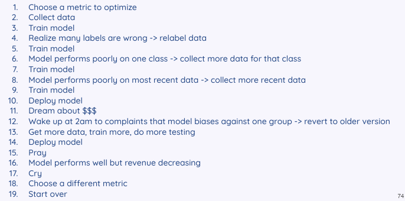

## Value of data

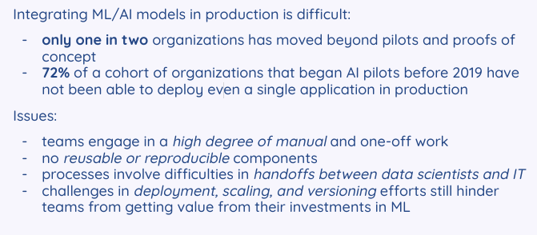

## ML System

Only a small fraction of real-world ML systems is actually composed of the ML code. (black box). The required surrounding infrastructure is vast and complex.

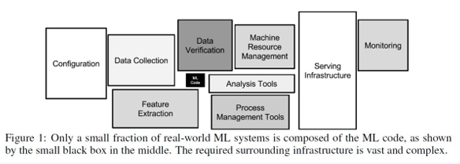

## Before Designing an ML system

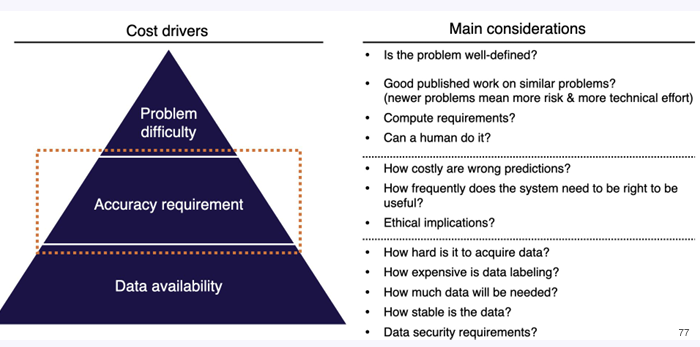

A "hierarchy of needs" (depicted as a pyramid) and a checklist to assess if an ML project is feasible before starting


