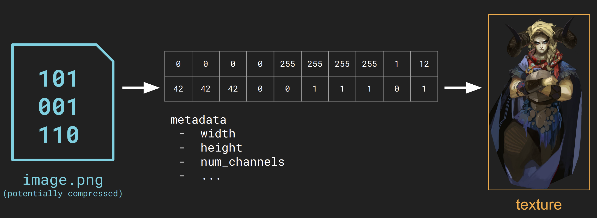
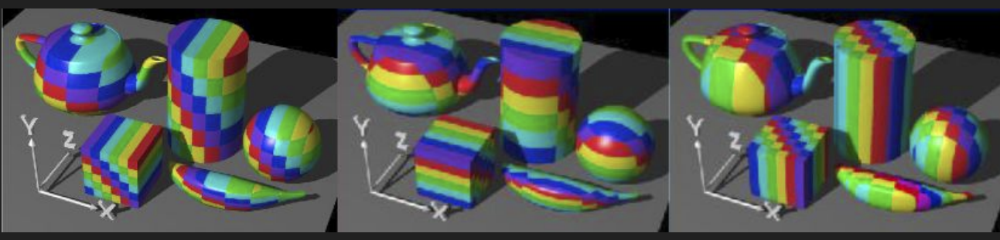
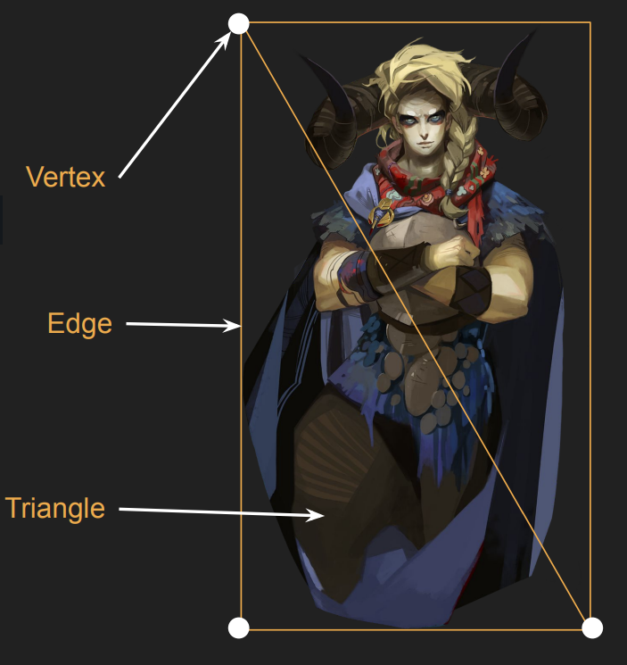
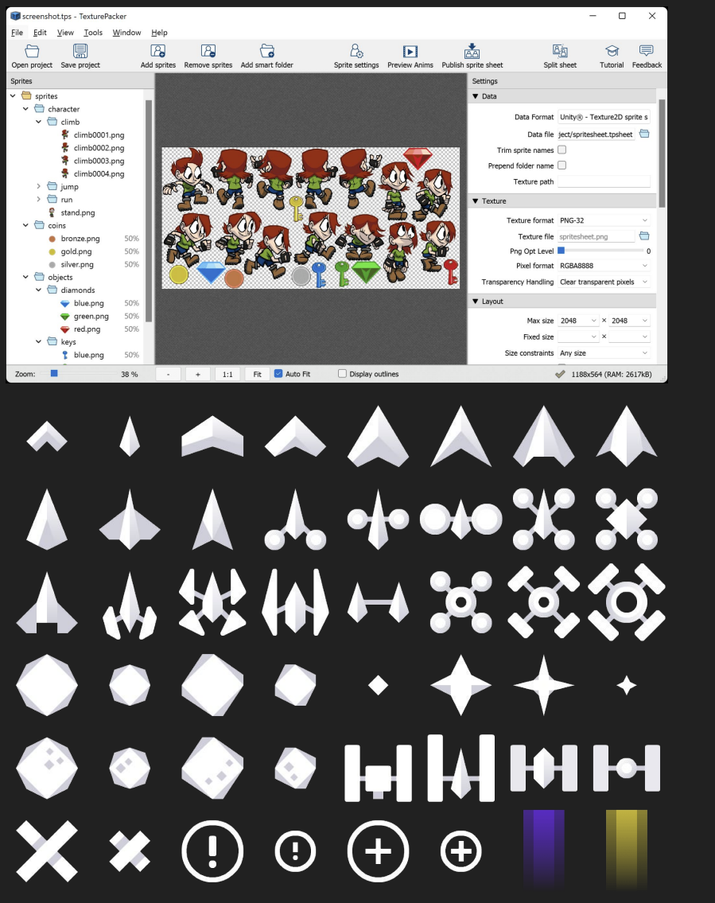
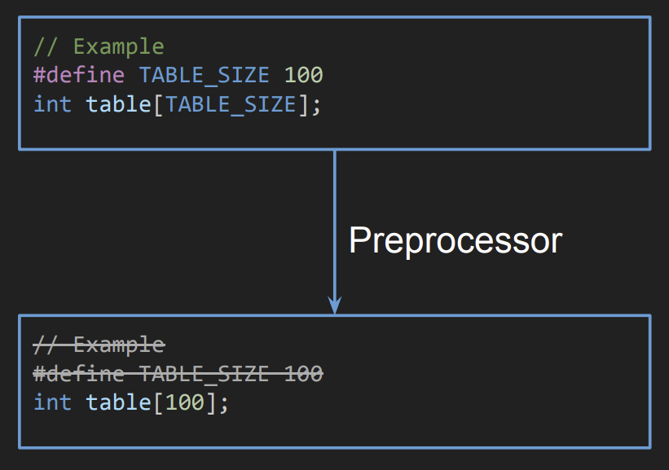
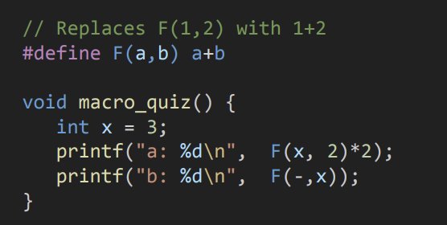
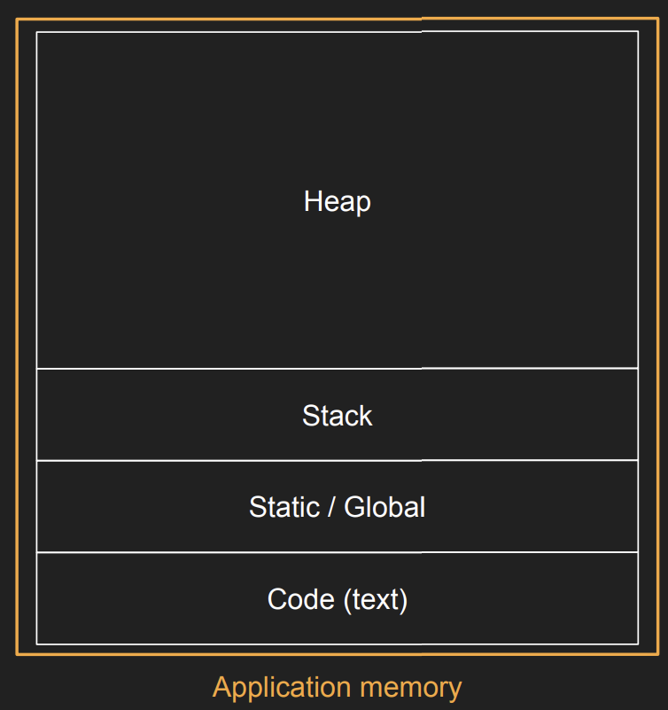
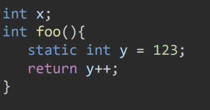
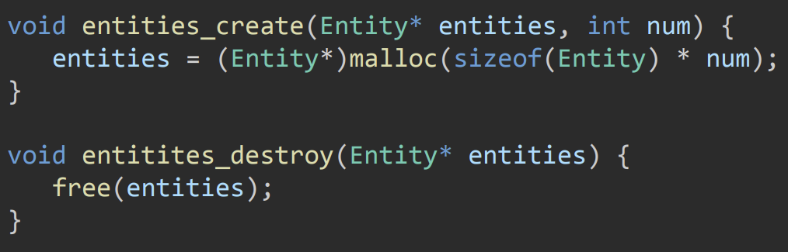

# Lecture 1 (Sprite Based Rendering)

## Types of delay

### Busy wait

```
SDL_Time walltime_busywait = walltime_work_end;
while(walltime_busywait - walltime_frame_beg < target_framerate_ns)
    SDL_GetCurrentTime(&walltime_busywait);
```

* Precise but costly.
* Continously checks the current time in a loop until the target frame rate is reached. 


### Simple Delay

```
// NOTE: `SDL_Delay` gets milliseconds, but our timer gives us
nanoseconds! We need to convert it manually
SDL_Delay((target_framerate_ns - time_elapsed_work) / 1000000);
```

* Simple, but too imprecise.
* Requires manual conversion as SDL_Delay uses milliseconds while requires nanoseconds.

### Delay NS

```
SDL_DelayNS(target_framerate_ns - time_elapsed_work);
```

* Higher resolution than simple delay, however still too imprecise.
* Uses SDL_DelayNS directly.

### Delay precise

```
SDL_DelayPrecise(target_framerate_ns - time_elapsed_work);
```

* Precise, as it attempts to wait as close to the requested time as possible
* May return later than expected due to OS scheduling
* Uses SDL_DelayPrevise, which may utilize busy waiting internally if necessary.

### Custom Delay

```
SDL_DelayNS(target_framerate_ns - time_elapsed_work - 1000000);
SDL_Time walltime_busywait = walltime_work_end;

while(walltime_busywait - walltime_frame_beg < target_framerate_ns)
    SDL_GetCurrentTime(&walltime_busywait);
```

* Balance between precision and cost.
* Uses a sleeping delay (SDL_DelayNS) with an arbitrary safety margin (1 millisecond), then "busy waits" (loops) what is left.

### Discussion

The custom delay is considered the best approach:
* Balances between precision and cost.
* Busy wait is very precise but too costly
* Simple/NS delay saves ppower, but is too imprecise, becuase the OS schedule can often make it over-sleep.
* Custom delay, sleep for most of the time, and then busy-wait for the tiny remainder.
  * High precision of a busy wait, with the low power consumption of a sleep
    * Sleeping is cheap, and busy wait (looping) is too expensive. 

## Sprite Based Rendering

### Questions of the lecture

How do we:
* pack them to be used in a smart and efficient way?
* make them interact with each other
* import digital images into games?
* manupulate them so that they appear to be in a consistent and believable digital world?

## Vector Math Basics

Given 2D vectors $a, b$ and scalar $f$:

Sum: Adds components together. Used for movement (Position + Velocity).$$a + b = (a.x + b.x, \ a.y + b.y)$$

Subtraction: Subtracts components. Used to find the vector pointing from one object to another (Destination - Origin).$$a - b = (a.x - b.x, \ a.y - b.y)$$

Scale: Multiplies vector by a number. Used to change speed or size.$$a * f = (a.x * f, \ a.y * f)$$

Element-wise Multiplication: Multiplies components.$$a * b = (a.x * b.x, \ a.y * b.y)$$

* Does not any standard geometric interpretation, but is useful in specific cases.

Length: Calculated using the Pythagorean theorem.$$\text{length}(a) = \sqrt{a.x^2 + a.y^2}$$

Squared Length (Optimization):$$\text{length\_sq}(a) = a.x^2 + a.y^2$$

* Square roots are expensive operations for CPU, you shoudld squared distances.

## Dot Product

The dot product is a scalar value derived from two vectors, essential for determining angles and facing directions.

$$\text{dot}(a, b) = a.x \cdot b.x + a.y \cdot b.y$$

YOu can use the result of the dot product to quickly check the relationship between two vectors:

Perpendicular ($90^\circ$): Result is 0.

Same Direction ($<90^\circ$): Result is Positive ($> 0$).

Opposite Direction ($>90^\circ$): Result is Negative ($< 0$)

Collinear (Parallel): Result equals the product of their lengths ($||a|| \ ||b||$).

Squared Length (magnitude as a dot product): A vector dotted with itself equals its length squared ($v \cdot v = ||v||^2$)

## 2D Graphics

### Raster Graphics

An image produced as an array (the raster) of picture elements (pixels) stored in a frame buffer.

* They consist of a grid of data (e.g., numbers representing Red, Green, and Blue values)

* Additional metadata is required to interpret the data, such as width, height, and num_channels .



### Images

Raster images can have any resctangular shape

File formats:
* Uncompressed: raw, bmp
* Compressed: jpreg, png

When loaded it is often stored uncompressed in main memory

### Textures

Textures are images that are uploaded to the GPU.
* Textures are used by modern GPUs
for both 2D and 3D graphics

* Textures are used to store: colors,
shadows, geometry data, etc.



### Texture rendering

How can we render a texture in
modern engines?
* Rendering engine these days treat 2D graphics as a special case of 3D.

#### Triangles

When rendering graphics
everything is usually first turned
into triangles.

* One triangle is three edges and three vertices



### Sprites

High-level representation of all the info we need to render a texture in a 2D setting
* Texture
* Position and Size
* Tint 
* Pivot

#### Sprite pivot

* The "logical" center of a sprite
* Defaults to the center of the sprite, but it can be useful to have it in other places.

Particularly useful for rotation: an arm should rotate around the joint, not its physical center.

### Texture Atlases

It is much more efficient to pack multiple sprites in the same texture

* Arrangements of sprites is important:
  * Arranged in a uniform grid vs Packed

Arranged in a uniform grid
  * trivial to generate
  * trivial to get each sprite
  * more wasted space (epsecially with non-uniform sprites)

Packed
* Requires dedicated software and algorithms to generate
* Extracting the sprite is more difficult.



## C++ (things)

### Preprocessor

Text replacement function before
compiling source.



Inject information in the program at compile time.
  
### Preprocessor macros

Create a text-replacement macro (should be used with caution)



#### Useful Examples

```
// mem.cpp
#include <stdlib.h>
#define MEM_CHUNK_SIZE 128

int main() {
    void* a = malloc(MEM_CHUNK_SIZE);
    free(a);
}
```

### C/C++ Memory Layout

Application memory is allocated on program startup by OS
* No access memory outside the application (protected by OS)
* Using virtual memory addresses 
* Destroyed on program exit by OS



#### Code (Text) segment

* Contains the machine code for the program
* It's data like everything else, so can be referenced

#### Static / Global segment

Contains global and static variables



#### Stack

Contains local variables and function parameters
* Has a fixed (and comparatively small) size
* Size of each stack frame is known at compile time

Stack frame = A specific block of memory on the Stack allocated for a single function call.

#### Heap 

General purpose memory
* Has a fixed (and compratively small) size
* Dynamically allocated (anything created with alloc function)
* Grows as needed




