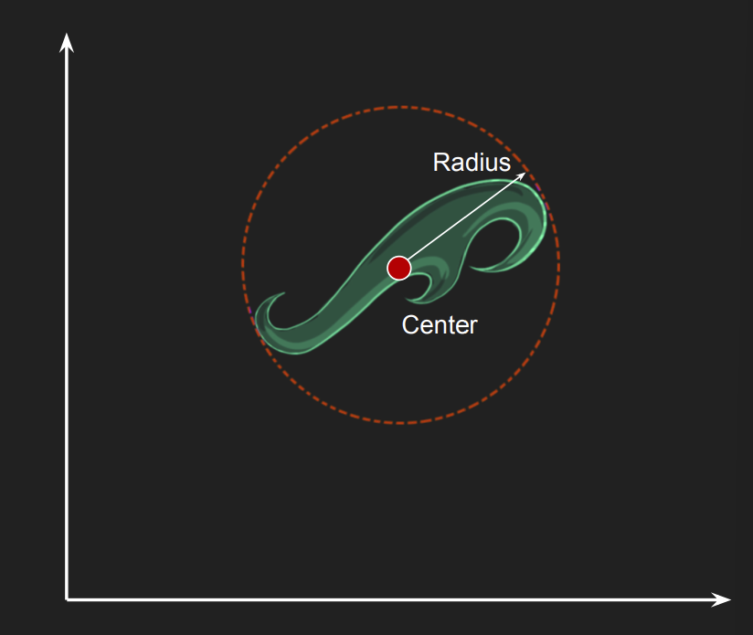
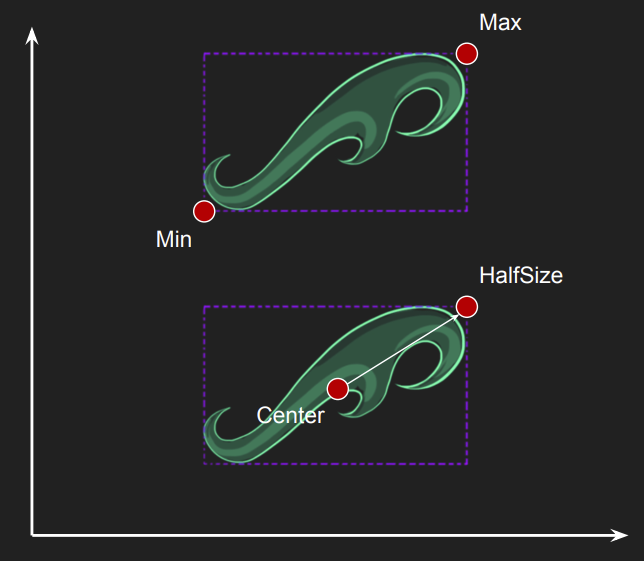
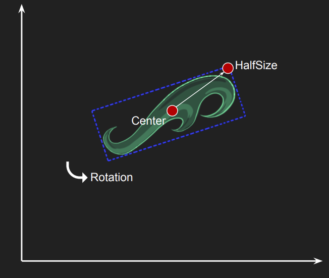
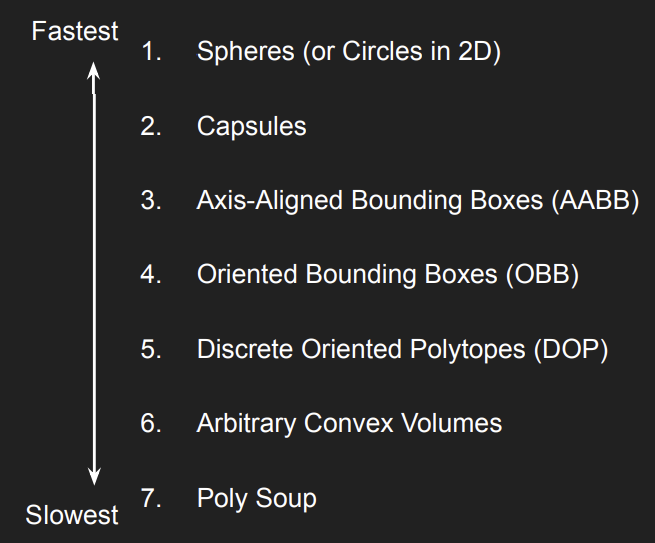
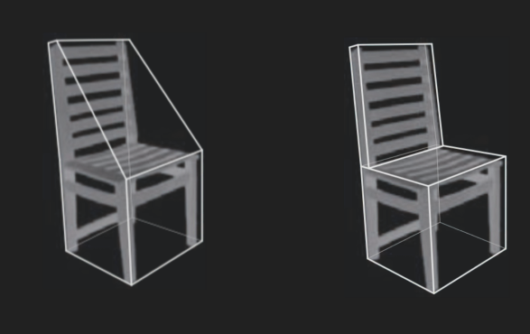
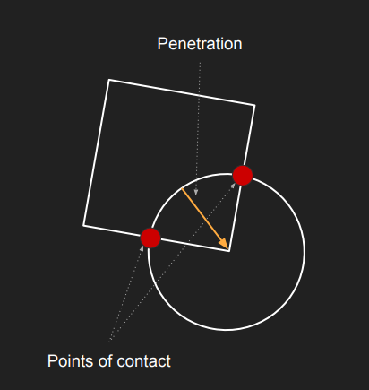
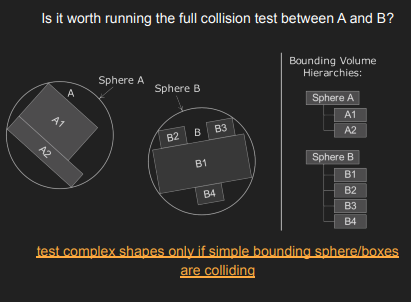

# Lecture 2 (Collision)

## Problem Statement

How do we:
* Seperate entities that are colliding
* Efficiently detect collisions between arbitrary shapes
* Tacke the quadratic nature of checking multiple colliders 

## Physics vs Collisions

### Impact of physics on a Game

**Design**:

* Loss of Control: Designers lose some direct control and predictability over the game world because physics simulations can behave in unexpected ways.

* Emergent Gameplay: On the flip side, consistent physics rules allow for "emergent behaviors"

**Engineering**:
* Programmers must build or integrate more complex tools to handle the simulation
* It’s not just one isolated feature; all other game systems (gameplay logic, AI, audio) must be written to work with and respect the physics system accordingly.

**Art**:
* The tools artists use become more complex to support physical properties (mass, friction, collision shapes).
* Art assets cannot just look good; they must be "physics-aware." For example, a model needs a correct collision mesh to match its visual shape.

etc.

### Collision detection vs. physics simulation

Physics simulations depends strongly on efficient collision detection.

## Geometric overlaps and seperations

The collision system detects if any
pairs objects collide

* Objects are represented by simplified primitive shaapes
* If a collision is detected contact information is generated, to allow object seperation.

### Collision Terms

Contact (or collision)
* State where two objects are touching but not necessarily overlapping

Intersection (or overlap/penetration)
* The mathematical state where the geometry of Shape A is partially inside Shape B

Convexity (Convex vs. Concave)
* Convex: A shape with no indentations or "caves."
  * If you draw a straight line between any two points inside the shape, the entire line remains inside the shape.
* Concave: A shape that has an indentation or "dent."
  * A straight line between two points inside the shape might pass outside the shape.

Edge explanation is also good enough.

### Bounding representation

**Bounding Circle**:
* Represented by a Center position and a radius
* A point collides with the bounding circle if distance to center is less than radius

**Axis-aligned Bounding Box**
* Represented by either
  * Min + Max Positions: Storing the coordinates of the "bottom-left" (min) and "top-right" (max) corners.
  * Center + Half-Size: Storing the center point $(x, y)$ and the distance to the edges (half-width, half-height).
* AABBs cannot rotate. If the game object rotates, the AABB must be redefined (recalculated) to fit the new orientation while remaining aligned to the X/Y axes.
* A point $P$ collides with an AABB if it falls strictly inside the box's boundaries.
  * min < p < max

**Oriented Bounding Box**
* Represented by:
  * Center Position: The $(x, y)$ coordinate of the box's midpoint.
  * Half-Size: The distance from the center to the edges (half-width and half-height).
  * Rotation: The angle of orientation (allowing the box to tilt).

### Collision Primitives

### Compound Shapes

A concave object can be
approximated by multiple convex
colliders

**Convex Decomposition:** The
process of cutting a concave
object into convex parts.

### Collision testing

There are several ways to determine if two collision primitives collide.
* Point vs Point
* Sphere vs. SPhere
* AAB vs Point
* Etc.

The physics system needs to be able to test against pairs of collision primitives.

### GJK Algorithm

The GJK (Gilbert-Johnson-Keerthi) algorithm is a method for detecting collisions between two convex shapes.

The core concept here is the Minkowsky difference.

#### Minkowsky Difference

Instead of checking if Shape A and Shape B touch, GJK mathematically subtracts them to create a new, abstract shape called the Minkowski Difference.
* Concept: Represents the relative distance between all points of the two shapes.
* Formula: $C = A - B$
* The Rule: The Minkowski Difference contains the Origin $(0,0)$ if (and only if) the two original shapes are colliding-

There are however two questions:
* How do we do this operation efficinetly?
* How do we test if an arbitrary convex shape contains the origin

#### Support Function
Calculating the full Minkowski Difference is too slow. We compute only the specific points we need

* Goal: Find the furthest point of the Minkowski Difference in a specific direction $d$
* Formula: $S_{A-B}(d) = S_A(d) - S_B(-d)$Procedure: Find extreme point of $A$ in direction $d$, subtract extreme point of $B$ in the opposite direction ($-d$).

#### Simplex
Since we cannot check if the Origin is inside the full shape, we iteratively build a simpler shape called a Simplex inside it.
* Definition: The simplest possible shape for a given dimension (e.g., a Triangle in 2D).

**The algorithm** (GJK Loop):
1. Use the Support Function to find a new point in a direction towards the Origin.
2. Add this point to the Simplex.
3. Check if the Simplex contains the Origin (using Dot Products).
4. If inside: Conllision confirmed; If outside: Discard the furthest point, and update the search towards the origin, and repeat.
5. The stop condition: 
   * If the new point found, did not pass the origin, the shapes are seperated.

**Dot Product**:
* Calculate the Normal (perpendicular vector) pointing out from the Simplex edge.
* Calculate the vector from the edge to the Origin ($Origin - PointOnEdge$).
* Perform the Dot Product: $Result = Normal \cdot VectorToOrigin$.
  * Positive ($> 0$): Origin is in the same direction as the outward Normal $\rightarrow$ Outside the shape.
  * Negative ($< 0$): Origin is in the opposite direction $\rightarrow$ Inside (behind the wall).

### Seperation

Once a collision is confirmed, we must physically separate the objects to prevent them from passing through each other
* Contact Point: Identify the specific coordinate where the two shapes are touching.
* Collision Normal: Determine the direction of the impact (perpendicular to the surface). This tells us which way to push the objects apart.
* Penetration Depth: Calculate the distance the objects are overlapping. This tells us how far to push.

**Seperation Logic**:

We use the Normal and Depth to apply a corrective movement (Translation Vector).
* Formula: $SeparationVector = Normal \times Depth$

### Discrete detection

At each simulated timestep, move all objects to their new locations, then do static testing.
* Move: Update all objects to their new locations based on velocity and timestep.
* Test: Perform static collision checks (e.g., Overlap Test) at these new positions.
* If overlapping, move them apart the same way before.

**Pros and Cons**
* Works well for objects that move slowly relative to their size
* However, fast movememnt relative to size and produce gaps. The engine check Position A (frame 1) and POsition B (frame 2), but ignores the gap between them. If an obstacle was in that gap, the object just passes through it.

### Swept Shapes

Create a new shape that occupies all the space the object passed through during the frame.

Example: A Swept Sphere becomes a Capsule.

We perform a standard static collision check on this new shape.
* If the Capsule intersects a wall, the sphere hit the wall sometime during its movement.

Limitations: 
* If the object rotates while moving, the resulting swept volume might become Concave
* GJK only works on convex shapes.

### Collision Queries

These are hypothetical tests used to gather information (e.g., for AI, gameplay logic) rather than resolving physical impacts. They do not move objects or apply forces.

* Point Test: Checks if a specific coordinate lies inside a shape.
* Ray Casting: Projects a line (ray) from a specific point in a specific direction to detect the first object it hits.
* Shape Casting (Shapecast): Sweeps a full geometry (e.g., a sphere or box) along a path to check for intersections.

## Optimizing collision detection

Finding collisions between all objects is the most expensive part of the physics engine for two reasons:
1. Expensive Individual Tests
2. The naive approach checks every object against every other object ($O(n^2)$).

### Dolision Detection Optimization

#### Pairs optimization

Bounding Volume Hierarchies (BVH): Use simple shapes like Spheres or AABBs to encase complex objects
* If the simple outer shell (AABB) does not collide, the complex inner object cannot collide.
* Expensive test only if simple bounding spheres/boxes are colliding. 

#### Global Optimization

Static Colliders: Objects that never move (walls, ground). We never check Static vs. Static, only Dynamic vs. Static.

Collision Layers: Do we care about collisions between A and B?

World partitioning: Split the game world into smaller regions to avoid checking objects that are far apart.

#### World Partitioning algorithms

Only test for collisions between objects that are in the same region.

Quadtrees (2D) / Octrees (3D): 
1. Recursively subdivide space in equal size regions.
2. High resolution for crowded areas, low resolution for empty areas.
3. Perform collision test only between objects in the same region
4. Remember, objects can belong to multiple regions when they
cross the boundaries

Dynamic AABB Trees:
1. Recursively group objects’ AABB into pairs
2. Leaves are objects’ AABB, internal nodes are union of children’s AABB
3. If object is not colliding with a (internal) node, it can’t collide with any children!
4. Can be extremely effective, but keeping the tree balanced is key

Other algrothims exists such as: Binary Partition Trees, R-tree, k-d Tree.

## Collision Detection Revised

Collision detection is now performed in
two steps:
1. Broad-phase: separate objects into multiple groups
2. Narrow-phase: intersection tests on all objects within this groups.

## Important for the Exam
● types of colliders
● generic overview of the GJK algorithm
● difference between broad and narrow phase
● ways to optimize collision detection
● overview of world partition algorithms

