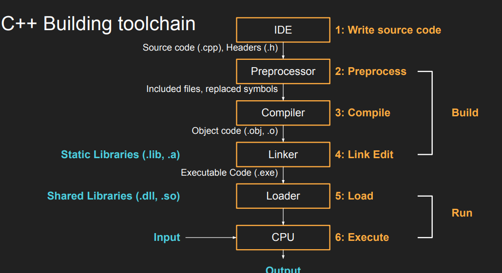

# Lecture 3 (Coordinate Systems)

## Why Cordinate Systems?
1. Game code indepdent from resources
   1. Changing the window/monitor size do not affect the game
2. Game code free to reason about space in whatever wayt is more convenient for deisng
3. A mechanism to render stuff outside the screen

Goal: Make game logic resolution-independent and easier to design.

Solution: Use abstract coordinate frames rather than raw pixels.

### Frame of reference

Positions in space are always relative to
something else

Different tasks are easier in different
frames of reference
* Rotate around a point or origin


### Moving between frames of reference

It’s always possible to move
between frames of reference, it’s
the inverse operation!

### Transformation functions

These are key transformations that are easily reversible:
1. Translate
2. Rotate
3. Scale

## Coordinate Systems (we use)

1. Object Space (Texture):
   1. Up: Negative Y.
   2. Right: Positive X
2. World Space (Game Logic):
   1. Up: Positive Y.
   2. Right: Positive X.
3. Camera Space:
   1. Up: Positive Y.
   2. Right: Positive X.
4. Screen Space:
   1. Up: Negative Y.
   2. Right: Positive X.

Model / | Coordinate System | Up Direction (Y) | Right Direction (X) | Origin / Mental Model |
| :--- | :--- | :--- | :--- |
| **Object Space** (Texture) | **Negative** | Positive | Top-Left (Image storage) |
| **World Space** (Game Logic) | **Positive** | Positive | Bottom-Left (Standard Math) |
| **Camera Space** | **Positive** | Positive | Center (View relative) |
| **Screen Space** | **Negative** | Positive | Top-Left (Monitor pixels) |

## 2D Transformations

```
struct Transform
{
    vec2f position;
    vec2f scale;
    float rotation;
};
```

Intuitive, but a bit cumbersome, and little less efficient than transform matrices.

### Note on rotation

Angle (Degree/Rad): Simple, but slower due to repeated trigonometry.

Sin/Cos: Performant (trig done once), but complex to maintain state.

## C++ Building Pipeline



### Classic C++ Build

Classic Build (Separate Compilation):
* Structure: Headers (.h) for declarations, Source (.cpp) for implementation.
* Process: Each .cpp compiles to .obj, then linked to .exe
* Cons: Slow compilation on large codebases, complex dependency tracking.

The header files (.h, .hpp, hxx) contain
declarations that need to be shared among
multiple source files.
* data types, funciton decelrations, constant values, enumeration types etc.

The source files copntain actual executable functions and methods of the program, as well as any global data.


### Unity Build

Due to a number of factors (mostly inefficient preprocessing and issues with incremental
linking), people developed a new approach called Unity Builds (as in “unified”).

The idea is to have one single compilation unit, and include all code in there.

### Classic Vs Unity Builds

**Classic**
* Pros: 
  * Well known and understood
  * Maps well to OOP
* Cons:
  * Can be very slow it compile (especially C++, especially big code bases)
  * Requires a dedicated build system to keep track of everyrthing
  * difficult for beginners to wrap their head around it

**Unity**
* Pros:
  * Very fast to compile
  * No need to complex build systems
* Cons:
  * Code tends to spiral a bit if not tended
  * Difficult for beginners to wrap their head around it.

