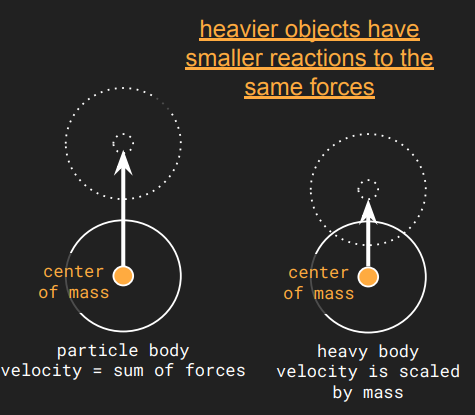
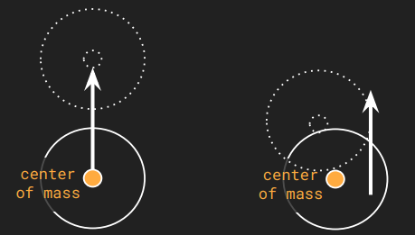
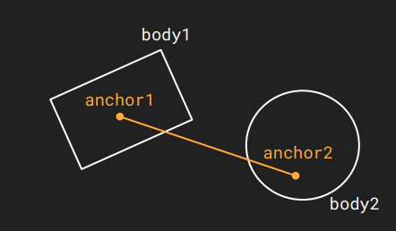
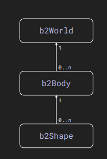
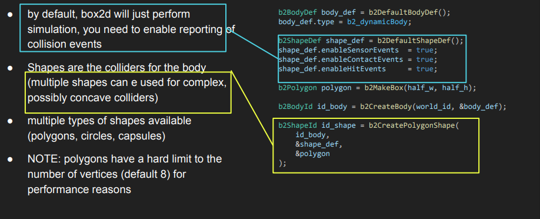
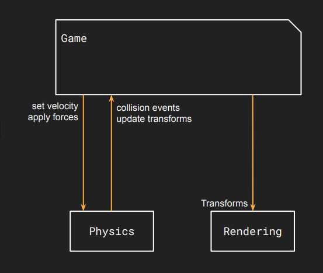

# Lecture 4 (Physics)

## Lecture Questions

How do we:
* make physics simulation and our game communicate?
* integrate 3rd party libraries in our project?
* complement collision detection with realistic physics?
* optimize physics simulations?

## Physics Simulation

### Physics Concepts
* Position: The current location of an object (in space)
* Speed: The magnitude of the velocity
* Velocity: The change of position over time
* Acceleration: The change of velocity over time
* Momentum: The object's velocity scaled by its mass.
* Force: A vector quantity that causes a change of velocity.

### Rotational counterparts
* Position $\rightarrow$ Rotation.
* Speed $\rightarrow$ Angular Speed.
* Velocity $\rightarrow$ Rotational Velocity
* .Acceleration $\rightarrow$ Rotational Acceleration (rarely used).
* Momentum $\rightarrow$ Angular Momentum.
* Force $\rightarrow$ Torque

### Non-Particle Bodies

Particle Assumption: Simple physics simulations often assume objects have no size and zero mass, effectively treating them as particles (what we have done so far).

Real-World Objects: Real objects have physical dimensions and mass, requiring a "Non-Particle" model.

**Heavier objects have smaller reactions to the same forces**

**Particle vs. Non-particle**
* For particle bodies:
  * Force can only be applied to the center of mass
  * Entire force constributes to changing velocity
* Non particle vodies:
  * Forces cam ne applied anywhere
  * Off-center forces apply some energy to angular velocity

### Other physics concepts
* Drag: A resistive force that slows down an object's motion.
* Angular Velocity: The rate of rotation of an object.
* Torque: A rotational force (the rotational equivalent of linear force).
* Mass: Represents the "weight" or quantity of matter in an object.
  * Influences the effects of foreces on an object
  * Formula: Force = Mass * Acceleration

### Realtime physics simulation

Physics simulations are computationally expensive, so games use specific techniques to maintain performance.

**Timing**:
* Simulations are performed in fixed steps (e.g., 60 times per second) rather than variable steps
* Makes the simulation numerically stable

**Sleep**:
* A rigid body can be marked as sleeping
* Objects are put to sleep when velocity is under a given threshold
* Physics simulation are not performed on sleeping objects
* Objects are woken up on collisions and/or when force is applied

### Types of physics bodies
* **Static**
  * No movement under simulation
  * Can be manually moved by user
  * Has no velocity
  * Example: The ground, walls, or fixed platform
* **Dynamic**
  * Fully simulated
  * Mass = density * volume
  * Move according to forces 
  * Example: A bullet flying through the air, or a falling crate.
* **Kinematic**
  * Move according to velocity
  * Does not respond to forces
  * Example: A moving platform, that goes up and down regardless of what is on it

### Friction
Definition: The force resisting the relative motion of solid surfaces sliding against each other.
* It is a parameter defined on a physics body.
* Effects:
  * Low Friction: Objects slide easily (e.g., a small push on a smooth surface)
  * High Friction: Objects resist movement significantly (e.g., a big push is required on a rough surface).

### Restituion / elasticity
Definition: A physics material property that defines the "bounciness" of collisions.
* Values:
  * Restitution = 0: Inelastic collision (No bounce).
  * Restitution = 1: Perfectly elastic collision (Full bounce).
  * 
### Constraint
Definition: Limits the movement of an object to simulate physical connections or restrictions.
* Modeled by adding joints to objects
* Examples:
  * Door Hinge: A door constrained to rotate around a specific axis.
  * Fixed Rotation: Disallowing the rotation of an object entirely.

### Distant Joint
Definition: Maintains a fixed distance between two anchor points on two rigid bodies.
* Can be parameterized to create specific effects, such as spring-like connections .
* Uses b2DistanceJointDef to define properties like limits and springs before creation.

### Revolute Joint
Definition: Forces two bodies to share a common anchor point .
* Useful for hinges or wheels; can be configured as a motor or spring
  * Which means:
    * Motor: The joint can actively spin itself (applying torque), used for things like car wheels or windmills.
    * Spring: The joint can be elastic
* Uses b2RevoluteJointDef to link two body IDs (bodyIdA, bodyIdB) .

### Sensors/Triggers
Definition: Useful for gameplay logic rather than physical simulation .
* Physics objects do not collide with sensors (they pass through).
* Collision callbacks are still invoked when overlaps occur, allowing you to trigger game events.

### Common Physics Problems
Constraint Issues: The physics engine may fail to satisfy all constraints simultaneously

Numerical Instability: Can lead to artifacts such as objects oscillating or jittering uncontrollably

Incorrect World Scale: Using the wrong scale (e.g., pixels instead of meters) causes unrealistic physics behavior.

## Box2D

A C-based 2D physics engine. Types use the b2 prefix (e.g., b2World) .

**Units (MKS):**
* Uses Meters-Kilogram-Second system.
* Optimized for objects between 0.1 and 10 meters .
* Angles are measured in Radians

**Core Entities**:
* b2World: The container for all entities; manages gravity and global settings (sleep, continuous collision) .
* b2Body: Represents a non-deformable rigid body. Contains properties like type, transform, and damping .
* b2Shape: The collision geometry attached to a body. Contains density, friction, collision filters, and sensor settings .

### Object lifecycle

All entities follow a strictly defined creation pattern :
1. Define: Fill a definition structure (e.g., b2BodyDef) .
2. Create: Call b2CreateXXX with the definition .
3. ID: Receive a b2XXXId identifier (e.g., b2BodyId) .
4. Destroy: Clean up with b2DestroyXXX

### Geometric Queries

* TestPoint: Checks if a specific point lies inside a shape (b2Shape_TestPoint).
* RayCast: Projects a line to find intersections. Returns hit position, normal, and fraction (b2World_CastRayClosest) .

### Integrating Box2D

The physics world needs to be synchronized with the rest of the game, and vice versa
* Update physics world
* Update transforms
* Collision events

