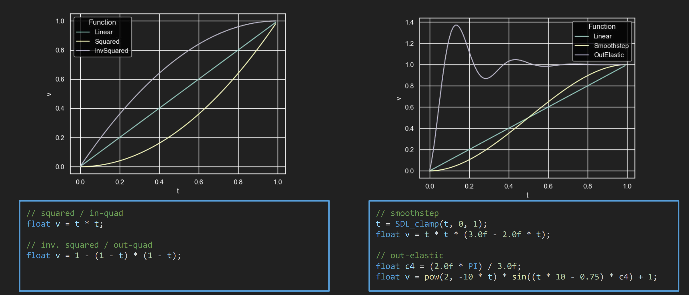
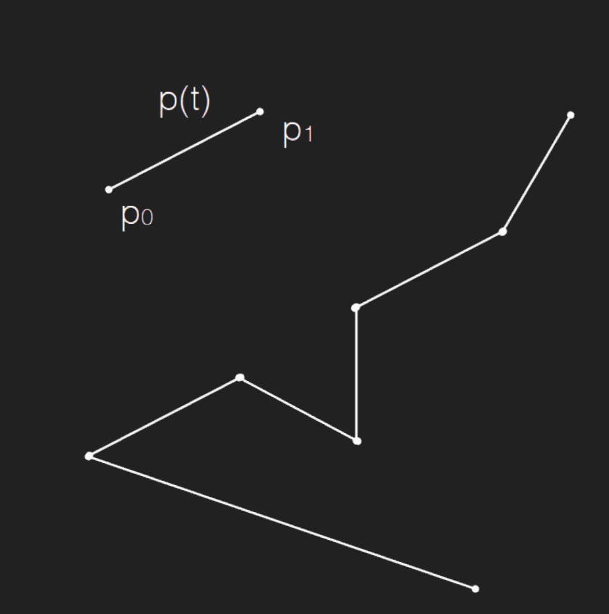
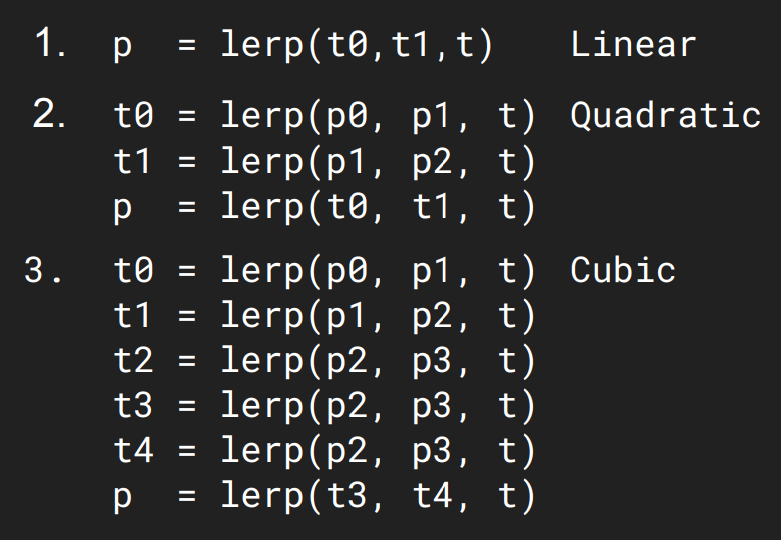
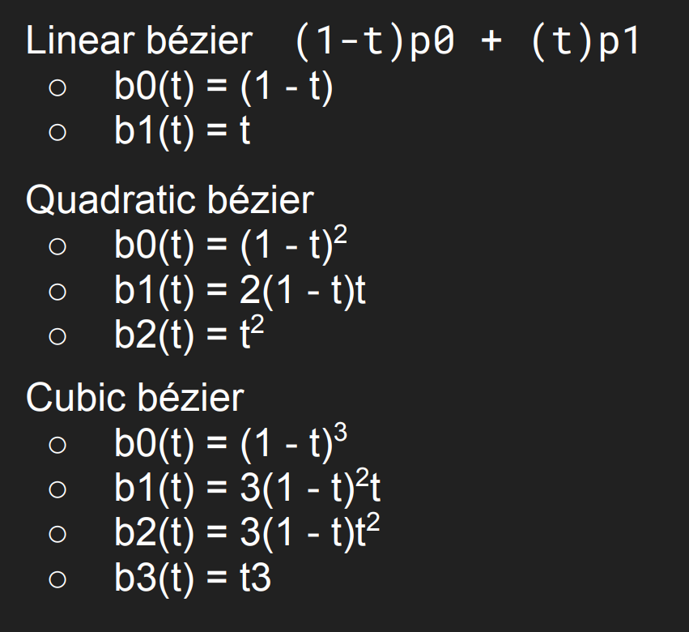
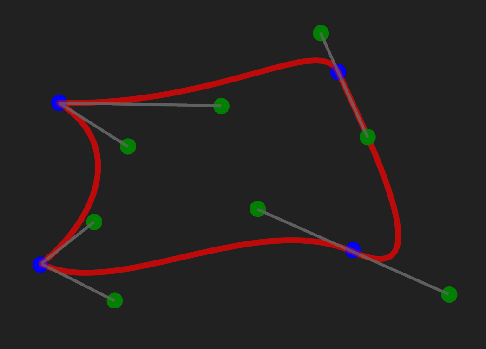
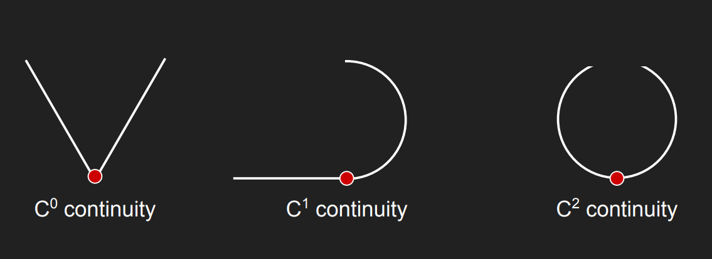
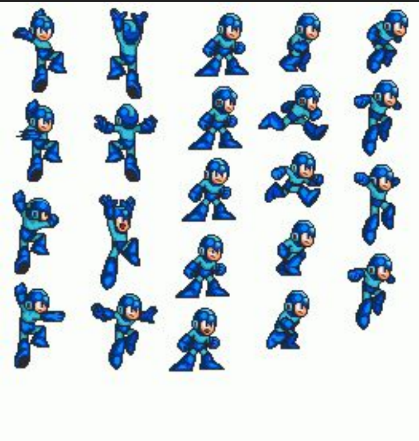
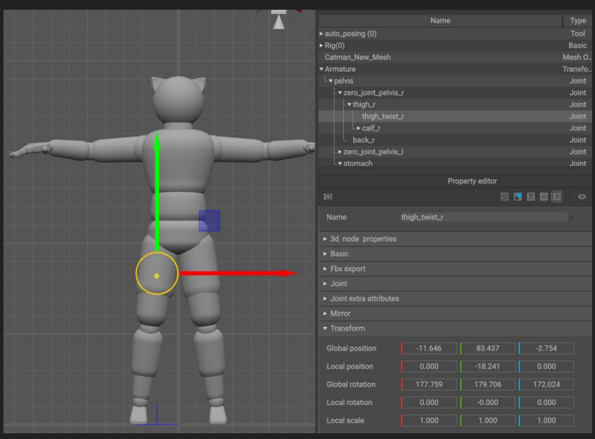

# Lecture 5 (Animation and Sound)

## Lecture Questions

How do we:
* Add audio to our games?
* manipulate audio to leverage game's multmediality and interactivty
* use the math that we know to emulate motion?
* smooth continous motion with proper control?

## Linear Interpolation

Definition: Finds an intermediate value between two values ($P_0$ and $P_1$) using a fraction $t$ (usually time)1

Formula: $pos = p0 \cdot (1 - t) + p1 \cdot t$

### Easing function

Purpose: Modifies the $t$ input for lerp() to allow motion to accelerate or decelerate (non-linear speed)

Examples:
* Smoothstep: S-curve, eases in and out.
* Squared: Ease-in (starts slow).
* Inverse Squared: Ease-out (starts fast).

### Moving between two points

Simply using linear interpolation causes very jagged movement (given two or more point).

### De Caseljau Algorithm

What if we had two lines (3 points)

Find two points by
* t0 = lerp(p0, p1, t)
* t1 = lerp(p1, p2, t)

Then we interpolate between these points.
* p(t) = lerp(t0, t1, t)

This algorithm constructs curves by recursively performing linear interpolations (lerp) between control points

### Bézier curves

Bézier curves are defined by the number of control points used
* Sort of readable, but verbose and not efficient.

### Basis Curves

Instead of calculating multiple steps of lerp, you use a single formula with Basis Functions (polynomials) for each point.

Basis curves represent Bézier curves using explicit polynomial functions rather than recursive interpolation.

### Problems

Béziers do not scale well in the number of
points.

Adding more points requires more basis functions

They lack local control; moving a single control point changes the shape of the entire curve, which makes fine-tuning difficult

### Splines

A spline is a parametric piecewise curve (find point from parameter t).
* Built by concatenating together multiple basis curves.

Defined by control points and optional tangent vectors.

It has the following desirable properties:
* Easy to compute first (velocity) and second (acceleration) derivatives.
* Moving a control point affects only a limited section of the curve, unlike standard Béziers where it affects the whole shape

#### Evaluating a spline
We would like to find point of t = 1.5.

Imagine we have two Bézier curve segments.
* [p0,p1,p2] and [p2, p3, p4]
* 1.5 is in the second segment.
* Normalize $t$ (The Translation)
The math formulas for curves (like $t^2$ or $(1-t)^3$) only work with inputs between 0.0 and 1.0. They don't understand "1.5".

We use this formula to find the local percentage (0 to 1):

$$t_{local} = \frac{\text{Current Time} - \text{Segment Start}}{\text{Segment End} - \text{Segment Start}}$$

$$t_{local} = \frac{1.5 - 1.0}{2.0 - 1.0} = \frac{0.5}{1.0} = \mathbf{0.5}$$

Now that we know we are 50% (0.5) of the way through Segment 2, we plug $0.5$ into the Bézier formula for that specific segment to get the final position3

As this is a quadratic basis formula (3 points):

$$Pos = (1-t)^2 \cdot P_{start} + 2(1-t)t \cdot P_{control} + t^2 \cdot P_{end}$$

### Continuity

Continuity describes the smoothness of the connections between curve segments

* $C^0$ (Continuous Position): The segments are connected; the end of one curve touches the start of the next.
* $C^1$ (Continuous Velocity): The connection is smooth without sharp corners. The tangents at the connection point align
* .$C^2$ (Continuous Acceleration): The rate of change is smooth. The curvature doesn't change abruptly across the connection

### Control points

To create splines with specific continuity easily ("cheating"), we group points into Control Points and Knots
1. Control Point ("Fit"): The main point the curve physically passes through
2. Knots: two external points, that indicate what shape the curve can take

**Imposing constraints on the knots we canenforce continuity.**
1. $C^1$ (Smooth Velocity): The knots on either side of the control point must lie on the same line
2. $C^2$ (Smooth Acceleration): Requires $C^1$ (collinear), plus the knots must be at the same distance from the control point4

## Types of animation

### Classic Cel Animation

Traditional hand-drawn animation (e.g., Disney) usually running at 24 fps

Uses "cels" (transparent sheets with drawings) layered over a fixed background.

#### Key frames in cel animation

Keyframes: Important frames drawn by lead artists to define the motion

In-betweens (Tweening): Intermediate frames drawn by junior artists to smooth the transition

#### Animation Cycles

Looping sequences of frames (e.g., walking).

### Cel/Sprite Animation

Raster-based technique inspired by cel animation, often used in 2D games.
* Images are stored in a sprite sheet for optimization.
* Optionally can be looped

#### Sprite animation for 3D

Used in 3D games for UI, distant objects ("billboarding"), or specific artistic styles (e.g., Doom, TOEM)

### Rigid hierarchical animation

Character is divided into separate, non-deformable (rigid) parts organized in a scene hierarchy.

* Animates the transforms of the hierarchy nodes using SQT (Scale, Quaternion rotation, Translate) matrices
* In-betweens are calculated by interpolating the SQT of two consecutive keyframes.

### Per-vertex animation

Non-rigid animation where keyframes store unique positions for every vertex.

* In-between frames are found via linear interpolation of vertex positions.

Simple to implement but requires massive memory, is hard to author, and difficult to reuse

Animated shaders (flags, water), facial expressions (Shape Keys), or body sliders.

### Skinned Animation

Combines rigid hierarchy (skeleton) with vertex animation to deform a single mesh

Consists of:
1. Skeleton: A hierarchy of "bones" (joints) animated like a rigid hierarchy.
   1. A simplified structure what is being
modeled
2. Each vertex is mapped to one or
more ‘bones’ in the skeleton

We can find the animated position
using the transformation of the
skeleton bones

#### Skeleton hierachy

Joins and bones are the same thing
(a bone is the space between two
joins)

Each join has:
* join index
* SQT transformation
* Parent index

#### Rigging models
* Mapping each vertex to a number of
bones
* For performance reasons, a fixed
number of bones (usually, each
vertex mapped to 4 bones)
* Each bone has a weight and the sum
of all weights must be 1.0

#### Key frames
Keyframes are defined by modifying the transforms of the skeleton hierarchy,
* For each keyframe, we store the SQT (Scale, Quaternion rotation, Translation) of each joint in the skeleton.

#### Skinned animations
We can now compute the final destination
of each vertex position:
1. Compute skeleton position
2. COmpute position of each vertex by:
   1. For each associated joint, apply the joint transform to the vertex position
   2. Average the 4 positions optained.

## Sound

### Sound in Games

**Sound types**:
* MUsic: Usually plays continuous loops
* Audio clips: sounds played based on game events (jump, collision, etc)
* Procedural Sound: generated based on current game context.

**Sound properties**:
* Sampling rate (frequency/quality)
* NUmber of channels:
  * Mono: single chnanel
  * Stereo: Left and Right channel
* File extension: wav, mp3

### Playing Sound
1. Load/uncompress sound assets in the engine
2. Process each sound with effects and filters
3. Mix all of them together
4. Map to physical output

Step 2, 3, 4 are usually performed by a system called Mixer.

### Mixing

The virtual mixer usually has 8 or more
channels.
* Mixing means adjusting how we treat
sounds played on different channels.
  * Adjusting music volume vs sound effect volume
* Games may have additional layers of
mixers, like a user controlled Master
Volume, with underlying sliders for sfx,
music, voice over, etc.
* Mixing can also involve various filters

### Filters
Filters modify audio frequencies, jokingly referred to as "easing functions for sounds".

* Low-pass: Cuts high frequencies; lets low frequencies "pass"
  * Effect: Makes the sound muffled, like hearing music through a wall or underwater.
* High-pass: Cuts low frequencies; lets high frequencies "pass".
  * Effect: Removes bass, making the sound tinny, like a cheap radio or telephone.
* Band-pass: Keeps a specific "band" of frequencies in the middle, cutting both the very low and very high ends
  * Effect: Isolates specific tones, often used for "old phone" or megaphone effects.
Etc.

### Audio Tricks

#### Ducking
Ducking means lowering the volume of centain channels to prioritize something else.

Common when important sounds or
voice overs are played, turn down
everything else.

Can be used to simulate a sudden
focus shift

#### Panning

Shifting sound volume between speakers (e.g., Left vs. Right in stereo).

* Can be used for:
  * Simulating physical conditions (like hearing loss in one ear)
  * Positioning sounds based on their location on the 2D screen

#### Positioning

3D: Head-Related Transfer Function,
adjust volume and delay between
ears based on position and direction
of sound emitter

2D: Panning based on screen
position, (things on the left are louder
in the left speaker, etc.)

### SDL_Mixer

Initialization: Must explicitly call SDL_Init(SDL_INIT_AUDIO).

Load files (supports OGG, MP3, etc.) into MIX_Audio* (mixer) objects using MIX_LoadAudio

Play simply with MIX_PlayAudio, but this offers no control once started (cannot pause/mute individual sounds)

Control global volume with MIX_SetMasterGain (ranges 0.0 to 1.0; going above 1.0 can damage hardware)

#### Tracks

For granular control (looping, fading, pausing), use Tracks instead of raw audio playback.

Create a track with MIX_CreateTrack linked to your mixer

