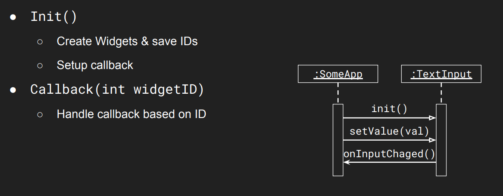
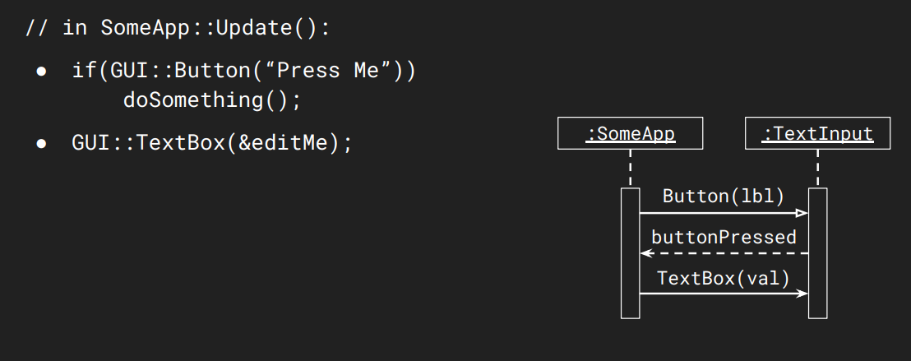

# Lecture 6

## Lecture Questinos

How do we:
* create effective tools for game development?
* create dynamic and effective UIs for games?
* integrate our UIs with the game world?

## Graphics User Interfaces

### What is a GUI

GUI is a Broad concept covering *user interaction* and *visual feedback*.

Commonly thought of as the *interactive part* of an application.

Games, 3D modelling apps, drawing apps etc. can be thought of as **visualization with GUI on top**.

### GUI in Game Engines

Here, GUIs are mostly used as tools to create a game around them, or to debug.

However, games themlsevles also hae GUI to allow th euser interact with them.

### Drawing GUI elements

GUI elements are typically drawn last, allwoing them to be drawn on top of everything.
* This means draw all your 2D/3D stuff, then draw HUD / GUI
* Camera effects can either go before the GUI or after, depending on whether you want the GUI affected.

## Retained vs Immediate GUIs

### Retained Mode GUI 
* GUI elements hold their own state.
* Application Receives callbacks from
GUI
* Objects references or IDs are used to keep track of objects (sycnrhonization of state)

### Immediate Mode GUI 
* GUI elemnts only exist as function calls
* Application state is reflected directly in GUI
* No synchronization needed
* Immediately respond to GUI input where it happens

### Comparison

RMGUI:
* Pros:
  * Reusable components; typical OO design
* Cons: State duplication (if you have a health bar, the "Health" value exists in two places)

IMGUI:
* Pros:
  * Flexible; no state duplication; fast to iterate
* Cons:
  * Internally need to maintain state

## Dear IMGUI
* Bloat-free C++ library, renderer agnostic, outputs optimized vertex buffers.
* Values are passed as pointers (references), not copies
* Functions return true when a value changes

### Creating windows

Defined by ImGui::Begin() and ImGui::End() blocks.

Use ImGuiWindowFlags_ to disable resizing, moving, or title bars.

Position/Size: Set before the Begin call using SetNextWindowPos and SetNextWindowSize

### WOrking with text

Text (and many other ImGUI
functions) work similar to the C-style
printf function and can format
text-strings. (%f, %i, %s).

### Text alignment

We can align text using the cursor's position to specify where the next item will be rendered.
* Calculated manually using window width and CalcTextSize.
* SetCursorPosX defines the render position of the next item.

### Images button and Custom Fonts

Image Button: Renders a button using a texture (image) instead of a text label.
* ImGui::ImageButton("id", texture_ptr, size)

Custom Fonts: Fonts must be loaded once at startup using:
* ImGui::GetIO().Fonts->AddFontFromFileTTF("path.ttf", size)
* Start: ImGui::PushFont(myFontPtr); to begin using the custom font.
* End: ImGui::PopFont(); to return to the default font
* Supports TrueType Fonts (.ttf).

### Explicit IDs

ImGui internally uses the label string (the text on the button/widget) to create a unique hash ID and store the widget's state

If two widgets share the exact same label (e.g., two buttons named "Meow"), they generate the same ID.

