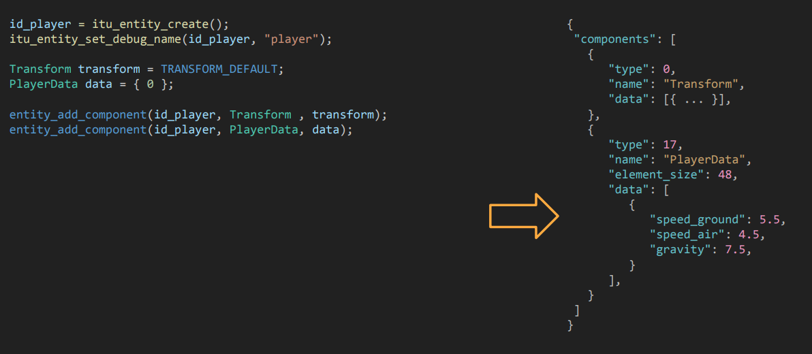

# Lecture 7 (Scene Graphs)

## Lecture Questions

How do we:
* define game content in data rather than code?
* move as much responsibility from the game code into the engine code?
* compute complex trasnformations fast?
* express transform relationships between objects in an intuitive way?


## Matrices

Changing frames of reference (e.g., converting global points to screen space) was done via manual arithmetic.

Which is: Finicky, Error prone, inefficient.

**The Solution** = Matrices!!

Matrices use linear transformations (addition and multiplication only).
* Fast compared to other mathematical operations such as division, exponentiation, trigonometric operations.
* Replaces walls of manual math with a uniform interface.
* Works equally well for 2D and 3D transformations.

We will use them for three operations:
* Rotation
* Scale
* Translation

### Matrix Representation
* 2 dimensional array of numbers (m-by-n matrices)
* We usually focus on small matrices

### Matrix multiplication

Multiplication: Allows for combining transformations. It is non-commutative ($A \times B \neq B \times A$) .

### Identity matrix

A special matrix with $1.0$ on the diagonal and $0.0$ elsewhere. The input equals the output ($I \times A = A$)5

### Matrix transformations

Matrices are used to perform linear transformations

### Translations

We cannot use a 2x2 matrix to translate a
vector.
* Translation requires addition, which is not defined between matrices and vectors

Instead we can make use of homogeneous coordinates.

### Homogeneous coordinates

Use **homogeneous coordinates**.

"Go up one dimension" to solve the math problem. For 2D, we use a 3D vector (vec3) and a $3\times3$ matrix4

This extra dimension allows translation values to be stored in the matrix's third column, turning the addition operation into a multiplication operation.

## Transforms revised

### Transform representations
There are two main ways to store transform data:
1. Position, Rotation, Scale
   1. Intuitive, but cumbersome and a bit less efficient.
2. Transform matrices
   1. Highly efficient; unified math for all transformations.
   2. More efficient

```
struct Transform
{
    // // not implemented, not worth it
    // Transform* parent;
    vec2f position;
    vec2f scale;
    float rotation;
};

struct Transform3D
{
    Transform3D* parent;
    
    // pos, rot, scale relative to parent
    // actual data
    glm::mat4 local;
 
    // pos, rot, scale relative to world
    // computed every frame based on local transform
    // parents’ local transforms
    glm::mat4 global;
};
```

* local: The actual data (pos/rot/scale relative to parent)
* global: Computed every frame based on local transform + parent's global transform

### Updating the global transform

Transforms are stored in a simple array (linear memory) for cache efficiency.

Update loop:
* transforms[i].global = transforms[i].parent->global * transforms[i].local;

Critical Issue: This simple loop only works if the parent is updated before the child.

We can easily achieve this in two ways:
1. sort transforms in breadth order
2. store explicit tree links for breadth-first
traversal order

### Navigating the transform hierachy

To navigate the tree efficiently (e.g., to update parents before children), we add specific pointers to the Transform struct:

```
// navigational refs for efficient traversal
 // moving a transform in the hierarchy becomes
 // slightly more costly, but that’s an operation
 // that should happen relatively rarely
 Transform3D* parent;
 Transform3D* child_first;
 Transform3D* child_last;
 Transform3D* sibling_prev;
 Transform3D* sibling_next;
```

### When do we actually update the global transforms?

Reading/writing global transforms constantly is expensive.

Use "Dirty Flags" (bitmasks) to track changes (mark if a transform is invalid).

Logic: Only recalculate Global if the Local transform or the Parent has changed since the last frame.

## Data-driven Scenes

### The GameObject Nesting Problem

The challenge of effectively managing complex, deep hierarchies of game entities where objects are attached to one another

Hardcoding these massive, nested structures directly in C++ is unmanageable, inflexible, and messy

Instead: his problem motivates Data-Driven Scenes. Instead of writing code to spawn every joint, you define the tree structure in a data file (like JSON or a custom binary format) and let the engine reconstruction the hierarchy at runtime.



---

Instead, we define the scene in a data file (like JSON) and just have the engine load that file.

Separation: Game content is defined in data files, not compiled code .

Flexibility: You can tweak values (like speed_ground or gravity) without recompiling the engine.

Structure: It handles the complex nesting of components cleanly in a readable format .

### Key Based vs Binary Dump

**Key based:** This method stores data using explicit labels and values (e.g., "speed": 5.5)
* Pros: 
  * Human-readable: Easy to read and edit manually.
  * Can handle changes to data types
* Cons:
  * Slow and clunky
  * Most need full fledged parsing

Great for tools!

**Binary Dump**: This method writes the raw memory of C++ structs directly to a file.
* Pros: 
  * Speed: Extremely fast to read and write
  * Extremely simple
* Cons:
  * Any change to the struct definition makes old files unusable or requires complex conversion procedures
  * "Very annoying" to find errors because the files are not human-readable

Great for shipping games!

### A note on binary headers

Here are concise notes on Binary Headers based on the final slides.

A Note on Binary Serialization
When using binary dumps (which are fast but risky), you must follow these three rules to avoid crashes and corruption.

**Serialize Handles, Not Pointers**:
* The Problem: Pointers store virtual memory addresses (e.g., 0x00ac04). These addresses change every time the program runs.

**Store Only What is Needed**:
* Minimalism: Do not serialize derived data (like acceleration structures) that can be recreated from the base data at runtime.

**Always Add Headers**:
* Usage: Write a header struct before the data arrays to store metadata (like version info or object counts).

