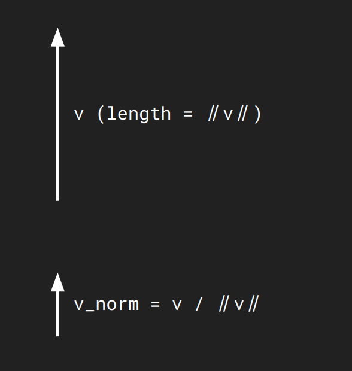
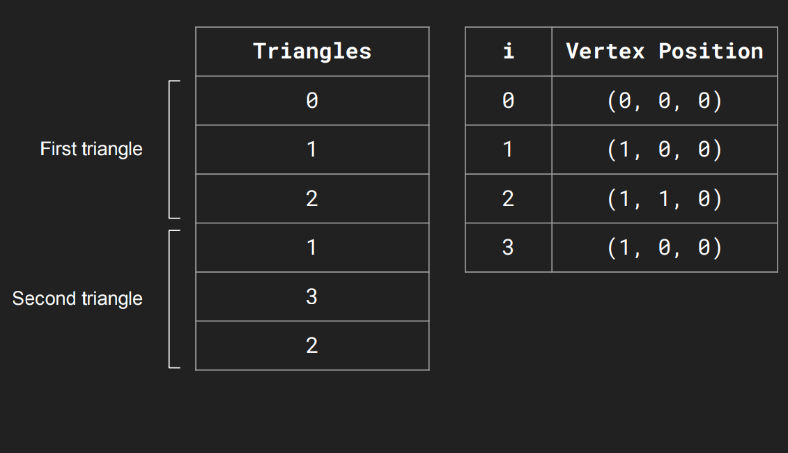
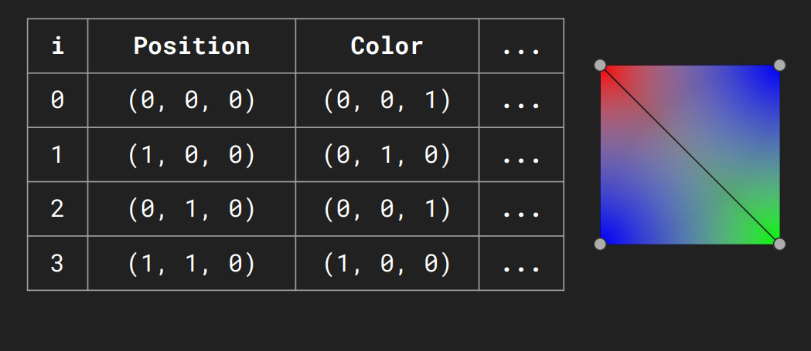
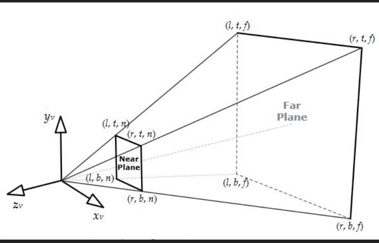
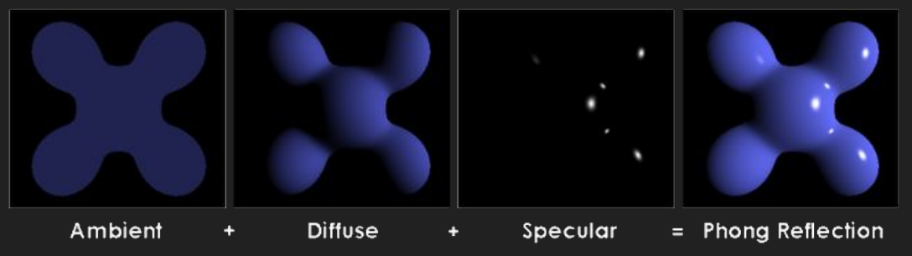

# Lecture 8 (3D Rendering)

## Additional Math

### Normalize a vector

Often we are interested in working with vectors of length 1.0 (unit vectors)
* Commonly used in many formulas
* We obtain unit vectors by diving vectors with its own length

### Cross product
Defined only in 3D; takes two vectors and returns a vector perpendicular to both.

Different than dot proudct:
* dot product returns a single number indicating how much two vectors align
* While, cross product returns a new vector perpendicular to the plane of the original vectors

**Usages**:
* Finding a vector that is othogonal to two other vectors
* Area of a parallelogram
* **Finding the normal vector to a plane (so perpendicular to the plane)**

### Surface normal
Vector perpendicular to object in 2D or 3D
* The same as normal vector
* Computed for each face (trinagle) usin any two edjges a and b
* Usually a unit vector

$n = normalize(a \times b)$

### Reflection

Reflects a vector with regard to a
surface normal

Often used for lighting calculations or physics bounces.

### Axis-aligned rotations
Rotations carried out around one specific coordinate axis (X, Y, or Z)

### Directions vs ROtations
Distinction: A direction vector tells you where an object is looking, but not how it is oriented

To fully compute a rotation, you need at least two non-parallel directions.

### Orientation in 3D

Orientation in 3D space has 3 degrees of freedom.
* Can be expressed in multiple mathematical ways (Matrices, Euler angles, Quaternions)

### Euler's angles
Expresses rotation as a sequence of rotations around the X, Y, and Z axes.

Pitch, Yaw, and Roll.

The order in which rotations are applied matters.

Suffer from Gimbal Lock, where axes align and a degree of freedom is lost.
* What does this mean? A state where two of the three rotational axes align and become parallel to each other.

### Rotate around an axis

A method to rotate an object around an arbitrary axis, rather than just the principal X/Y/Z axes.

Often useful for specific gameplay mechanics

### Quaternions

Mathematical constructs composed of 4 numbers ($q=[x, y, z, w]$) used to describe complex rotations.

Can describe complex rotations without incurring in gimbal locks.

Allows for correct, smooth interpolation between rotations (known as SLERP: Spherical Linear Interpolation).
* Which is? A method to interpolate between two rotations (Quaternions)

### LookAt
A helper function to create a view matrix, positioning an observer (camera) in 3D space

Specifies observer’s (usually camera, but can be
used for anything really!).

* Eye Position: Where the camera is located (3D point).
* Target: Where the camera is looking (3D point).
* Up Vector: A 3D direction defining which way is "up".

## 3D Rendering

### What is a Mesh?

A Mesh is a collection of data used to store and render 3D geometrices.
* Represented though:
  * Vertices
  * Edges
  * Faces:
    * Quads (four-sided polygons)
    * Traingle

For 3D modelling and animation quads are prefered, while trinagles are convenient and performant for GPU

### Describing triangular mesh

#### Naive Approach

You simply list every single vertex for every triangle in a table
* To draw a square (made of 2 triangles), you list 6 vertices (3 for the first triangle, 3 for the second)

*Wastes memory. Shared vertices (like the corners where triangles touch) are duplicated. Since each floating-point value is 4 bytes, duplicating full vertices adds up quickly*

#### Optimized Approach

You split the data into two separate tables:

List of vertexes in each trinagles: Lists the triangles by referencing the IDs from the Vertex Table (e.g., "Triangle A uses vertices 0, 1, and 2").

List of vertex and positions: Lists each unique vertex only once with an ID

*Saves significant memory by avoiding duplicate data storage*

### Vertex data

A single vertex contains more than just position data; it stores various attributes needed for rendering (e.g., Color, UV)

Interpolation: The engine takes the values defined at the vertices and interpolates (blends) them across the face of the triangle

Example: If vertices have different colors (e.g., Red, Green, Blue), the triangle's surface will appear as a smooth gradient between them

### UV Coordinates

A specific type of vertex data used to map a 2D texture image onto the 3D geometry

Tells the engine which part of the texture appears on which triangle. Like other attributes, UVs are specified per vertex and interpolated across the triangle.

Why?
* Mapping a 2D image directly to a complex 3D shape is difficult and causes artifacts (like projecting a map onto a globe). However, mapping a 2D texture to a 2D triangle is mathematically simple

### Lighting models

#### Global Illumination
Simulates realistic light bouncing between surfaces.
* Includes algorithms like Ray tracing, Path tracing, and Photon mapping
* Very realistic

#### Local Illumination
Standard for real-time rendering due to performance.
* Calculates light from source $\rightarrow$ object $\rightarrow$ camera, ignoring other objects.
* Lacks physical shadows or reflections (must be faked)

### Virtual Cameras

Repositions objects relative to the camera
* Projects 3D objects onto the 2D screen (projection matrix).

#### Orthographic cameras

Renders everything within a [-1, 1 ]cube
centered around the origin
* Objects appear the same size,
disregarding of distance form camera
* Useful for 2D games

#### Perspective projection

A way to flatten 3D space onto a 2D screen that mimics the human eye.

Renders a frustum (pyramid) specified by near/far planes.

Objects appear smaller as they get further away (mimics reality).

* Frustum: The pyramid-shaped volume of space that the camera can actually "see." anything outside this pyramid is ignored (clipped).
* Objects appear smaller as they get further away (unlike Orthographic projection)

The pyramid is defined by:
* Field of View (FOV): How wide the camera lens is (the angle). High FOV = Fisheye lens; Low FOV = Zoom lens.
* Aspect Ratio: The width of the screen divided by the height (e.g., 16:9).
* Near Plane:
  * Definition: The closest distance from the camera that rendering can occur.
* Far Plane: 
  * The maximum distance the camera can see.
  * The computer shouldn't waste power drawing objects that are infinitely far away.

### Lights

Used by shaders to properly alter an object’s
color to make it look 3D

**Types**:
* Directional Light: Infinite rays from one direction (e.g., The Sun).
* Point Light: Emits in all directions from a specific point (e.g., Light bulb). Fades over distance.
* Spot Light: Point light restricted to a cone (e.g., Flashlight). Defined by direction and "cutoff" angle.
* Ambient Light: A base brightness added to everything to prevent pitch-black shadows (simulates indirect light).

**Parameters**:
* Color/Intensity: RGB color and brightness multiplier.
* Attenuation: How fast the light fades out as it travels (Inverse Square Law).
* Position/Direction: Where it is and where it points.

### Objects and materials

Defines how a specific surface reacts to light.

DIfferent materials will react to light in different ways.

To model them we use an asset called a Material, which defines these parameters:
* Shader: The mathematical program (code) that runs on the GPU to calculate the look of the object
* Shader's parameters:
* The specific variables you tweak to change the look within that shader.
* Engine-specific settings that control the drawing process rather than the physics

### Phong Model

A mathematical formula used in Local Illumination to calculate the final color of a pixel (for reflections still).

The 4 Required Vectors: To calculate the color at any point, the shader needs:
* $l$ (Light Source): Direction to the light
* $v$ (Viewer): Direction to the camera/eye
* $n$ (Normal): Direction the surface is facing.
* $r$ (Reflector): The direction light would bounce if the surface was a perfect mirror.

Surface Color: Before lighting is applied, the "base" color of the object is determined by:
* Interpolated Vertex Color: Blended colors from the triangle corners.
* Texture Sample: The color picked from the image map using UV coordinates.

The Formula: Final Color = SurfaceColor * (Ambient + Diffuse) + Specular

Ambient + Diffuse: These are multiplied by the Surface Color (e.g., A red ball looks red in ambient light and red in diffuse light).

Specular: This is added after the color multiplication.

### Rendering Order

How does the engine decide what is in front of what?

Draw objects from back to front (like a painter adding layers to a canvas).
* It fails if objects intersect (e.g., a sword going through a shield)

#### Z-Buffer

The GPU maintains a 2D grid (buffer) storing the depth value (distance from camera) of every pixel drawn so far.
* This is stored in a 3D grid called z-buffer (or depth buffer)
* Before drawing a pixel, the GPU checks: Is this new pixel closer than the value already in the buffer?
  * Yes: Draw the color and update the depth value.
  * No: Discard the pixel (it's hidden behind something).

#### Transparency

You can't use Z-buffer logic for glass/water because you need to see through it, not block what's behind it.

Draw all Opaque (not transparent) objects first (write to Z-buffer).

Sort all transparent objects from furthest to closest.

Draw transparent objects last (blending them with what's behind).

## 3D Animation

