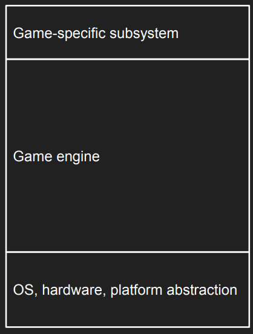

# Lecture 9 (Engine and Game Architecture)

## Anatomy of a game

### Game engines architecture overview

A game engine is generally structured in layers, ranging from hardware abstraction to game-specific logic.

Platform Layer: Hardware abstraction (OS, Drivers, SDKs).

Core Systems: Memory, Math, Debugging, File I/O.

Resources: Management of assets (Models, Textures, Audio).

Gameplay Foundations: Scripting, Physics, Animation, UI.

Game-Specific Subsystems: Player mechanics, AI, Cameras, Weapons.

### Through Exersises' lenses

The course provides a custom engine (itu utilities) built over SDL. 
Additionally it also has our 3rd party libraries.

### Game<>game interface layer

This layer is the "API" that you (the game programmer) interact with directly to build the game logic

### Game<>platform interface layer

These files abstract the low-level hardware details. They wrap 3rd-party dependencies.

### Outliers

Architecture is defined by where code sits on a spectrum of specificity .

General (Bottom/Left): Code that can be reused in any game (e.g., itu_lib_render, math libraries). This is "Engine" or "Tool" code.

Specific (Top/Right): Code that only works for this specific game (e.g., Level1_Script, HeroCharacter). This is "Game" code.

### Axis

Vertical Axis: Specificity (General $\leftrightarrow$ Specific)
* General (Bottom): Code that is generic and reusable across any project (e.g., a Math library, a generic Renderer).
* Specific (Top): Code that is unique to this project and cannot be reused elsewhere (e.g., "Level 2 Boss Logic").
  
Horizontal Axis: Purpose (Tool $\leftrightarrow$ Game)
* Tool (Left): Infrastructure code that facilitates creation or debugging (e.g., Editor tools, asset importers, debug drawers).
* Game (Right): Runtime logic that the player actually experiences (e.g., Player movement, scoring systems)5

### Tightening Up

1. Prevent Layer Bleeding: Higher layers (Game) should not bypass the Engine layer to talk directly to the Platform layer (e.g., Game logic shouldn't call raw SDL functions; it should ask the Engine to do it).
2. Sandbox 3rd Party Libraries: Wrap external libraries (like Box2D or ImGui) in your own API.
   1. Why? If you replace the library later, you only change the wrapper, not the whole game
3. Make a clearer division between tool code, debug and game code. 

## "Engine" interface

### Interaction between game and engine 
Gameeplay code only interacts with the most high-level concepts we develop:

#### Entities

The objects that populate the game world. They typically wrap around lower-level systems to provide a high-level interface

The Player: An entity representing the user's character.

UI Elements: Menu buttons and other interface items. (UI is not necesssarily in the game world, but can be) Example minecraft holding a map

Static Objects: Non-moving world elements

#### Resources 

The data assets required by entities to function.

They need efficient representation on disk and at runtime.

We need an efficient and convenient way to reference said resources.

---

Resources is a way for everyone on the team to interface with the game. 
* Everyone is either gonna make or use resources.
* A commonly used trick is to use the file-system as "database" of assets

#### Scenes

Collections of entities and their associated data that represent a specific section of the game

Could for example be a Level N with these entities (and their associated data)

* The term "scene" usually refers to both the
serialized resource that contains everything
present in this section of the game AND the
runtime collection of entities, resources and
runtime data.

Information to build a specific moment in runtime. 

## Entity Component System (ECS)

A data-oriented architecture designed to optimize memory layout for fast access.

Instead of objects owning data, data is grouped by type:
* Entity: An ID
* Component: Pure data chunks (so structs)
* System: The logic that processes entities with specific components

Pros:
* Cache friendly
* Components are stored contiguously
* Probably in Heap

We use struct, no overhead of class (can still have overhead).

### Sparsed Array vs Archetypes

Each component has its own pair of arrays: 
Dense Array: Stores the actual component data packed tightly (no gaps).
Sparse Array: Maps an Entity ID to an index in the Dense Array.

---

Entities are grouped into "Archetypes" based on the exact combination of components they possess

entities of Archetype A are stored together in one continuous chunk of memory.

## Object/Component

Common implementation, e.g Unity GameObject

GameObject: A container object that holds a list of components.

A GameObject acts as a container for functional components that determine how the GameObject looks and behaves.
* Relationship: 1 GameObject $\leftrightarrow$ N Components.
* Player (GameObject) holds Bike, Renderer, Controller (Components).
Unity with inheritance and object oriented.

Pros:
* Handles transform hierachies implcity
  * What is the problem?
    * The Problem" (Context): While convenient, implicit hierarchies require the CPU to "chase pointers" through the tree (Child $\rightarrow$ Parent $\rightarrow$ Root) to calculate positions. Since these objects are scattered in memory (heap), this causes cache misses and slows down processing compared to flat arrays
  * Easy to use and understand
* Cons:
  * Potentially poor performance
    * Data is scattered across memory, which might lead to poor cache performance.

GameObject functionality and data is not seperated, and usually done object oritnered.
In ESC, everything is seperated, and funcitonality works on something abstract.

## Quick tips

### Inversion of control

Instead of the game controlling the flow, the engine controls the game

### Static SIngleton vs Dependency Injection

Static Singleton: Global variables (e.g., ctx_estorage) accessed anywhere.

Dependency Injection: Explicitly passing context pointers (ContextEntities) to functions

### Sandboxing 3rd Party Libraries

Do not let external libraries (e.g., ImGui) bleed into your game code.

Strategy: Wrap the library in your own API (e.g., itu_lib_ui_text wraps ImGui::Text)
* Allows you to swap the underlying library later without rewriting all game code .

### Zero vs. Error Initialization

How you initialize memory matters for debugging.

Zero Initialization ({0}): Sets memory to zero.

Error Initialization (memset to 0xdf): Fills memory with obvious garbage.

Makes bug more obvious to spot (unsure if 0 is intentional or not, while 0xdf is more obvious as a bug). 

### Reasonable Defaults

void using #define macros for gameplay values.

Bad: #define WINDOW_W 800 (Requires recompilation to change).

Good: Use a struct EngineConfig with default values. This allows runtime changes and user configuration (e.g., loading settings from a file)

### Strings as resources

Problem: Storing raw strings ("I am a button!") in every entity is slow and redundant.

Solution: Store strings in a central resource system and reference them by ID (e.g., itu_sys_rstorage_string_get("lbl_game_start")).