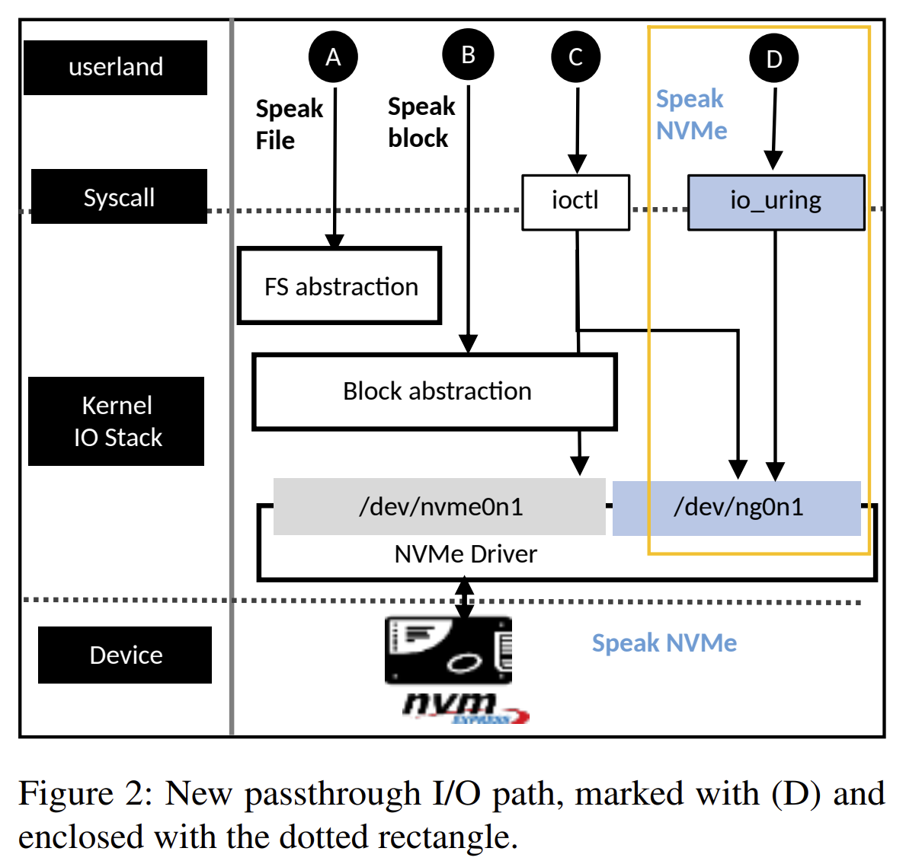
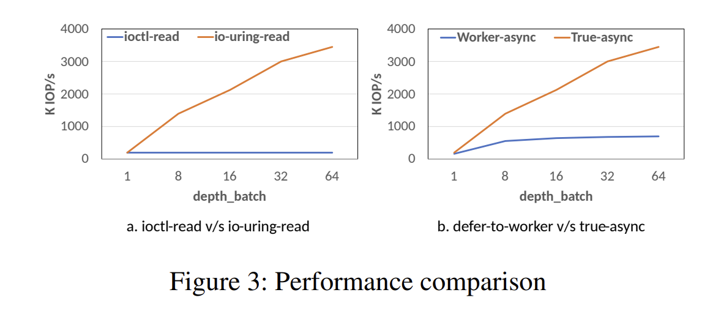
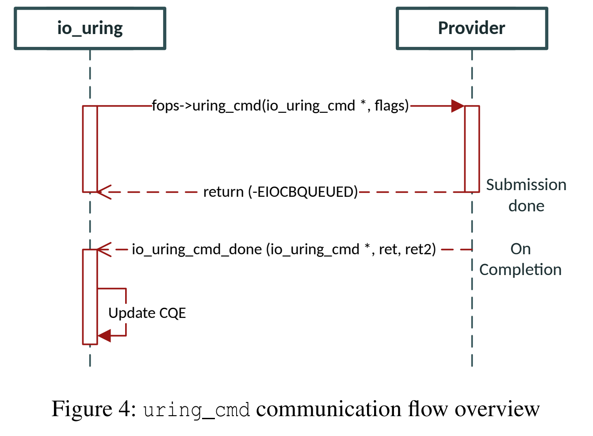
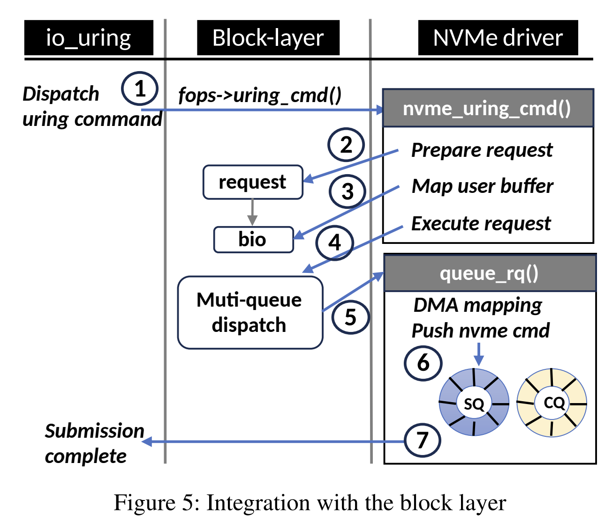
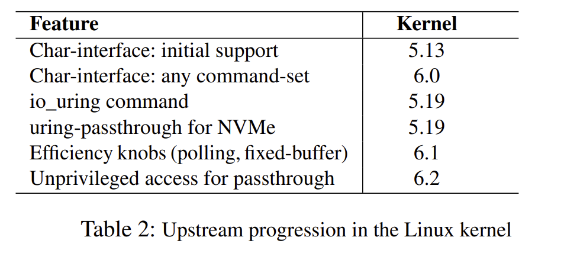
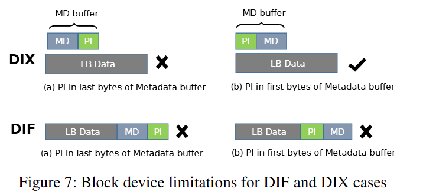
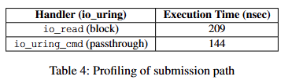
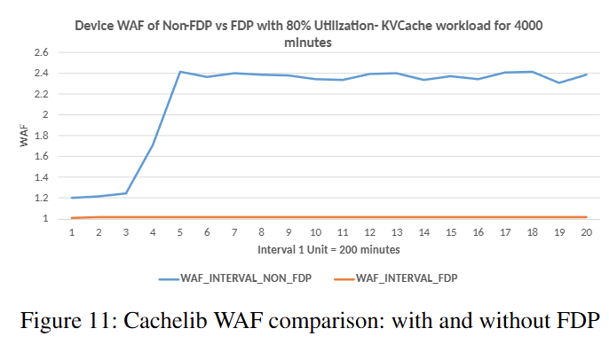

## Paper

### Abstract

Key ingredients are:

* NVMe char interface
* io_uring command

They compare against the existing io_uring block path, and demonstrate its flexibility by intergrating data placemement into Cachelib

What is FIO?

### Introduction

Non-Volative Memory Express protocol has been the catalyst for the adoption of NANDs storage device and SSDs.
NVME continues to bring new capabilities (performance and funcitonality)

All the new interface require vertical integration across different storage layers (driver, block, file-system) and defined new user interfaces to accodomate for device interfaces.

They go against principle of maintaining a stable and general purpose operating system.

The paper presents I/O passthry, allows the deployment of any new nvme feature, as it is devoid of extra abstractions.

The papers contributions are specifically:
NVMe passthrough I/O path; higher flexibility than block I/O path.
io_uring_command, to implement asynchronous IOCTL

---

What is IOCTL?
---

### Motivation

#### NVMe innovations vs Kernel abstractions

Fast paced growth of NVMe innovations vs. the lack of the Linux kernle's agility

*NVMe meant to support only block storage, is no longer tied to it*

Through the introduction of the NVMe *command-set*, NVMe 2.0 defines three:

* NVM command set
* Zoned namepsace command set
* Key-value command set

*What are each of these command-sets?*

For the Linux Kernel, generic abstraction are the foundation.

**Figure 1**:

* Abstractions layers across different I/O paths

For syscall users, the file system itself is abstracted.

Figure 1, outlines problems with the existing I/O paths:

* new NVMe commands do not fit into the existing user interface
  * Adding a new syscall requires a more generic use case than a NVMe specific one.
  * New syscalls are discourages as it has to be supported indefinitetly
  * Increase in NVMe interfaces that still need a user interface in LInux. Example the ZNS, lacks a user-space API due to the unconvenition semantics.

One way to alleviate the user -interface scarcity is by using the NVMe passthrough path. Which is devoid of the file/block abstraction, which can be seen in the figure.

Applications can send the NVMe command using the *ioctl* syscall.

However this comes at the cost of **efficiency**, as *iotcl* is sychronous and not a good for fit for highly parallel NVMe storage.

All three pargs in the figure, rely on the block interface. However, **the availability of the block-interface is not guaranteed**

* Block device is marked with zero-capacity. Why?
* ZNS device wiothut zone-append is makred as read-only
* ZNS device with non-power of two zone-size is makred hidden
* Any non-block command-set, cannot be operated with the block interface (key-value as an example)

#### IO advanced with io_uring

Io_uring is a feature-rich asynchronous I/O subsystem in linux.

* It operates at the boundary of user-space/kernel and covers storage and network I/O. *What does it by at the boundary?*
* The communication is handled through a pair of ring buffers: **Submission Queue** and **Completion QUeue**
  * Shared by between user-space and kernel
* These rings are created through an *io_uring_setup* call

IO_uring brings the following advancements in the I/O path:

* Batching: allows of multiple I/O requests in with in a single syscall
* SQPoll: Syscall-free sibmission
* IOPoll: Completions can be pulled by seting a IORING_SETUP_IOPOLL flag. Which gives interrupt-free I/O.
* Chaining: Allows to establish an ordering among multiple commands.
  
Additionally io_uring has added asyn variants of various sync syscall. The paper outlines how it is turned async:

* Worker-based async: spawn a worker thread and delgated a sync operation to it
* True-async: It relies on ensuring that the submitter does not block during submission. Implementation effort grows as all componenets should provide wait-free compliance.

### Design considerations

#### Limitations of existing NVMe passthrough

A passthrogh interface to applications by using ioctl-driven opcodes.

* NVME_IOCTL_IO64_CMD is used to send NVMe I/O commands.
* NVME_IOCTL_ADMIN64_CMD is used to send NVMe admin commands

These operate on a struct that the user-space sends for sync passthrough (listing 1).

Upon submission, the NVMe driver copies this to kernel-space suing *copy_from_user* operation. The call is put to wait until completion arrives.
ON completion, the primary result is sent to the user-space using *ioctl* return value, and other one is updated into the result field.

This interface allows to bypass the abstractions, it suffers several limitations.

* Tied to the block device, which itself is fragile. **Why?**
* IOctl, due to its blocking interface, harms scalability and efficiency. **Figure 3**
* There is a per-command overhead of copting command and result between user and kernel space
* The interface can only be used by the root user

#### Design Goals

* **Block I/O dependence**: As it cannot represent the non-block command sets NVMe has
  * Should have higher flexibity and cover all NVMe commnd set regardlerss of their semantics
* **Catch-all user interface**: Adding a syscall each time is impractical.
* **Efficient and scalable**: : NVMe represents fast and paralle storage. So the new interface should have the same or higher efficienty and svalability than the block I/O path
* **General accessibility**: not be locked to root
* **Upstream acceptance** should become part of the official Linux repositories.
  
### I/O Passthru in Kernel

THe proposed I/O path, is shown in Figure 2. Labelled as D.

* New char-interface, which interfaces with io_uring using a new command *io_uring_command*.

#### Availability

**NVMe generic char interface**

The **NVMe generic device** solves the availability issue associated with the block device.

* By modifying NVMe driver to create a character device node for each namespace found on the NVMe device.
* Char device is created for unknown command sets
* While the block device follows the naming convention /dev/nvme<X>n<Y>, the char device follows
/dev/ng<X>n<Y>.

* User-space can
send any NVMe command through the character device using ioctl.

#### Effiency & scalability

THe efficiency limitation of NVMe passhtorugh requires solving a more fundamental problem in LInux.

* Coining an efficient alternative of ioctl
* Has to be generic enough to be applied beyond the NVMe use case.

Toi do this they three things into *io_uring*:

* **io_uring_cmd**, **Big SQE**, and **Big CQE**.

**io_uring_cmd**

* A simple way yo introduce iotcl-like capability is to use the workr-based-async approach.
* However, it will scale properly, can be seen in Figure 3:

*io_uring for 512 b random-read with and without worker-thread*

As such thet use the true-async design approach to add *io_uring_cmd*

The user interface involved preparing SQE with a new OPCODE: IORING_OP_URING_CMD-

This provides zero copy communication as the SQE is shared between the user and kernel space.

**Big SQE**
Requilar SQE wirth 16 bytes of free space is not enough. As the NVMe passthrough command is about 80 bytes in size (listing 1).

As such *Big SQE* provides 80 bytes of free space, and is double the size of an SQE

---

*What is the difference between free space and size?*
---

**BIg CQE**

* Some NVME commands return more than one result to the user space.
* Regular io_uring CQE lacks the ability to return more than one result.
* As such they introduce **Big CQE**, which is double the size and provides 16 bytess extra of space to return additional information to user-space.

IO_uring_command is implemented to be generic to support any underlying command. The **command provider** can be any kernel componney that colaborates with io_uring.

The communication between io_uring and command-provider follows
the true-async design approach (figure 4).

During submisison io_uring porcesses the SQE and prepares a struct io_uring_cmd (Listing 3)

Io_uring invokes the command-provider by using uring_cmd handler of file-operations.

* The provider does what is necessary for the submission and returns to io_uring without blocking. Actual completion is decoupled from submission and is rather done when the provider calls io_uring_cmd_done with the primary and auxiliary result.

**Asynchronous processing**

The following opcodes hav ebeen added:

NVME_URING_CMD_IO : for NVMe I/O commands.
• NVME_URING_CMD_IO_VEC: vectored variant of the
above.
• NVME_URING_CMD_ADMIN: for NVMe admin commands.
• NVME_URING_CMD_ADMIN_VEC: vectored variant of the
above

**Vectored variants**: allow multiple data buffers to be passed.

* Similar to using readv/writev syscall. WHat does this mean?

**Zero copy**: user-space creates this structurethe BIg SQE itself, eliminating the need for copy_from_user.

**Zero memory-allocation** Command completion is decoupled from submisison and the submitter is not blocked.

* This requires some fields to be persistent, so these cannot be created on the stack. Dynamically allocating these adds latency of the I/O, so this avoid using the free space **pdu** inside the struct io_uring_cmd. (listing 3)

**Fixed Buffer**
I/O buffers must be locked into the memory for any data transfer. This adds to the per I/O cost as buffers are pinned
and unpinned during the operation.

*What does pinned and unpinned mean?*

We can optimize by using the same buffers

Therefore, io_uring can pin several buffers upfront using io_uring_register.
Applications can use these buffers for I/O using opcodes such as IORING_OP_READ_FIXED or IORING_OP_WRITE_FIXED.

This is introduced for uring_cmd usinf a new flag: IORING_URING_CMD_FIXED.

* If found set, it does not attempt to lock the buffer. Instead, it talks
to io_uring to reuse the previously locked region

**Completion polling**

io_uring allows the application to do interrurpt-free completions read/write IO. Help reducing context-switches as the applaction engages in active polling, rahter than relying on interrupts

*Explain this*

Since io_uring decouples submission from completion, async
polling for completion is possible.

We extend async polling for uring_cmd too. For this, two
things are done differently during submission in the NVMe:

* A submisison identifier *cookie* is stored in the struct.
  * Queue-identify, and command-identifier are combined into a single4-byte entity.
* for completion a callback *uring_cmd_iopoll*, it extract the cookie as uses it to look for the matching completion entry in the NVMe compleiton queue.

#### Accesibility

Linux uses discretionary access control (DAC) as the default
way to manage object access

The NVMe driver guards all passthrough
operations by a coarse-granular CAP_SYS_ADMIN check
that disregards the file mode completely.

* File mode is a numeric representation that specifies who (file owner, member of a group,
or anyone else) is allowed to do what (read, write, or execute).
* VFS uses the file mode to do the first level permission checks, and then the second is done by the NVMe driver.

**Listing 5**:
Even through ng0n1 has been allowed to do unprivilliged rad/write oeprations, nothing goes wrong, it even behaves exactly the same as ng0n2.

As such the NVMe driver is modified to implement a fine-granular policy that takes the file-mode and command type into account.

#### Block layer

*Should it be bypassed or not?*

Passthrough does not mean bypassing the block layer. Rahter about not placing another layering over the device.

The introduced NVMe generic char-device does away with the block abstraction and presents cleaner semantics than passhtorugh over the block-device.

Figure 5, shows how I/O Passhtru interacts with the block layer during submission.

The block layer implements many common functionlies. Bypassing the block layer is not practical as it requires either reinventing or giving away the functionalities.

* **Abstract device limits:**: Block I/O automatically splits large requests to meet hardware limits , whereas I/O Passthru skips this abstraction, forcing the application to handle those limits manually.
* **I/O shceduler**: Not using the I/O scheduler performs best on NVMe SSDs. Linux I/O schedulers (BFQ, mq-deadline, kyber) add
significant overheads (up to 50%) and hamper scalability.
* **Multi queue**:
* **Tag management**:
* **Command-time & Abort**:

### Upstream

Table 2 shows the upstream progression of the proposed I/O path. All the parts have made it into the official LInux Kernel Repository.

#### Userspace I/O Passthru Support

**xNVMe**
xMVMe is cross-playform user -space library aimted at providing I/O interface independenc eto applications.

* the API Abstract multiple synchronous and asynchronous backends, including io_uring, libaio and spdk.
* They extend xNVMe to support a new asynchronous
backend named io_uring_cmd. This backend works with
NVMe character device /dev/ngXnY.

**SPDK**

SPDK contains a block-device layer *bdev*. It implements a consistent block-device API over varios devices underneath.

They add a new bdev xNVMe in SPDK, this aææows to switch among AIO, io_uring, and io_uring _cmd.

**Tooling**
nvme-cli, is a modified to list character interface
/dev/ngXnY.

### Enabling NVMe interfaces with I/O Passthru

How the flexibility and efficiency of I/O Passthru help consume some NVMe features that are otherwise challenging to use in Linux

#### Flexible Data Placement

*I am assuming there is not need to explain FDP concepts of RU and PIDs*

I/O Passthru comes to the rescue
as applications can send placement hints without worrying
about vertical integration of FDP to various parts of the kernel storage stack. We demonstrate this with Cachelib, which
can leverage FDP via I/O Passthru

#### Computational Storage

A new architecture that allows the host to offload various compute operations to the storage, reducing data movememnt adn energy consumption.

It invovles presenting two new namespaces:

* Memory namepsace:  The host needs to
issue new NVMe commands to (i) Transfer data between
host-memory and SLM and (ii) Copy data between NVM
namespace and SLM
* Compute namespace: The host
orchestrates the local data processing using a new set
of NVMe commands: execute-program, load-program,
activate-program, etc

Supporting this in the kernel is challenging, as these new namespaces come with non-block semantics, and unconventional commands.

However, thegeneric char interface (/dev/ngXnY) comes up fine for both SLM and Compute namespace.

#### End-to-end data protection

E2E data protection detect data integrity issues early and prevents corrupt data from being stored on the disk/drive. 
* NVMe SSDs have the ability to store extra metadata along with the data
  * Can be interleaved with the data buffer (DIF) 
  * Or in a seperate buffer (DIX)

* The metadata can contain *protect information* such as checksuym reference tag, and application tag.

Kernel supports for this is limited. Which can be seen in Figure 7.

...

### Experiments

The experiments were conducted in three parts:

* Compare the efficiency of new passthrough I/O against the block on a direct-attached NVMe SSD
  * Comparison between: block interface /dev/nvmeXnY and char-interface
/dev/ngXn as they both driven *io_uring*
  * Sync pasthrough is excluded asit does not scale well (due ot iotctl)
  * Unbuffered rabdin read workload
* Demonstrate flexibility of the I/O Passthru interface by applying it in CacheLib
  * Caching engine
* Compare the scalability of block and passthrough I/O against SPDK

#### Efficienct Characterization
* SSD used is optimized for 512b random reads
  * How?
* Can have up to 5M IOPS per its specification, which is why the paper on focuses on read-only workload.

**Peak Performance using single CPU core**
* Thet measure the individual and combined impact of two knobs:
  * FB; fixed-buffers (which is?)
  * Completion polling
Both of thesde are bounded to a single CPU core and issue 512b random read at queue-depth 128 and batch size set to 32 (what does that mean?)

* Fixed-bufferr shows higher IOPS, as the overhead of mapping buffers is minimized.
* Poll, also shows improved nuymbers as interrupts and context-switching overhead goes over. 

*io_uring* passthrough path is beter than io_uring block in all four cases.

When both of these are combined, performance reaches it peak.

(Is done with and wiothut optimized kernel config)

The reason for better numbers for Passthrough I/O, is that I/O submissions via io_uring passthrough invovled less processing than the io_uring block path. 
* Skips split, merge and I/O shceduling

The block-path handler io_read, takes 209 nanoseconds for a single submision., While passthrough takes 144 nanoseconds for the submission.

**Scalability across queue-depths**

What is *t/io_uring?*

* It is used issue 512b random reads and vary queue-depths and batch sizes.
* Figure 9b, shows IOPS comparison between block and passthrouh paths. 
  * At single-depth utilizes of the device bandwidth is lowest
    * Both paths yield the same performance, as expected as it denoted synchronous performance
  * As the queue-depth is amplified, parallel processing capabilites are leveraged, and we see a consistent increase in IOPS
  * A leaner submission path matters more when I/O requests arrive at a higher rate.
    * We can see this as patthrough can process 19% more requests, which goes up to 31% at 128 queue-depth. 

**CPU Utilization and submission latency**
* Comparison when fixed-buffer is enabled for block and passthrough I/O path
* fio random read workload with single queue-depth and varying block sizes (4KB, 16KB and 64KB)
* Figure 9a shows the result. 
* Submission latency increases with larger record size
  * Due to physical pages (around 4KB in size) need to be locked, and DMA (direct memory address) mapping for these pages need to be done.
  * A larger I/O buffer invovled more physical pages, so it takes more time to perform the aforementioned steps.
  * With smaller blocks the submission and completion rate is high, But as we shift to lager records sizes, the workload becomes more I/O bound.
* Therefore CPU utilization is highger for 4KVB record size. 

* Fixed bugger variants exibit reduced submission latency and CPU cost. Why?

**SQPoll and Batching**

Again, t/io_uring is used to issue 512b random reads with queue-depth set 128, and varying batch sizes (2-32).
* To reduce contention and variance sqpoll tread is affined on a CPU core, which differs from the core whicjh t/io_uring is bound.
* Figure 10, compares the block and passthrough path with SQPoll option is disabled and enabled.
* SQPOLL helps eliminate system call cost. How?
* Less batching led to more syscalls
* SQPoll enabled results in better performance for both block and passthrough

* Batching and SQPoll provide a means to reduce syscall cost, but SQPoll requires an exxtra CPU core, so that its polling loop does not collide with the application thread that submits I/O

### Data-placement in CacheLib

Cachelib uses two I/O engines for data handling:
* BigHash and BlockCacheBigHash handles data of small sizes and random writes in 4K sizes. 
* The large item engine, BlockCache issues sequential flash-friendly workload for data management.

The leading casye of High WAF is due to intermixing both of these I/O patterns, and resulting impact on SSD garbage collection.

NVMe FDP commands allow the Host to send write hints to the SSD to avoid intermixing within the physical media.

Cachelib was modified to use I/O passthru interface to send different placement identifiers for the two I/O patterns. 

Evaluating this changes, was dione using the built-in Cachebench too,, which can replay Meta producted workloads. 

The experiemnts we ran 66 hours and the resulting WAF comparison is shown in Figure 11.

Without placement hints, the intermicing occurs, asn the WAF soras above 2. Howefer with placememnt hints the WAF remains close 1.

### Comparison against SPDK

Compare scalability among *io_uring_block*, *io_uring_char*, and SPDK paths.

SPDK perf tool, is used, as it has minimal overhead during benchmarking.
* A distinct CPU core is used for each device.
* Figure 12a shows the comparison.
* Figure 12b shows per-core scalability by forcing a single CPU core for bioth devices.

Overall these figures, that I/O passthru reduces the per-core efficienct gap, but is sitll far from kernle-bypass solutions like SPDK.

There are multiple reasons for this:
* SDPK gets single-user lixury due to exclusive ownership of the NVMe device
* IO Passthru needs to use the block layer for its feaure: hardware-queue abstraction, tag amangement, timeout/abort support
  * These features come at the expense of extra processing in the I/O path
* Some features do not fit the passthrough path (e.g., writeback-throttling and Block-cgroups)
  * Turning theser off improves the I/O performance
  * Given the numerous kernel configurations that exist, more performance tuning is avaiable. 
  *  Figure 12(b) shows that, with extra config changes, block I/O performance improves to 7.9M, and passthrough I/O improves to 8.3M.

### Discussion

#### I/O Passthru versus File systems

**File System**
Does passthrough make sense when LInux offers many stable and mature filesystems?
* They see 2 reasons that it does
* The maturity of these file systems comes in the way of embracing emerging hardware
  * Stability is priritized over adopting novel storage interfaces, in some cases these storage itberfaces either change over a short period or do not get widespread adoption.
  * Which poses a risk of bloated code, and put a maintenance burden on the file system maintainers
  * Passthrough helps consume new storage innovation
* Second; large-scale storage systems have dfrifted away from file system, due to multiple reasons:
  * low performance , less control and rigidity towards new hardware.

**Performance**

FS-driven buffered I/O cab perform better than block/oppassthrough I/OO when it scompletes from DRAM without causing thrashing

Table 5, compares filesystem buffered I/O performance with passthrough I/O.
* two types of fio-random read workloads which vary in size (8GB and 32GB)

FS buffered I/O performs better when the I/O size is less than the
DRAM size (i.e., 16G) but worse when the workload cannot
fit in the DRAM.

What is FS-driven buffered I/O.

#### Multi-tenancy SQ/CQ limits

I/O passthruy does not invovlve dedicating resources to a single applecation. Each io_uring ring pair is a piece of preallocated memory that the application gets. 
* The application can use the same ring to do I/O multiple times. 

### Related Work

SPDK allows application to skip the abstraction layers and work directly with NVMe devices. 
*  However, SPDK NVMe-driver is a user-space library that maps the entire PCI bar to a single application.
*  SPDK users face challaenges when having to support multi-tenenat deployment (What us multi-tenant here?)
*  SPDK NVMe driver can operated only in polled mode.
  
The abbreviation for NG is for the NVMe generic interface, inspired by sg. 
The sg driver allows user application to send SCSI commands tot he underlying SCSI device. What is SCSI?

This communication from the user-space is done on character device node /dev/sgX, with syscalls such as write, read, and ioctl

### Conclusion

Many new storage featyres&interfaces do not fit well witihn the block layer and face daoption changes due to absence of apporpriate syscalls in Linux.

* Early adopters are left with two options: use syncrhonous NVMe passthrough on block interface (that m,ay or amy not exist) or switch to kernel-bypass solution

The paper creates a new alternativre by adding a new passthrough path in kernel.

Overall, this opens up an effciient way to use current/future NMVe features, this path was integrated into various user-space libraries/tools.

Results demonstrate tjhat the new passthrough path outperforms the existing block I/O path.

The io_uring_command infrastructure ensures that io_uring capabilities are not limited to existing mechanisms (i.e., classical read/write or other established syscalls) but will also be available to apply on new primitives.

